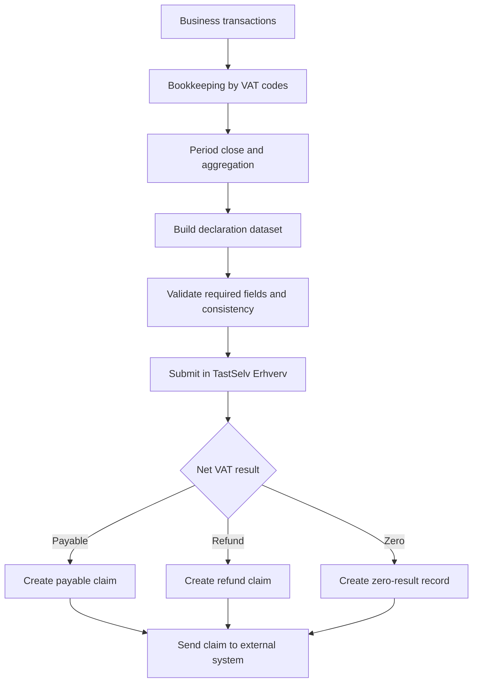
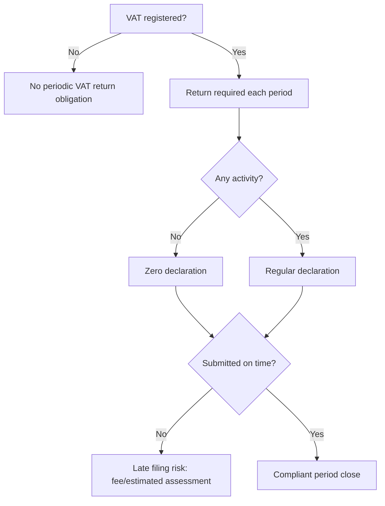

# 03 - VAT Flows, Filing Obligations, and Registration Basics

## End-to-End Filing Flow

## Filing Obligation Logic

## Registration Baseline
- VAT registration is generally required once taxable turnover threshold is exceeded.
- SKAT guidance states threshold baseline of `DKK 50,000`.
- Registration/change process is performed via `virk.dk`.
- Once registered, periodic filing obligation continues, including no-activity periods.

## Cadence Model (For Rule Engine)
- `monthly`: large turnover and/or opt-in cases.
- `quarterly`: medium turnover ranges, new business cases, and/or opt-in.
- `half_yearly`: lower turnover cases meeting conditions.
- `annual`: supported where policy profile enables annual cadence (legacy/transition profile).

Implement cadence as a policy table with effective dates, not hard-coded constants.

## Filing Due-Date and Compliance Tracking
For each due return, track:
- `obligation_id`
- `period_start`, `period_end`
- `due_date`
- `return_type_expected` (`regular` or `zero`)
- `status` (`due`, `submitted`, `overdue`)
- `risk_flags` (late fee risk, estimated assessment risk)

## Correction Flow
- User identifies prior filing error.
- User submits correction in relevant SKAT correction path.
- Tax Core must preserve prior version, apply correction logic, and regenerate outcome.
- If net outcome changes, create new adjustment claim event to downstream system.

## Sources
- SKAT - Register for VAT: https://skat.dk/erhverv/moms/moms-saadan-goer-du/saadan-registrerer-du-din-virksomhed-for-moms
- SKAT - File VAT: https://skat.dk/erhverv/moms/moms-saadan-goer-du/saadan-indberetter-du-moms
- SKAT - Deadlines and payment: https://skat.dk/erhverv/moms/frister-indberet-og-betal-moms
- SKAT - Correct filed VAT: https://skat.dk/erhverv/moms/moms-saadan-goer-du/ret-tidligere-indberettet-moms

## ViDA and VAT 3.0 Gap Closure Addendum

### Confirmed Additions
- [confirmed] Cadence baseline includes `annual` alongside monthly/quarterly/semi-annual.
- [confirmed] High-risk outcomes require taxpayer notification with evidence and amend/confirm loop.
- [confirmed] ViDA ingest profile includes recurring `corner_5` access-point ingestion.
- [confirmed] Step-2 prefill interaction is reclassification-driven; direct free-form numeric overwrite is disallowed.
- [confirmed] Step-3 supports system-initiated settlement obligations by threshold policies (time/balance).

### Assumed Additions
- [assumed] IRM task routing is implemented via integration events (not direct shared-state coupling).
- [assumed] Payment-plan lifecycle remains externalized but exposed as integration status within Tax Core views.
- [assumed] B2C phase-B sales evidence source will be SAF-T or POS; bank transaction feeds are excluded.

