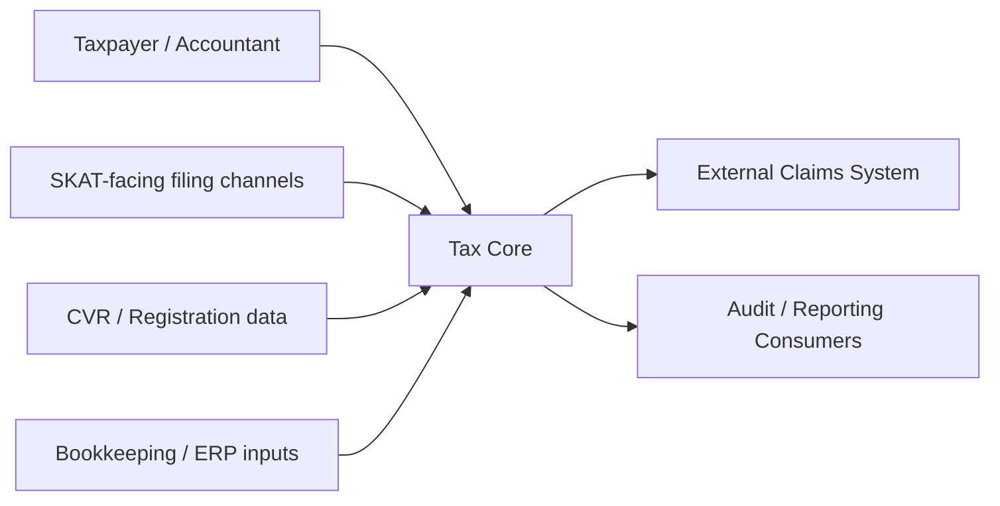

# 01 - Solution Architecture Overview

## Scope
Design a `Tax Core` platform for Danish VAT filing and assessment that terminates in claim creation and handoff to an external claims system.

## System Context

## Primary Capabilities
- Registration state and filing-obligation determination
- Filing intake and validation
- VAT calculation and assessment
- Correction handling
- Claim generation and dispatch
- Audit evidence and compliance reporting

## Core Design Principles
- Rules are configuration-driven and effective-dated.
- Filed declarations are immutable snapshots.
- Calculations are deterministic and reproducible.
- Every decision has a trace (data + rule references).

## Architecture Boundaries
Inside Tax Core:
- VAT obligation, validation, assessment, claim generation

Outside Tax Core:
- end-user portal UX
- final payment settlement and debt collection
- legal dispute case management

## Decision Outcome Contract
Each period for each taxable entity yields one outcome:
- `payable`
- `refund`
- `zero`

This outcome feeds claim orchestration.
