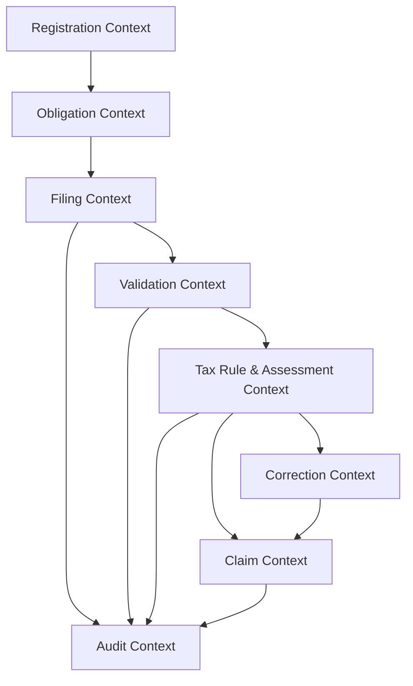

# 02 - Domain and Bounded Contexts

## Bounded Context Model

## Context Responsibilities
- `Registration Context`
  - VAT registration status and effective periods
  - threshold breach signals and registration-risk flags

- `Obligation Context`
  - period generation and cadence assignment
  - due-date status (`due`, `submitted`, `overdue`)

- `Filing Context`
  - declaration capture (`regular`, `zero`, `correction`)
  - canonical field normalization

- `Validation Context`
  - schema and cross-field checks
  - rule-result output (`error`, `warning`, `info`)

- `Tax Rule & Assessment Context`
  - reverse charge, exemptions, deduction rights, and net VAT logic
  - final result type (`payable`, `refund`, `zero`)

- `Correction Context`
  - prior-vs-new comparison and adjustment semantics
  - correction lineage chain

- `Claim Context`
  - claim payload assembly and idempotent external dispatch

- `Audit Context`
  - immutable evidence trail (inputs, rules, outputs, timestamps)

## Domain Events (Minimum)
- `VatRegistrationStatusChanged`
- `FilingObligationCreated`
- `VatReturnSubmitted`
- `VatReturnValidated`
- `VatAssessmentCalculated`
- `VatReturnCorrected`
- `ClaimCreated`
- `ClaimDispatched`
- `ClaimDispatchFailed`
