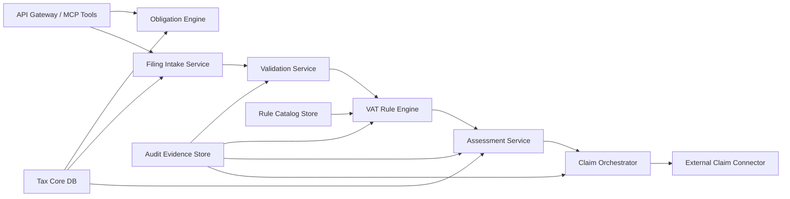

# 03 - Logical Components and Deployment View

## Logical Components

## Component Notes
- `VAT Rule Engine` executes effective-dated rule sets.
- `Assessment Service` computes final net VAT and result type.
- `Claim Orchestrator` ensures idempotent, retry-safe dispatch.
- `Audit Evidence Store` is append-only and queryable by `trace_id`.

## Deployment View (Reference)
- Compute:
  - containerized stateless services for intake/validation/assessment/claim
- Data:
  - relational store for operational data
  - append-only audit store (or immutable event table)
- Messaging:
  - queue/topic for claim dispatch and retry workflow
- Security:
  - centralized identity provider and secrets management

## Availability and Failure Model
- Internal service failures: retry with circuit breaker.
- External claim endpoint downtime: queued retries + dead-letter handling.
- Rule evaluation errors: fail closed for blocking errors, log warnings for non-blocking anomalies.
