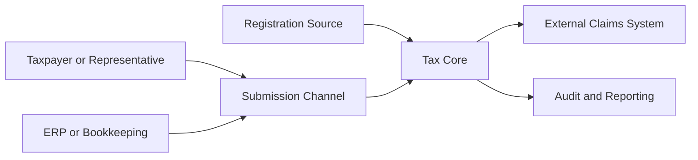
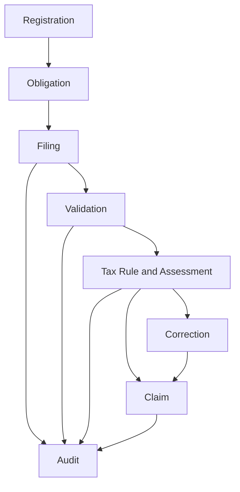
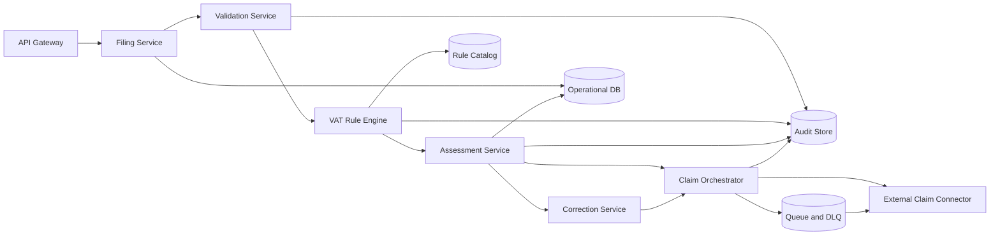

# 01 - Target Architecture Blueprint (Danish VAT Tax Core)

## 1. Architecture Scope and Drivers
- Support filing types: `regular`, `zero`, `correction`.
- Support outcomes: `payable`, `refund`, `zero`.
- Preserve end-to-end audit trace from filing input to claim dispatch.
- Externalize rules with effective dating and legal references.

## 2. Context and Boundaries

In scope:
- obligation, filing, validation, assessment, correction, claim dispatch, audit evidence

Out of scope:
- settlement and debt collection
- legal dispute adjudication

## 3. Bounded Contexts and Domain Responsibilities

Core events:
- `VatRegistrationStatusChanged`
- `FilingObligationCreated`
- `VatReturnSubmitted`
- `VatReturnValidated`
- `VatAssessmentCalculated`
- `VatReturnCorrected`
- `ClaimCreated`
- `ClaimDispatched`
- `ClaimDispatchFailed`

## 4. Component and Deployment Architecture

Consistency model:
- strong consistency for filing and assessment version writes
- outbox + queue for reliable claim dispatch
- idempotent external posting by stable key

## 5. Integration Contracts and Data Flows
Primary APIs:
- `POST /vat-filings`
- `GET /vat-filings/{filing_id}`
- outbound `POST /claims`

Claim payload:
- `claim_id`, `taxpayer_id`, `period_start`, `period_end`, `result_type`, `amount`, `currency`, `filing_reference`, `rule_version_id`, `calculation_trace_id`, `created_at`

Idempotency:
- key = `taxpayer_id + period_end + assessment_version`

## 6. Rule Engine and Policy Versioning Strategy
- Rule metadata: `rule_id`, `legal_reference`, `effective_from`, `effective_to`, `applies_when`, `calculation_or_validation_expression`, `severity`
- Rule packs:
  - filing validations
  - cadence/obligation
  - reverse charge
  - exemptions
  - deduction rights
- Deterministic replay by historical `rule_version_id`

## 7. Security, NFR, and Observability Design
- RBAC roles: `preparer`, `reviewer_approver`, `operations_support`, `auditor`
- Encryption at rest and in transit
- p95 validation+assessment target under 2s
- dispatch retry initiation within 1 minute
- trace IDs across API, services, and claims

## 8. Risks, Trade-offs, and ADRs
- Rule volatility -> effective-dated catalog + regression fixtures
- Integration instability -> queue, DLQ, reconciliation
- Data quality -> strict validation and feedback contract
- Audit defensibility -> append-only evidence

## 9. Delivery Phasing and Migration Plan
1. Foundation: filing schema, intake, baseline validation, audit scaffold
2. Assessment Core: rule engine, reverse charge, exemptions, obligations
3. Claims Integration: orchestrator, connector, retry/idempotency
4. Corrections and Controls: versioning, lineage, dashboards, alerts
5. Advanced Scenarios: modules for `Needs module`, routed `Manual/legal`
