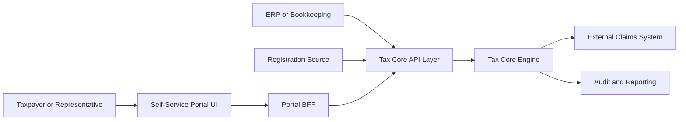
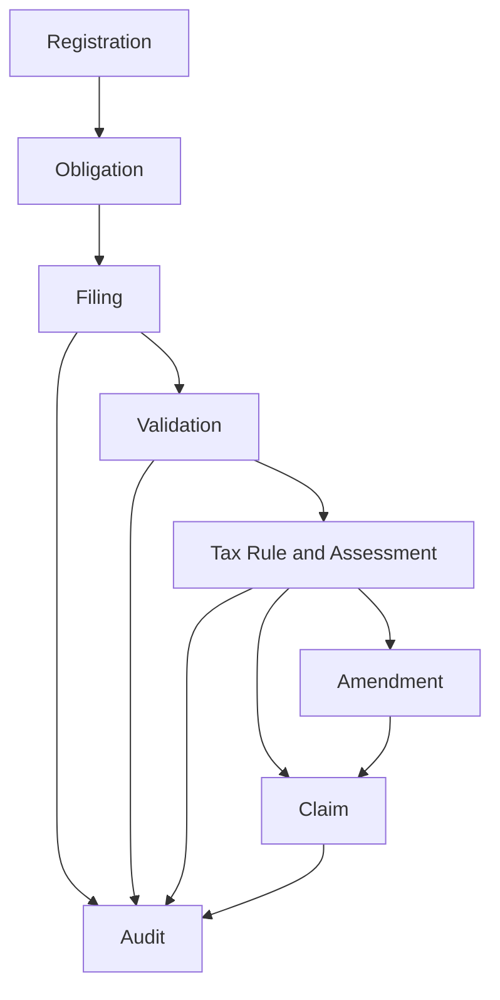
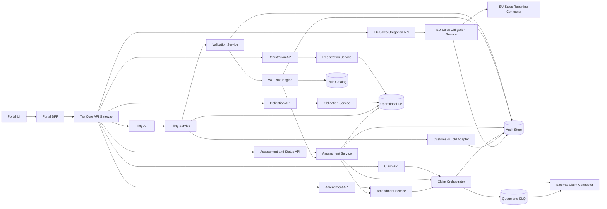

# 01 - Target Architecture Blueprint (Danish VAT Tax Core)

## 1. Architecture Scope and Drivers
- Support filing types: `regular`, `zero`, `amendment`.
- Support outcomes: `payable`, `refund`, `zero`.
- Preserve end-to-end audit trace from filing input to claim dispatch.
- Externalize rules with effective dating and legal references.
- Enforce open-source-only technology choices across runtime, data, integration, and platform tooling.
- Provide a taxpayer self-service portal for VAT workflows through a dedicated BFF layer.
- Provide API-first Tax Core ingress so all entry types can be submitted programmatically.
- Operate as a product-first Tax Core that coexists with incumbent authority and enterprise landscapes.
- Enforce deterministic legal decisioning; AI capabilities remain assistive and non-binding.

## 2. Context and Boundaries

In scope:
- taxpayer self-service portal and portal BFF
- API-first ingestion for registration, obligation, filing, amendment, and status queries
- obligation, filing, validation, assessment, amendment, claim dispatch, audit evidence
- tax-specific collection/settlement integration boundaries

Out of scope:
- settlement and debt collection
- legal dispute adjudication
- non-tax enterprise domains (for example HR, CRM, general ledger, procurement)

## 3. Bounded Contexts and Domain Responsibilities

Core events:
- `VatRegistrationStatusChanged`
- `FilingObligationCreated`
- `EuSalesObligationCreated`
- `EuSalesObligationSubmitted`
- `VatReturnSubmitted`
- `VatReturnValidated`
- `VatAssessmentCalculated`
- `PreliminaryAssessmentTriggered`
- `PreliminaryAssessmentIssued`
- `PreliminaryAssessmentSupersededByFiledReturn`
- `VatReturnCorrected`
- `CustomsAssessmentImported`
- `CustomsIntegrationFailed`
- `ClaimCreated`
- `ClaimDispatched`
- `ClaimDispatchFailed`

## 4. Component and Deployment Architecture

Consistency model:
- strong consistency for filing and assessment version writes
- outbox + queue for reliable claim dispatch
- idempotent external posting by stable key

Modern runtime and data platform profile:
- Service runtime: containerized microservices on Kubernetes with service mesh support for zero-trust mTLS and traffic policy.
- Event backbone: durable event streaming platform (Kafka-compatible) for domain events, outbox delivery, and replay.
- Stream processing: stateful stream processor for near-real-time obligation/compliance signals and data-quality monitors.
- Operational store: ACID relational database for transactional states (`filing`, `assessment_version`, `claim_status`).
- Analytical lakehouse: object storage + open table format (`Apache Iceberg` class) for immutable audit/event analytics.
- Transformation layer: SQL-first ELT and semantic models (dbt-style workflow) for compliance and operational reporting.
- Query layer: open-source federated SQL engine/warehouse for audit/regulatory analytics without coupling to service databases.

## 5. Integration Contracts and Data Flows
Primary ingress channels:
- Portal channel: `Self-Service Portal UI -> Portal BFF -> Tax Core API Gateway`
- Direct API channel: external clients/integrators call Tax Core APIs directly

Tax Core API surface (minimum):
- Registration:
  - `POST /registrations`
  - `PATCH /registrations/{taxpayer_id}`
  - `GET /registrations/{taxpayer_id}`
- Obligations:
  - `POST /obligations/generate`
  - `GET /obligations/{taxpayer_id}`
  - `PATCH /obligations/{obligation_id}/status`
  - cadence profiles include `monthly`, `quarterly`, `half_yearly`, and `annual` (policy-driven)
- EU-sales obligations (separate from domestic VAT return):
  - `POST /eu-sales-obligations/generate`
  - `GET /eu-sales-obligations/{taxpayer_id}`
  - `POST /eu-sales-obligations/{obligation_id}/submissions`
- Filings:
  - `POST /vat-filings`
  - `GET /vat-filings/{filing_id}`
- Amendments:
  - `POST /vat-filings/{filing_id}/amendments`
  - `GET /amendments/{correction_id}`
- Assessment and status:
  - `GET /assessments/{assessment_id}`
  - `GET /tax-periods/{taxpayer_id}/{period_end}/status`
- Claims:
  - `GET /claims/{claim_id}`
  - outbound `POST /claims` to external claims system

ViDA step operation contracts (configuration-driven on same core capabilities):
- Step-1 risk and review:
  - `POST /vida/reports/ingest`
  - `POST /risk/high-risk/review-requests`
  - `POST /risk/high-risk/{review_id}/confirm`
  - event `HighRiskFlagRaised`
  - event `TaxpayerReviewRequested`
- Step-2 prefill:
  - `POST /prefill/prepare`
  - `POST /prefill/{prefill_id}/reclassifications`
  - policy `prefill_edit_policy=reclassification_only`
- Step-3 VAT balance and settlement:
  - `GET /vat-balance/{taxpayer_id}`
  - `POST /settlements/requests`
  - event `SystemSettlementTriggered`
  - event `SystemSettlementNoticeIssued`

Canonical filing contract (return-level monetary fields):
- `output_vat_amount_domestic`
- `reverse_charge_output_vat_goods_abroad_amount`
- `reverse_charge_output_vat_services_abroad_amount`
- `input_vat_deductible_amount_total`
- `adjustments_amount`

Deterministic staged derivation contract:
- `stage_1_gross_output_vat_amount = output_vat_amount_domestic + reverse_charge_output_vat_goods_abroad_amount + reverse_charge_output_vat_services_abroad_amount`
- `stage_2_total_deductible_input_vat_amount = input_vat_deductible_amount_total`
- `stage_3_pre_adjustment_net_vat_amount = stage_1_gross_output_vat_amount - stage_2_total_deductible_input_vat_amount`
- `stage_4_net_vat_amount = stage_3_pre_adjustment_net_vat_amount + adjustments_amount`
- `result_type` and `claim_amount` derive only from `stage_4_net_vat_amount`.

Return-level vs line-level data boundary:
- Return-level store holds canonical filing aggregates and staged derived totals.
- Line-level fact store holds reverse-charge, exemption, deduction-right, and place-of-supply facts.
- Required linkage keys:
  - `filing_id`
  - `line_fact_id`
  - `calculation_trace_id`
  - `rule_version_id`
  - `source_document_ref`
- Reproducibility rule:
  - return-level aggregates and deductible totals must be reproducible from linked line-level facts.

EU-sales obligation lifecycle contract:
- States:
  - `eu_sales_due`
  - `eu_sales_submitted`
  - `eu_sales_overdue`
- Domain events:
  - `EuSalesObligationCreated`
  - `EuSalesObligationSubmitted`
  - `EuSalesObligationOverdue`

Customs or told integration boundary (non-EU imports):
- Ownership: `Customs or Told Adapter` owned by Tax Core integration layer.
- Contracts:
  - Inbound API/event for customs/import VAT facts:
    - `POST /imports/customs-assessments`
    - event `CustomsAssessmentImported`
  - Reconciliation API:
    - `POST /imports/customs-reconciliation`
- Failure and recovery events:
  - `CustomsIntegrationFailed`
  - `CustomsIntegrationRetried`
  - `CustomsReconciliationMismatchDetected`
- Audit evidence expectations:
  - persist source reference (`customs_reference_id`)
  - payload hash
  - import timestamp
  - reconciliation outcome linked to `trace_id`

Claim payload:
- `claim_id`, `taxpayer_id`, `period_start`, `period_end`, `result_type`, `amount`, `currency`, `filing_reference`, `rule_version_id`, `calculation_trace_id`, `created_at`

Idempotency:
- key = `taxpayer_id + period_end + assessment_version`

API parity rule:
- All user actions available in the portal must map to public Tax Core API operations.
- Portal BFF must not contain hidden business rules that diverge from Tax Core domain behavior.

Preliminary assessment lifecycle and replacement semantics:
- Preliminary lifecycle states:
  - `preliminary_assessment_pending`
  - `preliminary_assessment_issued`
  - `preliminary_assessment_superseded`
  - `final_assessment_calculated`
- Trigger and replacement events:
  - `PreliminaryAssessmentTriggered` (deadline passed with no filing)
  - `PreliminaryAssessmentIssued`
  - `PreliminaryAssessmentSupersededByFiledReturn`
  - `FinalAssessmentCalculatedFromFiledReturn`
- Contract rule:
  - preliminary outcomes are immutable records and never deleted
  - final assessment references superseded preliminary record by `supersedes_assessment_id`
  - audit store keeps bidirectional linkage between preliminary and final outcomes

Architecture-level data contract fields (reverse charge and deduction rights):
- Reverse-charge minimum fields:
  - `supply_type`
  - `counterparty_country`
  - `counterparty_vat_id`
  - `place_of_supply_country`
  - `reverse_charge_applied`
  - `reverse_charge_reason_code`
  - `eu_transaction_category`
- Deduction-right minimum fields:
  - `deduction_right_type`
  - `deduction_percentage`
  - `deduction_basis_reference`
  - `allocation_method_id`
- Context flow:
  - Filing captures fields -> Validation checks required combinations -> Rule Engine evaluates eligibility and percentages -> Assessment computes deductible result -> Audit persists full input/output lineage

DKK normalization and rounding policy ownership:
- Ownership: Tax Core architecture and rule governance (not portal/BFF).
- Policy:
  - normalize monetary inputs to `DKK`
  - compute using high precision decimal in rule/assessment paths
  - round output/claim amounts at finalization with configured deterministic `rounding_policy_version_id`
- Audit requirements:
  - store pre-round amount, rounded amount, and `rounding_policy_version_id` for replay and legal traceability.

AI boundary contract:
- Allowed:
  - assistive triage, anomaly hints, and explanation generation
- Not allowed:
  - AI-issued legal assessments, penalties, or legal fact mutation
- Binding outcomes:
  - only deterministic rule and assessment services produce legally binding decisions

ViDA and country overlay configuration dimensions:
- `jurisdiction_code`
- `vida_step_mode` (`step_1`, `step_2`, `step_3`)
- `vida_access_point_profile` (for example `corner_5`)
- `prefill_mode` (`none`, `partial_b2c`, `full_b2b`)
- `prefill_edit_policy` (`reclassification_only`)
- `balance_mode` (`off`, `periodic_projection`, `near_realtime`)
- `settlement_mode` (`manual_request`, `system_triggered`, `hybrid`)
- `b2c_sales_source_mode` (`lump_sum`, `saft`, `pos`)
- `settlement_trigger_policy_id`
- `statutory_time_limit_profile_id`

Interface and contract standards:
- Synchronous APIs: `OpenAPI 3.1` with versioned contracts and backward-compatibility policy.
- Asynchronous APIs: `AsyncAPI` + `CloudEvents` envelope for domain events.
- Schemas: registry-backed event and payload schemas (`Avro` or `Protobuf`) with compatibility checks in CI.
- Contract testing: consumer-driven and provider contract tests as release gates.

## 6. Rule Engine and Policy Versioning Strategy
- Rule metadata: `rule_id`, `legal_reference`, `effective_from`, `effective_to`, `applies_when`, `calculation_or_validation_expression`, `severity`
- Rule packs:
  - filing validations
  - cadence/obligation
  - reverse charge
  - exemptions
  - deduction rights
- Deterministic replay by historical `rule_version_id`
- Temporal legal correctness:
  - evaluation always uses policy/rule versions in force at event time
- Country-variation governance:
  - route deviations through explicit governance outcomes (`policy change`, `country extension`, `core change`, `reject`)

## 7. Security, NFR, and Observability Design
- RBAC roles: `preparer`, `reviewer_approver`, `operations_support`, `auditor`
- Encryption at rest and in transit
- p95 validation+assessment target under 2s
- dispatch retry initiation within 1 minute
- trace IDs across API, services, and claims

Industry-standard platform practices:
- Telemetry standardization: `OpenTelemetry` traces/metrics/log correlation across all services and pipelines.
- Supply-chain security: signed artifacts, SBOM generation, provenance checks (SLSA-aligned pipeline controls).
- Policy as code: centralized security/runtime policy enforcement (OPA/Gatekeeper class) for admission and config drift.
- GitOps and IaC: declarative environment management (Terraform + GitOps controller class) for repeatable deployments.
- Progressive delivery: blue/green or canary rollouts with automated rollback on SLO breach.

Open-source-only compliance rule:
- All selected technologies must be open source and license-approved by enterprise governance.
- Proprietary SaaS/PaaS components may be used only as hosting/operations layers for open-source engines, not as exclusive proprietary data or integration runtimes.
- Any exception requires an explicit ADR and architecture approval.

## 8. Risks, Trade-offs, and ADRs
- Rule volatility -> effective-dated catalog + regression fixtures
- Integration instability -> queue, DLQ, reconciliation
- Data quality -> strict validation and feedback contract
- Audit defensibility -> append-only evidence
- Tooling novelty risk -> apply “adopt where value is proven” governance with explicit maturity gates.

## 9. Delivery Phasing and Migration Plan
1. Foundation: API gateway, registration/obligation/filing API contracts, baseline validation, audit scaffold
2. Assessment Core: rule engine, reverse charge, exemptions, obligations
3. Portal and BFF: taxpayer self-service UI, portal BFF orchestration, API parity validation
4. Claims Integration: orchestrator, connector, retry/idempotency
5. Amendments and Controls: versioning, lineage, dashboards, alerts
6. Advanced Scenarios: modules for `Needs module`, routed `Manual/legal`
7. ViDA Step 1-3: recurring ingress, prefill/reclassification controls, near-real-time balance and settlement triggers

Future-proofing workstream (cross-phase):
- F1. Introduce schema registry + contract compatibility checks.
- F2. Establish event streaming backbone and outbox standard library.
- F3. Establish lakehouse for audit and compliance analytics with open table format.
- F4. Implement OpenTelemetry baseline and SLO-driven release gates.
- F5. Implement GitOps + policy-as-code + supply-chain attestation controls.

## 10. Capability-Configuration Operating Rule
- Tax Core services define the stable capability backbone.
- ViDA step progression and country-specific VAT behavior are configuration states of that backbone.
- Required architecture pattern:
  - stable bounded contexts and APIs
  - effective-dated policy/rule packs
  - jurisdiction and step activation profiles
- Anti-patterns (disallowed):
  - per-country service forks
  - per-step duplicate pipelines
  - hard-coded jurisdictional semantics in generic core components

## 11. ViDA Step-1/2/3 Addendum
- Step-1:
  - recurring ViDA ingest and verification/classification before legal use
  - high-risk explainability and amend/confirm loop
  - IRM-compatible case-task event on confirmed unchanged high-risk submissions
- Step-2:
  - B2B full prefill where verified coverage exists
  - B2C partial prefill with taxpayer sales-side completion
  - reclassification-first interaction model (no direct free-form numeric overwrite)
- Step-3:
  - near-real-time VAT balance updates
  - taxpayer-initiated and system-initiated settlement paths (threshold/time policy)
  - B2C source transition support (`lump_sum` to `SAF-T`/`POS`)

