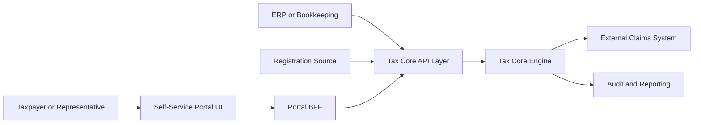
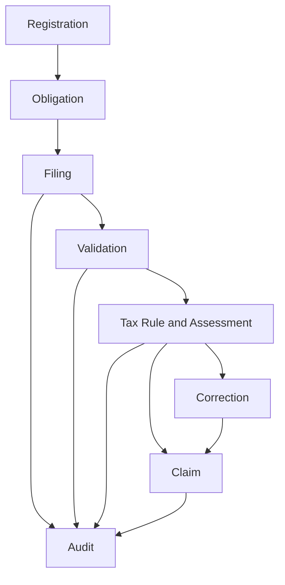
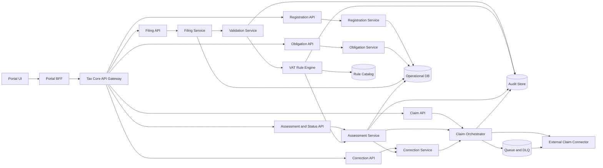

# 01 - Target Architecture Blueprint (Danish VAT Tax Core)

## 1. Architecture Scope and Drivers
- Support filing types: `regular`, `zero`, `correction`.
- Support outcomes: `payable`, `refund`, `zero`.
- Preserve end-to-end audit trace from filing input to claim dispatch.
- Externalize rules with effective dating and legal references.
- Enforce open-source-only technology choices across runtime, data, integration, and platform tooling.
- Provide a taxpayer self-service portal for VAT workflows through a dedicated BFF layer.
- Provide API-first Tax Core ingress so all entry types can be submitted programmatically.

## 2. Context and Boundaries

In scope:
- taxpayer self-service portal and portal BFF
- API-first ingestion for registration, obligation, filing, correction, and status queries
- obligation, filing, validation, assessment, correction, claim dispatch, audit evidence

Out of scope:
- settlement and debt collection
- legal dispute adjudication

## 3. Bounded Contexts and Domain Responsibilities

Core events:
- `VatRegistrationStatusChanged`
- `FilingObligationCreated`
- `VatReturnSubmitted`
- `VatReturnValidated`
- `VatAssessmentCalculated`
- `VatReturnCorrected`
- `ClaimCreated`
- `ClaimDispatched`
- `ClaimDispatchFailed`

## 4. Component and Deployment Architecture

Consistency model:
- strong consistency for filing and assessment version writes
- outbox + queue for reliable claim dispatch
- idempotent external posting by stable key

Modern runtime and data platform profile:
- Service runtime: containerized microservices on Kubernetes with service mesh support for zero-trust mTLS and traffic policy.
- Event backbone: durable event streaming platform (Kafka-compatible) for domain events, outbox delivery, and replay.
- Stream processing: stateful stream processor for near-real-time obligation/compliance signals and data-quality monitors.
- Operational store: ACID relational database for transactional states (`filing`, `assessment_version`, `claim_status`).
- Analytical lakehouse: object storage + open table format (`Apache Iceberg` class) for immutable audit/event analytics.
- Transformation layer: SQL-first ELT and semantic models (dbt-style workflow) for compliance and operational reporting.
- Query layer: open-source federated SQL engine/warehouse for audit/regulatory analytics without coupling to service databases.

## 5. Integration Contracts and Data Flows
Primary ingress channels:
- Portal channel: `Self-Service Portal UI -> Portal BFF -> Tax Core API Gateway`
- Direct API channel: external clients/integrators call Tax Core APIs directly

Tax Core API surface (minimum):
- Registration:
  - `POST /registrations`
  - `PATCH /registrations/{taxpayer_id}`
  - `GET /registrations/{taxpayer_id}`
- Obligations:
  - `POST /obligations/generate`
  - `GET /obligations/{taxpayer_id}`
  - `PATCH /obligations/{obligation_id}/status`
- Filings:
  - `POST /vat-filings`
  - `GET /vat-filings/{filing_id}`
- Corrections:
  - `POST /vat-filings/{filing_id}/corrections`
  - `GET /corrections/{correction_id}`
- Assessment and status:
  - `GET /assessments/{assessment_id}`
  - `GET /tax-periods/{taxpayer_id}/{period_end}/status`
- Claims:
  - `GET /claims/{claim_id}`
  - outbound `POST /claims` to external claims system

Claim payload:
- `claim_id`, `taxpayer_id`, `period_start`, `period_end`, `result_type`, `amount`, `currency`, `filing_reference`, `rule_version_id`, `calculation_trace_id`, `created_at`

Idempotency:
- key = `taxpayer_id + period_end + assessment_version`

API parity rule:
- All user actions available in the portal must map to public Tax Core API operations.
- Portal BFF must not contain hidden business rules that diverge from Tax Core domain behavior.

Interface and contract standards:
- Synchronous APIs: `OpenAPI 3.1` with versioned contracts and backward-compatibility policy.
- Asynchronous APIs: `AsyncAPI` + `CloudEvents` envelope for domain events.
- Schemas: registry-backed event and payload schemas (`Avro` or `Protobuf`) with compatibility checks in CI.
- Contract testing: consumer-driven and provider contract tests as release gates.

## 6. Rule Engine and Policy Versioning Strategy
- Rule metadata: `rule_id`, `legal_reference`, `effective_from`, `effective_to`, `applies_when`, `calculation_or_validation_expression`, `severity`
- Rule packs:
  - filing validations
  - cadence/obligation
  - reverse charge
  - exemptions
  - deduction rights
- Deterministic replay by historical `rule_version_id`

## 7. Security, NFR, and Observability Design
- RBAC roles: `preparer`, `reviewer_approver`, `operations_support`, `auditor`
- Encryption at rest and in transit
- p95 validation+assessment target under 2s
- dispatch retry initiation within 1 minute
- trace IDs across API, services, and claims

Industry-standard platform practices:
- Telemetry standardization: `OpenTelemetry` traces/metrics/log correlation across all services and pipelines.
- Supply-chain security: signed artifacts, SBOM generation, provenance checks (SLSA-aligned pipeline controls).
- Policy as code: centralized security/runtime policy enforcement (OPA/Gatekeeper class) for admission and config drift.
- GitOps and IaC: declarative environment management (Terraform + GitOps controller class) for repeatable deployments.
- Progressive delivery: blue/green or canary rollouts with automated rollback on SLO breach.

Open-source-only compliance rule:
- All selected technologies must be open source and license-approved by enterprise governance.
- Proprietary SaaS/PaaS components may be used only as hosting/operations layers for open-source engines, not as exclusive proprietary data or integration runtimes.
- Any exception requires an explicit ADR and architecture approval.

## 8. Risks, Trade-offs, and ADRs
- Rule volatility -> effective-dated catalog + regression fixtures
- Integration instability -> queue, DLQ, reconciliation
- Data quality -> strict validation and feedback contract
- Audit defensibility -> append-only evidence
- Tooling novelty risk -> apply “adopt where value is proven” governance with explicit maturity gates.

## 9. Delivery Phasing and Migration Plan
1. Foundation: API gateway, registration/obligation/filing API contracts, baseline validation, audit scaffold
2. Assessment Core: rule engine, reverse charge, exemptions, obligations
3. Portal and BFF: taxpayer self-service UI, portal BFF orchestration, API parity validation
4. Claims Integration: orchestrator, connector, retry/idempotency
5. Corrections and Controls: versioning, lineage, dashboards, alerts
6. Advanced Scenarios: modules for `Needs module`, routed `Manual/legal`

Future-proofing workstream (cross-phase):
- F1. Introduce schema registry + contract compatibility checks.
- F2. Establish event streaming backbone and outbox standard library.
- F3. Establish lakehouse for audit and compliance analytics with open table format.
- F4. Implement OpenTelemetry baseline and SLO-driven release gates.
- F5. Implement GitOps + policy-as-code + supply-chain attestation controls.
