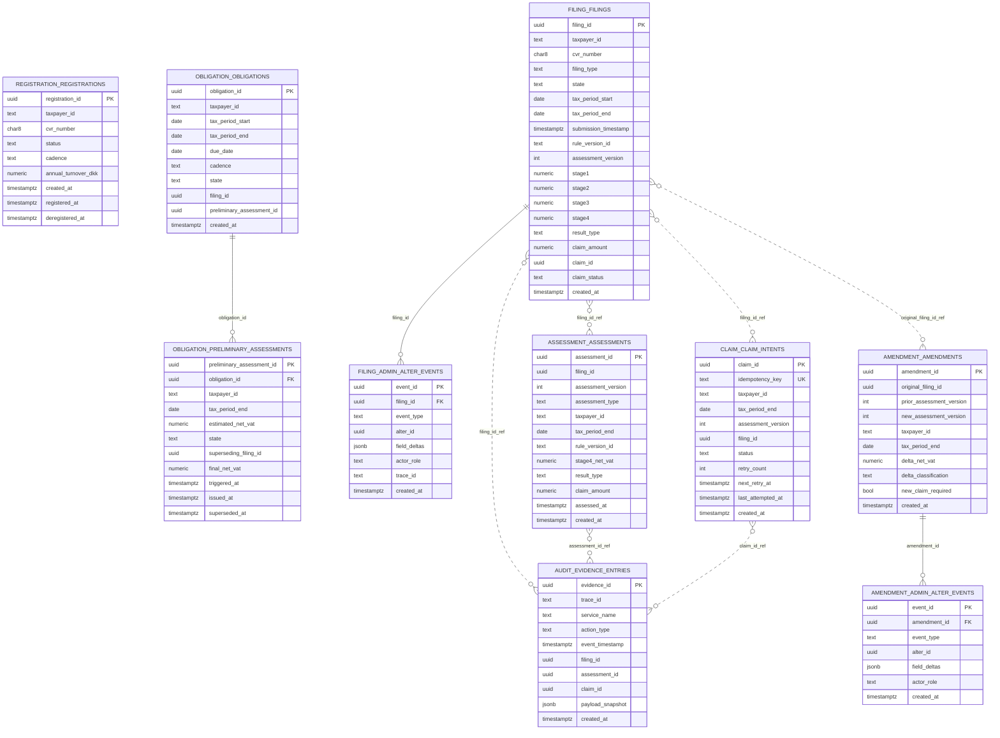
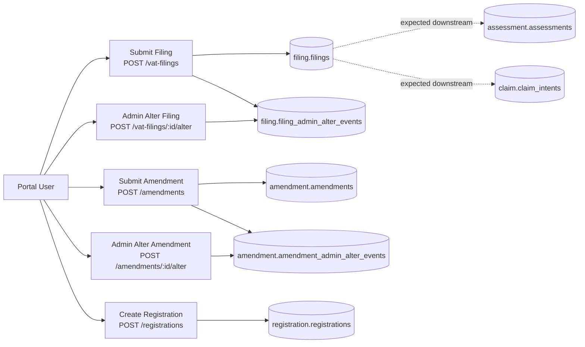

# Tax Core Operational Data Model - Audience View

This drawing is designed for mixed stakeholders (engineering, architecture, QA, delivery) to understand what data exists, where it lives, and how user actions move through services into persistent tables.

## 1) Bounded Context Data Model (ER view)

Notes:
- Dotted relationships represent cross-context soft references (no cross-schema FK).
- Hard FK constraints are used only inside a bounded context.
- Core lineage path is Filing -> Assessment (versioned) -> Claim and Filing -> Amendment.

## 2) User Action to Persistence Map

Interpretation:
- Solid arrows are implemented direct writes.
- Dotted arrows are expected by product flow but currently depend on separate orchestration or missing calls.
