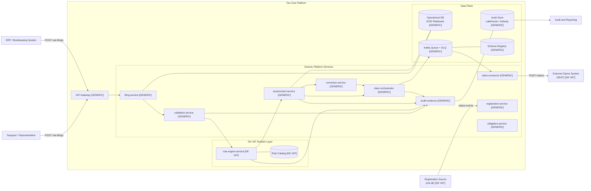
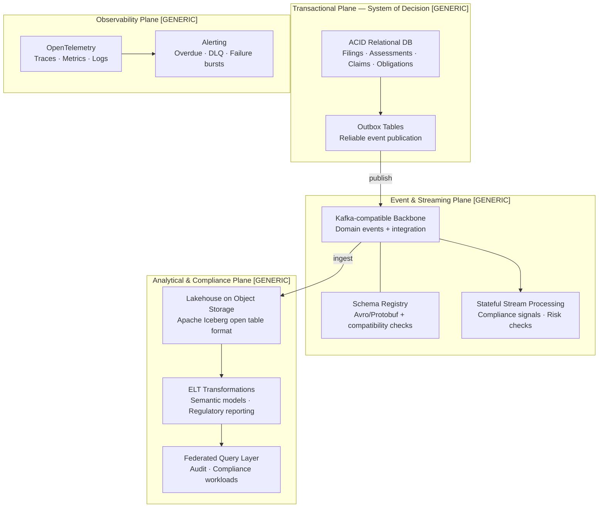
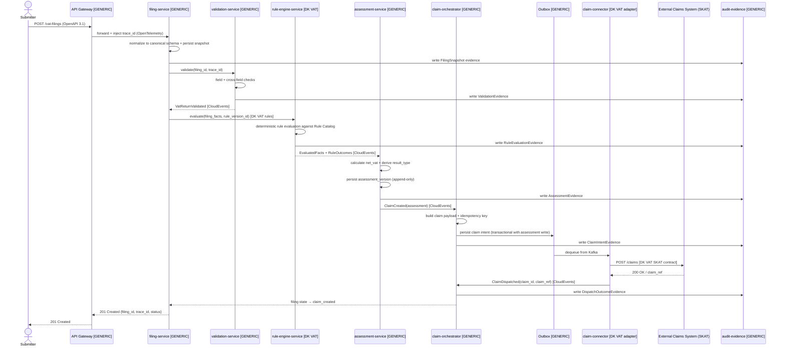
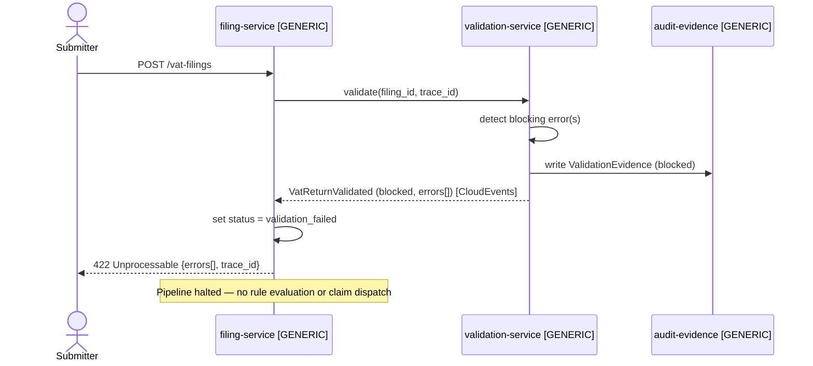
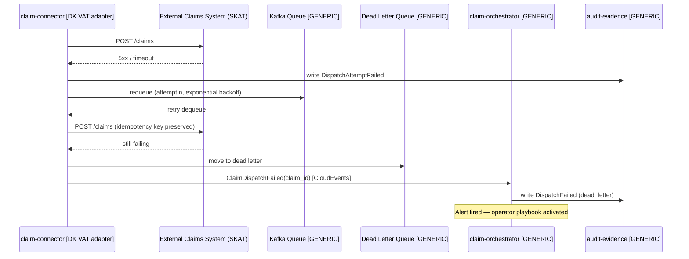
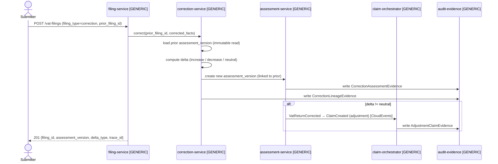
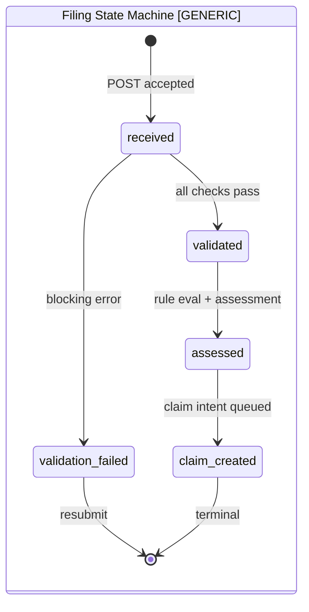
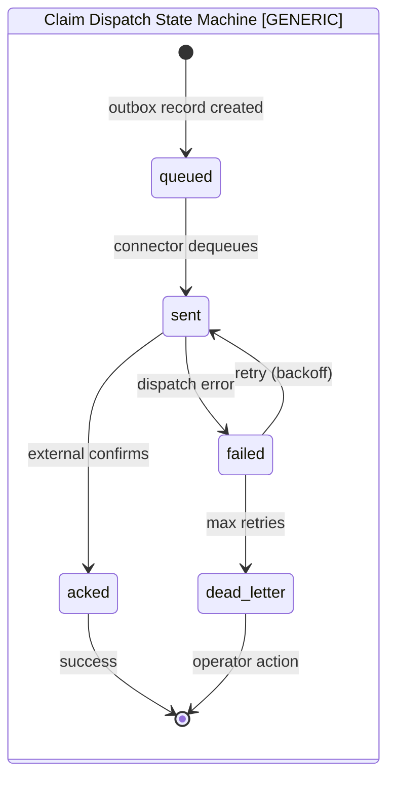

# Solution Design: VAT Filing and Assessment (Tax Core — Denmark)

> **Status:** Draft v1.1
> **Designer:** Solution Designer (DESIGNER.md contract)
> **Architecture inputs:** `architecture/01-target-architecture-blueprint.md`, `architecture/02-architectural-principles.md`, `architecture/03-future-proof-modern-data-stack-and-standards.md`, ADR-001 through ADR-005, `architecture/designer/01-03`
> **Analysis inputs:** `analysis/02-vat-form-fields-dk.md`, `analysis/03-vat-flows-obligations.md`, `analysis/07-filing-scenarios-and-claim-outcomes-dk.md`
> **Working folder:** `design/`
> **Drawings:** `design/drawings/tax-core-vat.drawio`

---

## 0. Building Block Taxonomy

This design distinguishes two layers of building blocks:

| Layer | Label | Meaning |
|---|---|---|
| **Generic** | `[GENERIC]` | Domain-agnostic capability reusable across any tax, regulatory, or compliance domain. No Danish VAT-specific logic. |
| **DK VAT-specific** | `[DK VAT]` | Contains Danish VAT legal rules, Rubrik field mappings, ML §§ references, SKAT-specific integrations, or DKK denomination logic. |

The separation serves two purposes:
1. The generic layer can be extracted into a reusable platform kernel for other tax domains.
2. The DK VAT layer is the only part that changes when Danish legislation changes — it is isolated and versioned accordingly.

---

## 1. Design Scope

### In Scope
- VAT filing intake and canonical normalization
- Field and cross-field validation
- Deterministic rule evaluation (domestic, reverse charge, exemptions, deductions)
- Assessment calculation and outcome determination (`payable`, `refund`, `zero`)
- Correction versioning and lineage
- Claim creation, outbox publication, and external dispatch
- Append-only audit evidence across all stages
- Modern data stack integration (Kafka backbone, OpenAPI/AsyncAPI contracts, OpenTelemetry, Lakehouse audit plane)

### Scenarios Covered
S01–S23 from `architecture/traceability/scenario-to-architecture-traceability-matrix.md`. S24, S25, C14, C15, C20, C21, C22 require dedicated modules or manual/legal routing — **out of scope**.

### Out of Scope
- Settlement and debt collection
- Legal dispute adjudication
- Taxpayer-facing UI
- Special schemes (brugtmoms, OSS/IOSS, momskompensation)
- Bankruptcy estate handling

---

## 2. Architecture Drawings

> All diagrams are also available as a multi-page draw.io file: `design/drawings/tax-core-vat.drawio`

### 2.1 System Context



### 2.2 Bounded Context Flow

```mermaid
flowchart TB
    REG_CTX["Registration Context\nregistration-service\n[GENERIC]"]
    OBL_CTX["Obligation Context\nobligation-service\n[GENERIC]"]
    FIL_CTX["Filing Context\nfiling-service\n[GENERIC]"]
    VAL_CTX["Validation Context\nvalidation-service\n[GENERIC]"]
    RULE_CTX["Tax Rule & Assessment Context\nrule-engine-service [DK VAT]\nassessment-service [GENERIC]"]
    COR_CTX["Correction Context\ncorrection-service\n[GENERIC]"]
    CLM_CTX["Claim Context\nclaim-orchestrator [GENERIC]\nclaim-connector [DK VAT adapter]"]
    AUD_CTX["Audit Context\naudit-evidence\n[GENERIC]"]

    REG_CTX -->|VatRegistrationStatusChanged\n[CloudEvents]| OBL_CTX
    OBL_CTX -->|FilingObligationCreated\n[CloudEvents]| FIL_CTX
    FIL_CTX -->|VatReturnSubmitted\n[CloudEvents]| VAL_CTX
    VAL_CTX -->|VatReturnValidated\n[CloudEvents]| RULE_CTX
    RULE_CTX -->|VatAssessmentCalculated\n[CloudEvents]| COR_CTX
    RULE_CTX -->|VatAssessmentCalculated\n[CloudEvents]| CLM_CTX
    COR_CTX -->|VatReturnCorrected\n[CloudEvents]| CLM_CTX
    FIL_CTX -->|evidence| AUD_CTX
    VAL_CTX -->|evidence| AUD_CTX
    RULE_CTX -->|evidence| AUD_CTX
    CLM_CTX -->|evidence| AUD_CTX
```

### 2.3 Modern Data Stack Planes



### 2.4 Happy-Path Sequence: Regular Filing → Claim Dispatch



### 2.5 Error Path: Validation Block



### 2.6 Error Path: Claim Dispatch Failure and Retry



### 2.7 Correction Flow



### 2.8 Filing and Claim State Machines





---

## 3. Building Blocks

### 3.1 Generic Building Blocks

These components contain no Danish VAT-specific logic and are reusable across tax domains.

#### `filing-service` [GENERIC]
**Responsibility:** Canonical intake, normalization, state ownership, response contract.

| Concern | Detail |
|---|---|
| Accepts | `POST /tax-filings` (schema parameterized per domain) |
| Normalizes | Source fields to domain canonical schema |
| Persists | Immutable filing snapshot (Operational DB, append-only) |
| Orchestrates | validation-service → rule-engine → assessment-service |
| State machine | `received` → `validation_failed` / `validated` → `assessed` → `claim_created` |
| Returns | `filing_id`, `trace_id`, `status`, summary |
| Writes audit | `FilingSnapshot` evidence on intake |
| Standards | OpenAPI 3.1 contract, OpenTelemetry `trace_id` injected at boundary |

#### `validation-service` [GENERIC]
**Responsibility:** Configurable field and cross-field validation gate before rule evaluation.

| Concern | Detail |
|---|---|
| Input | `filing_id`, `trace_id`, filing facts |
| Validates | Schema conformance, period integrity, amount constraints, type consistency |
| Severity model | `blocking_error` halts pipeline; `warning` passes with flag |
| Output | `ReturnValidated` event with `passed: bool`, `errors[]`, `warnings[]` |
| Writes audit | `ValidationEvidence` with field-level detail |
| Standards | Validation rules loaded from config/catalog — no hard-coded domain logic |

#### `assessment-service` [GENERIC]
**Responsibility:** Compute outcome from evaluated facts, persist versioned assessment.

| Concern | Detail |
|---|---|
| Input | `EvaluatedFacts` from rule engine |
| Calculates | Net amount using domain formula from rule output |
| Derives | `result_type` (`payable` / `refund` / `zero`) |
| Persists | Append-only `assessment_version` record |
| Emits | `AssessmentCalculated` event (CloudEvents envelope) |
| Writes audit | `AssessmentEvidence` with `calculation_trace_id` |
| Does NOT | Contain domain-specific calculation logic (delegated to rule engine) |

#### `correction-service` [GENERIC]
**Responsibility:** Version corrections, compute delta, preserve immutable lineage. (ADR-005)

| Concern | Detail |
|---|---|
| Input | `prior_filing_id` + corrected facts |
| Loads | Prior `assessment_version` (read-only) |
| Computes | Delta: `increase`, `decrease`, `neutral` |
| Creates | New `assessment_version` with `prior_version_id` pointer |
| Emits | `ReturnCorrected` event (CloudEvents) |
| Writes audit | `CorrectionLineageEvidence` |
| Constraint | Never mutates prior records (ADR-005) |
| Routes | Age-gated corrections → `Manual/legal` routing event (configurable threshold) |

#### `claim-orchestrator` [GENERIC]
**Responsibility:** Claim intent lifecycle, transactional outbox publication, status tracking. (ADR-004)

| Concern | Detail |
|---|---|
| Input | Accepted `AssessmentCalculated` or `ReturnCorrected` event |
| Builds | Generic claim payload with domain-supplied fields |
| Idempotency key | `taxpayer_id + period_end + assessment_version` |
| Publishes | Claim intent to outbox (transactional with assessment write) |
| Tracks | Status: `queued` → `sent` → `acked` / `failed` → `dead_letter` |
| Writes audit | `ClaimIntentEvidence`, `DispatchOutcomeEvidence` |

#### `registration-service` [GENERIC]
**Responsibility:** Taxpayer registration status lifecycle. Translates external registration events into internal `RegistrationStatusChanged` events.

#### `obligation-service` [GENERIC]
**Responsibility:** Obligation lifecycle management per cadence policy table. Emits `ObligationCreated` and tracks `due` / `submitted` / `overdue` states. Cadence rules loaded from effective-dated policy table — not hard-coded.

#### `audit-evidence` [GENERIC]
**Responsibility:** Append-only structured evidence writer and query API, keyed by `trace_id`. (ADR-003)

Every evidence entry: `trace_id`, `event_type`, `service_identity`, `actor`, `timestamp`, `input_summary_hash`, `decision_or_output_summary`, domain references.

Evidence types: `FilingSnapshot`, `ValidationEvidence`, `RuleEvaluationEvidence`, `AssessmentEvidence`, `CorrectionLineageEvidence`, `ClaimIntentEvidence`, `DispatchAttemptEvidence`, `DispatchOutcomeEvidence`

---

### 3.2 Danish VAT-Specific Building Blocks

These components contain Danish VAT legal logic, SKAT-specific integrations, or DKK field mappings. They change when Danish legislation changes.

#### `rule-engine-service` [DK VAT]
**Responsibility:** Pure, stateless, deterministic Danish VAT rule evaluation against the DK VAT Rule Catalog.

| Concern | Detail |
|---|---|
| Input | DK VAT filing facts + `rule_version_id` |
| Resolves | DK VAT rule pack from Rule Catalog at filing-time version |
| Evaluates | Domestic VAT, reverse charge EU goods/services, domestic reverse charge (ML §46), exemptions (ML §13), deduction rights, partial allocation, cross-border reporting |
| Output | `EvaluatedFacts`, `RuleOutcomes[]` with severity + ML legal reference, `rule_version_id` used |
| Constraint | Pure function — no side effects, no DB writes |
| Writes audit | `RuleEvaluationEvidence` keyed by `trace_id` |
| Determinism | Same inputs + same `rule_version_id` → identical output (legal replay guarantee) |
| Standards | Rule contracts schema-versioned in Schema Registry; compatibility checked in CI |

**DK VAT Rule Packs (execution order):**
1. `filing_validation` — cadence/obligation alignment
2. `domestic_vat` — salgsmoms / købsmoms baseline
3. `reverse_charge_eu_goods` — Rubrik A goods (ML §46 EU)
4. `reverse_charge_eu_services` — Rubrik A services (ML §46 EU)
5. `reverse_charge_dk` — domestic categories (ML §46 DK)
6. `exemption` — ML §13 exempt activity classification
7. `deduction_rights` — full / none / partial allocation model
8. `cross_border` — Rubrik B/C reporting obligations

#### `Rule Catalog` [DK VAT]
**Responsibility:** Effective-dated store of Danish VAT legal rules with legal references. (ADR-002)

Rule record schema:
- `rule_id`, `rule_pack`, `legal_reference` (e.g. `ML §46 stk. 1`), `effective_from`, `effective_to`, `applies_when`, `calculation_or_validation_expression`, `severity`

Governance requirements (from `architecture/02`):
- New rule requires `legal_reference`, `effective_from`, `effective_to`, and scenario regression pass
- Rule activation is data-only — no service redeployment
- Rollback via `effective_to` backdating
- No-gap constraint on `effective_from`/`effective_to` enforced by catalog ingestion service

#### `claim-connector` [DK VAT adapter]
**Responsibility:** Queue consumer adapting generic claim intents to the SKAT External Claims System API contract.

| Concern | Detail |
|---|---|
| Adapts | Generic claim payload → SKAT-specific POST /claims format |
| Currency | Enforces `DKK` denomination and rounding policy |
| Auth | SKAT-specific authentication (mechanism TBD — OQ-01) |
| Retry | Exponential backoff, max 5 attempts |
| DLQ | Dead letter on budget exhaustion; alert triggered |
| Idempotency | Stable key (`taxpayer_id + period_end + assessment_version`) preserved through retries |
| Anti-corruption | Wraps SKAT API behind internal adapter interface — external contract changes are isolated here |

#### DK VAT Canonical Filing Schema [DK VAT]
Defined in `analysis/02-vat-form-fields-dk.md`. DK-specific fields applied on top of the generic filing header:

**Generic header fields** (parameterized):
`filing_id`, `taxpayer_id`, `tax_period_start`, `tax_period_end`, `filing_type`, `submission_timestamp`, `source_channel`, `rule_version_id`

**DK VAT-specific monetary fields:**
`output_vat_amount` (salgsmoms), `input_vat_deductible_amount` (købsmoms), `vat_on_goods_purchases_abroad_amount`, `vat_on_services_purchases_abroad_amount`, `adjustments_amount`

**DK VAT-specific international value boxes:**
`rubrik_a_goods_eu_purchase_value`, `rubrik_a_services_eu_purchase_value`, `rubrik_b_goods_eu_sale_value`, `rubrik_b_services_eu_sale_value`, `rubrik_c_other_vat_exempt_supplies_value`

**DK VAT-specific identifier:**
`cvr_number` (8-digit Danish CVR), `contact_reference`

**DK VAT-specific blocking validation rules:**
- `cvr_number` must be 8-digit numeric
- `zero` filing cannot include positive VAT/value amounts
- `correction` must reference prior `filing_id` or period key
- Abroad purchase VAT with empty Rubrik A → warning
- EU sales with zero domestic output VAT → warning (classification review)

#### DK VAT Obligation Cadence Policy [DK VAT]
Effective-dated cadence rules loaded into `obligation-service`:
- `half_yearly`: default lower-turnover (< DKK 5M)
- `quarterly`: medium turnover (≥ DKK 5M) or opt-in
- `monthly`: large turnover (≥ DKK 50M) or opt-in
- Registration threshold: DKK 50,000 taxable turnover (ML basis)

---

## 4. API and Event Contracts

### 4.1 POST /vat-filings (OpenAPI 3.1)

**Request [DK VAT schema]:**
```json
{
  "cvr_number": "12345678",
  "tax_period_start": "2024-01-01",
  "tax_period_end": "2024-06-30",
  "filing_type": "regular",
  "source_channel": "api",
  "output_vat_amount": 150000.00,
  "input_vat_deductible_amount": 80000.00,
  "vat_on_goods_purchases_abroad_amount": 5000.00,
  "vat_on_services_purchases_abroad_amount": 2000.00,
  "adjustments_amount": 0.00,
  "rubrik_a_goods_eu_purchase_value": 20000.00,
  "rubrik_a_services_eu_purchase_value": 8000.00,
  "rubrik_b_goods_eu_sale_value": 0.00,
  "rubrik_b_services_eu_sale_value": 0.00,
  "rubrik_c_other_vat_exempt_supplies_value": 0.00,
  "contact_reference": "ref-2024-001"
}
```

**201 Created [GENERIC response envelope]:**
```json
{
  "filing_id": "fil_01J...",
  "trace_id": "trc_01J...",
  "status": "claim_created",
  "result_type": "payable",
  "net_vat_amount": 77000.00,
  "assessment_version": 1,
  "claim_id": "clm_01J...",
  "rule_version_id": "rv_2024H1",
  "submitted_at": "2024-07-05T10:32:00Z"
}
```

**422 Unprocessable [GENERIC error envelope]:**
```json
{
  "trace_id": "trc_01J...",
  "status": "validation_failed",
  "errors": [
    {
      "code": "VAL_PERIOD_INVALID",
      "field": "tax_period_end",
      "message": "Period end date is before period start date",
      "severity": "blocking_error"
    }
  ],
  "warnings": []
}
```

**409 Conflict [GENERIC]:**
```json
{
  "trace_id": "trc_01J...",
  "message": "Filing for this taxpayer and period already assessed",
  "existing_filing_id": "fil_01J..."
}
```

### 4.2 GET /vat-filings/{filing_id} [GENERIC + DK VAT fields]

**200 Response:**
```json
{
  "filing_id": "fil_01J...",
  "trace_id": "trc_01J...",
  "cvr_number": "12345678",
  "filing_type": "regular",
  "status": "claim_created",
  "result_type": "payable",
  "net_vat_amount": 77000.00,
  "assessment_version": 1,
  "claim_id": "clm_01J...",
  "rule_version_id": "rv_2024H1",
  "submitted_at": "2024-07-05T10:32:00Z",
  "period": { "start": "2024-01-01", "end": "2024-06-30" }
}
```

### 4.3 Outbound POST /claims to SKAT [DK VAT adapter]

```json
{
  "claim_id": "clm_01J...",
  "taxpayer_id": "12345678",
  "period_start": "2024-01-01",
  "period_end": "2024-06-30",
  "result_type": "payable",
  "amount": 77000.00,
  "currency": "DKK",
  "filing_reference": "fil_01J...",
  "rule_version_id": "rv_2024H1",
  "calculation_trace_id": "trc_01J...",
  "created_at": "2024-07-05T10:32:15Z",
  "idempotency_key": "12345678_2024-06-30_v1"
}
```

### 4.4 Domain Events (CloudEvents envelope, Avro/Protobuf schema, Schema Registry)

| Event | Layer | Publisher | Consumers | Key Fields |
|---|---|---|---|---|
| `RegistrationStatusChanged` | GENERIC | registration-service | obligation-service | `taxpayer_id`, `status`, `effective_date` |
| `FilingObligationCreated` | GENERIC | obligation-service | filing-service, audit | `taxpayer_id`, `period`, `due_date`, `cadence` |
| `ReturnSubmitted` | GENERIC | filing-service | validation-service, audit | `filing_id`, `trace_id`, `filing_type` |
| `ReturnValidated` | GENERIC | validation-service | filing-service, audit | `filing_id`, `passed`, `errors[]`, `warnings[]` |
| `VatAssessmentCalculated` | DK VAT | assessment-service | claim-orchestrator, audit | `filing_id`, `assessment_version`, `result_type`, `net_vat_amount` |
| `VatReturnCorrected` | DK VAT | correction-service | assessment-service, audit | `filing_id`, `prior_version`, `new_version`, `delta_type` |
| `ClaimCreated` | GENERIC | claim-orchestrator | audit | `claim_id`, `filing_id`, `idempotency_key` |
| `ClaimDispatched` | GENERIC | claim-connector | claim-orchestrator, audit | `claim_id`, `claim_ref`, `dispatched_at` |
| `ClaimDispatchFailed` | GENERIC | claim-connector | claim-orchestrator, audit | `claim_id`, `attempt`, `error`, `dead_letter: bool` |

---

## 5. Data Model and State Transitions

### 5.1 Core Entities

```
Filing [GENERIC header + DK VAT fields]
├── filing_id (PK)                              [GENERIC]
├── taxpayer_id / cvr_number                    [DK VAT: 8-digit CVR]
├── tax_period_start / tax_period_end           [GENERIC]
├── filing_type        (regular|zero|correction)[GENERIC]
├── source_channel                              [GENERIC]
├── submission_timestamp                        [GENERIC]
├── rule_version_id                             [GENERIC]
├── status                                      [GENERIC]
├── trace_id                                    [GENERIC]
├── output_vat_amount        (salgsmoms)        [DK VAT]
├── input_vat_deductible_amount (købsmoms)      [DK VAT]
├── vat_on_goods_purchases_abroad_amount        [DK VAT]
├── vat_on_services_purchases_abroad_amount     [DK VAT]
├── adjustments_amount                          [DK VAT]
├── rubrik_a_goods_eu_purchase_value            [DK VAT]
├── rubrik_a_services_eu_purchase_value         [DK VAT]
├── rubrik_b_goods_eu_sale_value                [DK VAT]
├── rubrik_b_services_eu_sale_value             [DK VAT]
├── rubrik_c_other_vat_exempt_supplies_value    [DK VAT]
└── contact_reference                           [DK VAT]

Assessment [GENERIC — append-only, one per assessment event]
├── assessment_id (PK)                          [GENERIC]
├── filing_id (FK)                              [GENERIC]
├── assessment_version                          [GENERIC]
├── prior_assessment_id (FK, null for original) [GENERIC]
├── net_vat_amount                              [GENERIC]
├── result_type   (payable|refund|zero)         [GENERIC]
├── claim_amount                                [GENERIC]
├── rule_version_id                             [GENERIC]
├── calculation_trace_id                        [GENERIC]
└── delta_type    (null|increase|decrease|neutral) [GENERIC]

Claim [GENERIC]
├── claim_id (PK)
├── assessment_id (FK)
├── filing_id (FK)
├── taxpayer_id
├── period_start / period_end
├── result_type
├── amount
├── currency       (DKK)                        [DK VAT: fixed DKK]
├── idempotency_key
├── status         (queued|sent|acked|failed|dead_letter)
├── dispatch_attempts
└── created_at / last_updated_at

Obligation [GENERIC — cadence rules are DK VAT data]
├── obligation_id (PK)
├── taxpayer_id / cvr_number
├── period_start / period_end
├── due_date
├── cadence        (monthly|quarterly|half_yearly) [DK VAT cadence policy data]
├── return_type_expected
└── status         (due|submitted|overdue)

Rule [DK VAT — Rule Catalog]
├── rule_id (PK)
├── rule_pack      (domestic_vat|reverse_charge_eu|...)
├── legal_reference (ML §§ reference)
├── effective_from / effective_to
├── applies_when   (expression)
├── calculation_or_validation_expression
└── severity       (blocking_error|warning|info)
```

### 5.2 State Machines — see Section 2.8

---

## 6. Rule Integration and Version Handling

### Rule Version Resolution [GENERIC mechanism, DK VAT data]
1. `filing-service` resolves active `rule_version_id` from Rule Catalog based on `filing.tax_period_end`
2. `rule_version_id` persisted on Filing record immediately at intake
3. All downstream evaluation uses this pinned version — never the current latest

### Rule Pack Execution Order [DK VAT]
```
1. filing_validation       → cadence/obligation alignment
2. domestic_vat            → salgsmoms/købsmoms baseline
3. reverse_charge_eu_goods → Rubrik A goods (ML §46 EU)
4. reverse_charge_eu_svcs  → Rubrik A services (ML §46 EU)
5. reverse_charge_dk       → domestic categories (ML §46 DK)
6. exemption               → ML §13 exempt activity
7. deduction_rights        → full / none / partial allocation
8. cross_border            → Rubrik B/C reporting
```

### Determinism Guarantee [GENERIC principle]
- Rule engine is a pure function: `evaluate(facts, rule_version_id) → outcomes`
- No DB writes inside the evaluation function
- Identical input + version → identical output (legal replay guarantee)

### Rule Lifecycle Governance [DK VAT governance]
- New rule: requires `legal_reference`, `effective_from`, `effective_to`, scenario regression pass
- Activation: data-only, no service redeployment
- Rollback: set `effective_to` in past
- No-gap constraint on `effective_from`/`effective_to` enforced at ingestion

---

## 7. Modern Stack Integration (Architecture/03)

| Concern | Implementation | Layer |
|---|---|---|
| Synchronous API contracts | OpenAPI 3.1 specs, versioned per service | GENERIC |
| Async event contracts | AsyncAPI + CloudEvents envelope | GENERIC |
| Schema management | Avro/Protobuf in Schema Registry, compatibility checks in CI | GENERIC |
| Event backbone | Kafka-compatible broker for all domain events | GENERIC |
| Outbox pattern | Transactional outbox tables, standardized relay publisher | GENERIC |
| Observability | OpenTelemetry traces/metrics/logs, `trace_id` end-to-end | GENERIC |
| Audit/compliance analytics | Audit events ingested to Lakehouse (Apache Iceberg) | GENERIC |
| Service auth | Zero-trust service-to-service auth (mTLS or token-based) | GENERIC |
| Infrastructure | IaC + GitOps managed environments | GENERIC |
| Supply chain | SBOM, artifact signing, provenance verification | GENERIC |
| Technology policy | 3-tier: Adopt / Trial / Hold; open-source-only for core paths | GENERIC |

---

## 8. Security, NFR, and Observability-by-Design

### RBAC Role Mapping [GENERIC framework, DK VAT roles]

| Role | Permitted Operations |
|---|---|
| `preparer` | `POST /vat-filings`, `GET /vat-filings/{id}` (own CVR only) |
| `reviewer_approver` | Read all filings; approve correction filings |
| `operations_support` | Read claim status, trigger DLQ reprocessing |
| `auditor` | Read-only access to audit-evidence store and all filings |

### Performance Targets
- `POST /vat-filings` (validation + assessment): p95 < 2s at baseline load
- Claim dispatch retry initiation: within 1 minute of failure detection
- Rule catalog version resolution: p99 < 100ms (cached per version)
- Period-end burst: queue buffering tested at 10× baseline throughput

### Observability (OpenTelemetry — per service)

| Service | Key Metrics | Key Alerts |
|---|---|---|
| filing-service | `filings_received_total`, `filings_failed_total`, `processing_duration_p95` | Duration > 2s |
| validation-service | `validation_errors_by_code`, `warnings_by_code` | Blocking error rate spike |
| rule-engine-service | `rule_evaluations_total`, `rule_version_miss_total` | Version resolution failures |
| assessment-service | `assessments_by_result_type`, `assessment_duration_p95` | Assessment failures |
| claim-orchestrator | `claims_queued_total`, `claims_acked_total`, `claims_dead_letter_total` | DLQ growth, failure burst |
| claim-connector | `dispatch_attempts_total`, `dispatch_success_rate` | Success rate < threshold |

All services: `trace_id` in every log line and outbound call header.

### Security Controls
- TLS in transit (service-to-service and external)
- Encryption at rest (Operational DB, Audit Store)
- Secrets in centralized secrets manager; never in config files or env vars in plaintext
- PII (CVR, amounts) excluded from structured logs; present only in audit evidence
- All mutating operations require authenticated identity; RBAC enforced at API Gateway
- Zero-trust service-to-service auth
- Policy-as-code admission controls; SBOM + artifact signing

---

## 9. Test Design and Scenario Coverage Mapping

### Scenario-to-Test Matrix

| Scenario | Layer | Services Under Test | Key Assertions |
|---|---|---|---|
| S01 — Domestic payable | DK VAT | filing→validation→rule→assessment→claim | `result_type=payable`, claim correct |
| S02 — Refund | DK VAT | same as S01 | `result_type=refund` |
| S03 — Zero declaration | DK VAT | same as S01 | `result_type=zero`, zero amount claim |
| S04 — Correction increases | DK VAT | correction→assessment→claim | `delta_type=increase`, new `assessment_version` |
| S05 — Correction decreases | DK VAT | same as S04 | `delta_type=decrease` |
| S06/S07 — EU reverse charge | DK VAT | rule engine | Rubrik A populated, reverse-charge rule applied |
| S08 — EU B2B sale | DK VAT | filing→rule | Rubrik B populated, zero DK output VAT accepted |
| S09/S10 — Non-EU import | DK VAT | rule→assessment | Import/place-of-supply rules applied |
| S11 — Domestic reverse §46 | DK VAT | rule engine | Buyer-liable flag set |
| S12/S13/S14 — Deduction | DK VAT | rule engine | Full/none/partial deduction computed |
| S18 — Late filing | GENERIC | obligation→filing | `overdue` status, risk_flags set |
| S19 — No filing by deadline | GENERIC | obligation | Preliminary assessment event emitted |
| S20 — Contradictory data | GENERIC | validation | Blocking error, pipeline halted |
| S21 — Past-period >3y | DK VAT | correction | Manual/legal routing event, not auto-assessed |

### Generic Platform Tests
- State machine transition coverage: all `Filing` and `Claim` states exercised
- Idempotency: duplicate claim intent with same key → no second claim
- Retry: connector fails 2×, succeeds 3rd → `acked`
- DLQ: connector fails 5× → dead letter alert fires
- Outbox reliability: service restart mid-flight → claim intent not lost

### DK VAT Rule Engine Tests
- One fixture per rule pack + legal reference (regression set)
- Determinism: same input × 100 invocations → identical output
- Historical replay: old `rule_version_id` → period-correct result
- Schema registry: rule contract change → compatibility check fails before deploy

---

## 10. Delivery Plan, Open Questions, and Risks

### Delivery Alignment

| Phase | Design Deliverables Required |
|---|---|
| Phase 1 — Foundation | `filing-service` design + OpenAPI spec, validation catalog, `audit-evidence` writer/query API, OpenTelemetry baseline |
| Phase 2 — Assessment Core | `rule-engine-service` design + DK VAT Rule Catalog schema, `assessment-service`, `obligation-service` + cadence policy |
| Phase 3 — Claims Integration | `claim-orchestrator` design, outbox schema, `claim-connector` SKAT adapter, retry/DLQ playbook |
| Phase 3M (modernization) | AsyncAPI + CloudEvents contracts, Schema Registry CI gates, Kafka backbone |
| Phase 4 — Corrections | `correction-service` design, lineage query API, compliance dashboard alerts |
| Phase 4M (modernization) | Lakehouse ingestion pipeline, audit analytics models |
| Phase 5 — Advanced | Module contracts for S24, S25, C14, C15, C20, C21, C22 (out of scope for this document) |

### Open Questions

| # | Question | Impact | Owner |
|---|---|---|---|
| OQ-01 | SKAT External Claims System API contract and auth mechanism? | Blocks claim-connector detailed design | Architecture / Integration |
| OQ-02 | Kafka cluster technology choice and hosting model? | Affects outbox and connector implementation | Architecture |
| OQ-03 | Rule Catalog storage: relational vs. document store? | Affects version resolution performance | Architecture |
| OQ-04 | Is `rule_version_id` assigned by period only, or also by filing type? | Affects rule resolution logic | Architecture / BA |
| OQ-05 | Partial deduction allocation %: per-taxpayer or per-period? | Affects deduction rights rule design | BA |
| OQ-06 | Audit Store retention policy? | Affects Lakehouse partitioning and archival | Architecture / Legal |
| OQ-07 | Schema Registry technology (Confluent Schema Registry, Apicurio, etc.)? | Affects CI gate implementation | Architecture |

### Risks

| Risk | Likelihood | Impact | Mitigation |
|---|---|---|---|
| SKAT Claims API changes without notice | Medium | High | Anti-corruption adapter in claim-connector; version contract |
| Rule catalog governance gaps (missing legal reference) | Medium | High | Schema validation at ingestion; block incomplete rules |
| Audit Store growth under high volume | Low | Medium | Lakehouse partitioning by period; define retention early |
| Replay fidelity broken by rule version gaps | Low | High | No-gap constraint on `effective_from`/`effective_to` at ingestion |
| Kafka operational complexity | Medium | Medium | Managed hosting of open-source Kafka; platform team runbook |
| Schema incompatibility breaks consumers | Low | High | Schema Registry compatibility gate in CI/CD before deploy |
| Correction lineage read model complexity | Medium | Low | Dedicated lineage query API; do not expose raw version chain |
