# Solution Design: VAT Filing and Assessment (Tax Core — Denmark)

> **Status:** Draft v1.6
> **Designer:** Solution Designer (DESIGNER.md contract)
> **Architecture inputs:** `architecture/README.md`, `architecture/01-target-architecture-blueprint.md`, `architecture/02-architectural-principles.md`, `architecture/03-future-proof-modern-data-stack-and-standards.md`, ADR-001 through ADR-009, `architecture/delivery/capability-to-backlog-mapping.md`, `architecture/traceability/scenario-to-architecture-traceability-matrix.md`, `architecture/designer/01-03`
> **Analysis inputs:** `analysis/02-vat-form-fields-dk.md`, `analysis/03-vat-flows-obligations.md`, `analysis/07-filing-scenarios-and-claim-outcomes-dk.md`, `analysis/09-product-scope-and-requirements-alignment.md`
> **Platform decisions:** `design/recommendations/internal-platform-choices-suggestions.md` (D-01 through D-17)
> **Working folder:** `design/`
> **Drawings:** `design/drawings/tax-core-vat.drawio`
> **Module guide:** `design/02-module-interaction-guide.md`

---

## Scope
End-to-end solution design for VAT filing and assessment on Tax Core, including the architect's capability-configuration contract and ViDA Step 1-3 operational coverage on the same core service topology.

## Referenced Sources
- `ROLE_CONTEXT_POLICY.md`
- `architecture/README.md`
- `architecture/01-target-architecture-blueprint.md`
- `architecture/02-architectural-principles.md`
- `architecture/03-future-proof-modern-data-stack-and-standards.md`
- `architecture/adr/ADR-001-bounded-contexts-and-events.md`
- `architecture/adr/ADR-002-effective-dated-rule-catalog.md`
- `architecture/adr/ADR-003-append-only-audit-evidence.md`
- `architecture/adr/ADR-004-outbox-queue-claim-dispatch.md`
- `architecture/adr/ADR-005-versioned-amendments.md`
- `architecture/adr/ADR-006-open-standards-contract-first-integration.md`
- `architecture/adr/ADR-007-lakehouse-and-event-streaming-data-platform.md`
- `architecture/adr/ADR-009-portal-bff-and-api-first-ingress.md`
- `architecture/adr/ADR-010-api-gateway-product-selection.md`
- `architecture/delivery/capability-to-backlog-mapping.md`
- `architecture/traceability/scenario-to-architecture-traceability-matrix.md`
- `architecture/designer/01-solution-design-brief.md`
- `architecture/designer/02-component-design-contracts.md`
- `architecture/designer/03-nfr-observability-checklist.md`
- `analysis/02-vat-form-fields-dk.md`
- `analysis/03-vat-flows-obligations.md`
- `analysis/07-filing-scenarios-and-claim-outcomes-dk.md`
- `analysis/09-product-scope-and-requirements-alignment.md`

## Decisions and Findings
- The architecture capability backbone remains stable; jurisdiction behavior and ViDA maturity behavior are activation/configuration overlays.
- ViDA Step 1-3 contracts are integrated as API/event/state additions on existing bounded contexts, not separate systems.
- Scenario coverage baseline is updated from `S01-S23` to `S01-S34` per architecture traceability.
- Annual cadence and Step-3 settlement/payment-plan events are treated as policy-driven extensions.

## Assumptions
- Confirmed: Architect contract requires capability core + configuration overlay (`architecture/README.md`, `architecture/02-architectural-principles.md`).
- Confirmed: ViDA Step 1-3 APIs/events and scenario IDs `S26-S34` are architecture-authoritative (`architecture/01-target-architecture-blueprint.md`, traceability matrix).
- Confirmed: System S and Tax Core run on the same trusted network segment and require no API authentication between systems.
- Confirmed: All active rules are effective now and remain effective until further notice (open-ended validity by default).
- Assumed: Existing bounded contexts host new ViDA contracts without introducing new top-level platform contexts in this release.

## Risks and Open Questions
- ViDA transport and cadence contract finalization remains open and affects operational sizing.
- System S human-task-management handoff semantics for high-risk confirmed filings remain integration-dependent.
- Settlement trigger policy and payment-plan partner contract details can still shift event schema fields.

## Acceptance Criteria
- Design explicitly references and implements architect updates for capability/configuration and ViDA Step 1-3.
- Scenario coverage and tests include `S26-S34`.
- API/event names align with architecture source terminology.
- Out-of-scope statements do not conflict with Step-3 settlement scope.
- API contract deltas between OpenAPI and runtime are explicitly documented with a freeze gate for Code Builder.

## 0. Building Block Taxonomy

This design uses a three-layer model to clearly separate reusable infrastructure, VAT domain logic, and Danish-specific legislation.

| Layer | Tag | Meaning |
|---|---|---|
| **Platform** | `[PLATFORM]` | Tax- and domain-agnostic infrastructure. Reusable for any system. No VAT or legal concepts. |
| **Generic VAT** | `[VAT-GENERIC]` | VAT-domain specific, but jurisdiction-agnostic. Works for any country's VAT system. Contains VAT lifecycle concepts (filing, obligation, amendment, claim) but no national legislation. |
| **Danish VAT Overlay** | `[DK VAT]` | Danish VAT legislation-specific. Contains Danish legal rules (ML §§), System S integrations, DK-specific field schemas (Rubrik A/B/C, CVR), DKK denomination, and DK regulatory thresholds. Applied as a configuration and rule overlay on top of the Generic VAT layer. |

### Overlay Model

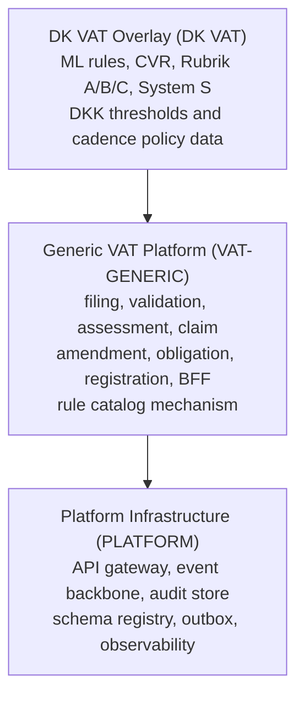

The Generic VAT layer defines the **shape** of VAT processing. The DK VAT overlay populates that shape with Danish legislation. To support a second jurisdiction, only a new overlay is added — the Generic VAT layer and Platform remain unchanged.

---

## 1. Design Scope

### Product-First Scope Boundary
Tax Core (SOLON TAX) is a **product-first fiscal core** — not a platform, toolbox, or reference implementation. Core tax semantics are non-optional. Non-tax enterprise domains (HR, CRM, general ledger, banking, non-tax case management) are external integrations, not in-scope capabilities. Partial adoption is supported through capability slices; national variation is governed through the extension governance model, not semantic forks.

### Authoritative External Integration Constraint
This design assumes a single external integration boundary: `System S`.
- `System S` handles registration APIs before Tax Core filing/assessment processing.
- `System S` handles taxpayer-accounting and collection-facing APIs after Tax Core claim and settlement outcomes.
- Tax Core does not integrate with any other external system in this scope.

### In Scope
- Portal BFF — taxpayer-facing facade translating portal actions into Tax Core API calls
- VAT registration and obligation management
- Taxpayer registration capture and synchronization with `System S` registration APIs
- VAT filing intake, canonical normalization, and schema validation
- Field and cross-field validation (including reverse-charge and deduction-right minimum fields)
- Deterministic rule evaluation (domestic VAT, reverse charge, exemptions, deductions)
- Assessment calculation and outcome determination (`payable`, `refund`, `zero`)
- **Preliminary assessment** lifecycle (issued on overdue, superseded by filed return)
- Amendment versioning and lineage
- Claim creation, outbox publication, and external dispatch
- System S accounting integration (`taxpayer-accounting/payment-events`, `taxpayer-accounting/payment-segments`)
- Append-only audit evidence across all stages
- Modern data stack (Kafka backbone, OpenAPI/AsyncAPI/CloudEvents, OpenTelemetry, Lakehouse audit plane)
- Return-level aggregates linked to line-level fact records for reproducibility
- DKK normalization and deterministic rounding policy
- ViDA Step 1-3 API/event contracts (`POST /vida/reports/ingest`, prefill and settlement flows)
- Capability-configuration operating rule for country and maturity-step rollout

### AI Boundary
AI capabilities are **assistive only** in this system. Deterministic policy engines (rule-engine-service, assessment-service) are the exclusive source of legally binding VAT decisions.
- Allowed: assistive triage, anomaly hints, explanation generation
- Not allowed: AI-issued legal assessments, penalties, or mutation of legal facts

### Scenarios Covered
S01-S34 per `architecture/traceability/scenario-to-architecture-traceability-matrix.md`. S24, S25, C14, C15, C20, C21, C22 require dedicated modules or manual/legal routing and remain out of scope for this baseline.

### Out of Scope
- Split-payment real-time collection (ViDA Step 4) and external debt-collection orchestration
- Legal dispute adjudication
- Taxpayer-facing UI (only BFF design is in scope — UI is a separate concern)
- Special schemes (brugtmoms, OSS/IOSS, momskompensation)
- Bankruptcy estate handling
- Non-tax enterprise domains (HR, CRM, general accounting)

---

## 2. Architecture Drawings

> Multi-page draw.io: `design/drawings/tax-core-vat.drawio`

### 2.1 System Context

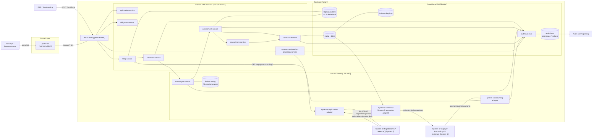

### 2.2 Three-Layer Architecture

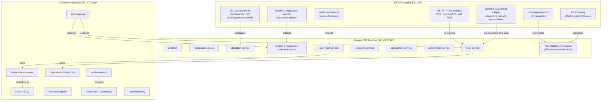

### 2.3 Portal BFF Integration

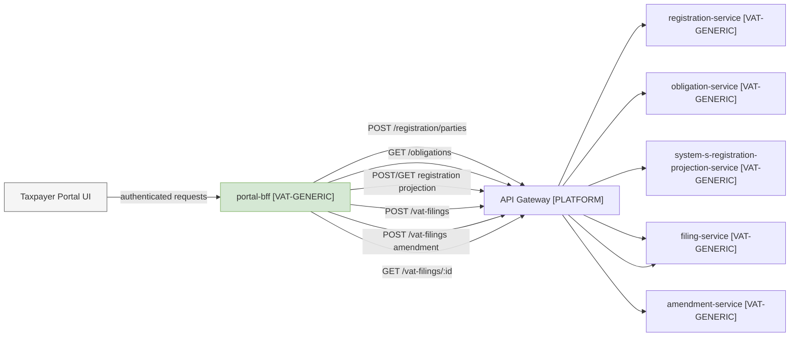

### 2.4 Bounded Context Flow

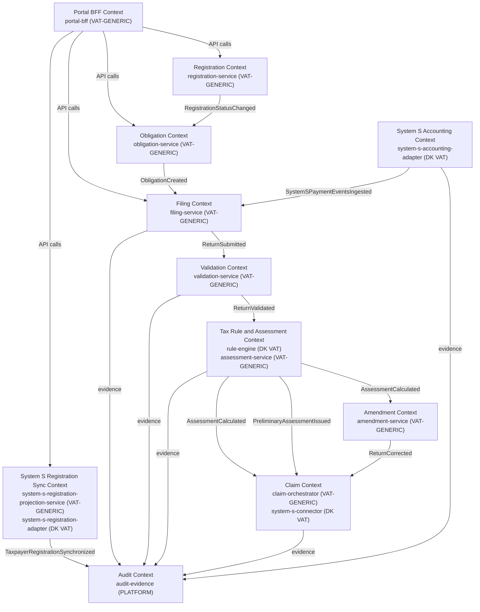

### 2.5 Modern Data Stack Planes

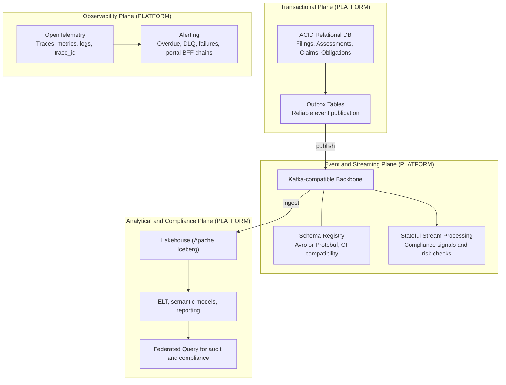

### 2.6 Happy-Path Sequence: Regular Filing → Claim Dispatch

```mermaid
sequenceDiagram
    actor User
    participant BFF as "portal-bff (VAT-GENERIC)"
    participant GW as "API Gateway (PLATFORM)"
    participant FS as "filing-service (VAT-GENERIC)"
    participant VS as "validation-service (VAT-GENERIC)"
    participant RE as "rule-engine (DK VAT)"
    participant AS as "assessment-service (VAT-GENERIC)"
    participant CO as "claim-orchestrator (VAT-GENERIC)"
    participant OBX as "Outbox (PLATFORM)"
    participant CC as "system-s-connector (DK VAT)"
    participant ECS as System S Claims
    participant AE as "audit-evidence (PLATFORM)"

    User->>BFF: submit filing (portal action)
    BFF->>GW: POST /vat-filings (OpenAPI 3.1, trace_id)
    GW->>FS: forward
    FS->>FS: normalize to DK VAT canonical schema
    FS->>AE: FilingSnapshot
    FS->>VS: validate(filing_id, trace_id)
    VS->>VS: field + cross-field checks [VAT-GENERIC logic + DK VAT schema]
    VS->>AE: ValidationEvidence
    VS-->>FS: ReturnValidated [CloudEvents]
    FS->>RE: evaluate(facts, rule_version_id) [DK VAT rules]
    RE->>RE: deterministic evaluation vs Rule Catalog
    RE->>AE: RuleEvaluationEvidence
    RE-->>AS: EvaluatedFacts [CloudEvents]
    AS->>AS: net_vat = output - input + adjustments; derive result_type
    AS->>AS: persist assessment_version (append-only)
    AS->>AE: AssessmentEvidence
    AS->>CO: AssessmentCalculated [CloudEvents]
    CO->>CO: build claim + idempotency key
    CO->>OBX: persist claim intent (transactional)
    CO->>AE: ClaimIntentEvidence
    OBX->>CC: dequeue (Kafka)
    CC->>ECS: POST /claims [DK VAT System S contract]
    ECS-->>CC: 200 OK / claim_ref
    CC->>CO: ClaimDispatched [CloudEvents]
    CO->>AE: DispatchOutcomeEvidence
    CO-->>FS: state to claim_created
    FS-->>GW: 201 {filing_id, trace_id, status}
    GW-->>BFF: 201
    BFF-->>User: filing confirmed
```

### 2.7 Error Path: Validation Block

```mermaid
sequenceDiagram
    actor User
    participant BFF as "portal-bff (VAT-GENERIC)"
    participant FS as "filing-service (VAT-GENERIC)"
    participant VS as "validation-service (VAT-GENERIC)"
    participant AE as "audit-evidence (PLATFORM)"

    User->>BFF: submit filing
    BFF->>FS: POST /vat-filings
    FS->>VS: validate(filing_id, trace_id)
    VS->>VS: blocking error detected
    VS->>AE: ValidationEvidence (blocked)
    VS-->>FS: ReturnValidated (blocked, errors[]) [CloudEvents]
    FS->>FS: status = validation_failed
    FS-->>BFF: 422 {errors[], trace_id}
    BFF-->>User: validation errors (UX-formatted)
    Note over FS: Pipeline halted; no rule evaluation or claim dispatch
```

### 2.8 Error Path: Dispatch Failure and Retry

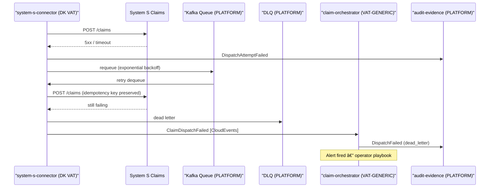

### 2.9 Amendment Flow

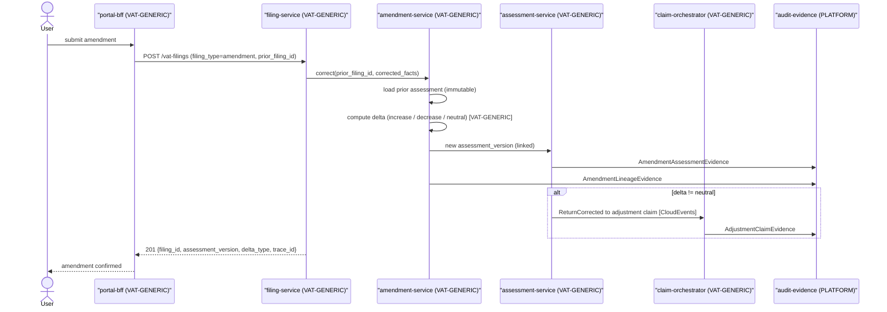

### 2.10 State Machines

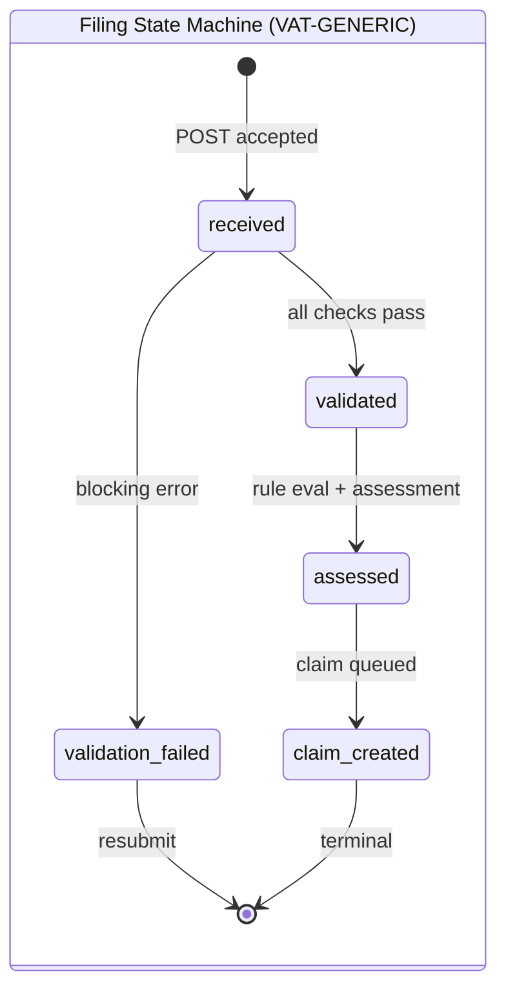

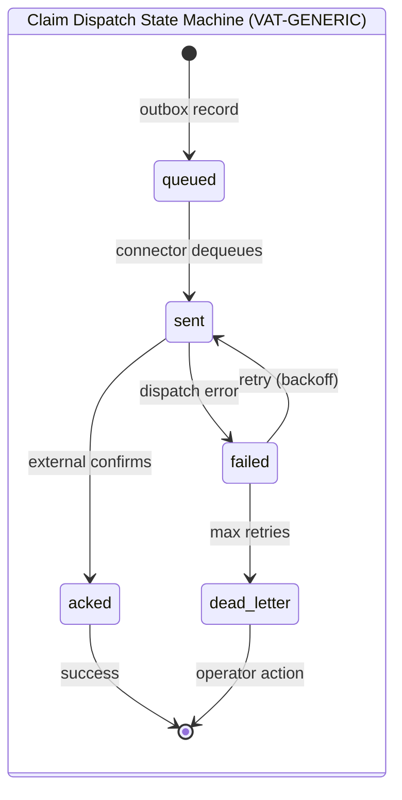

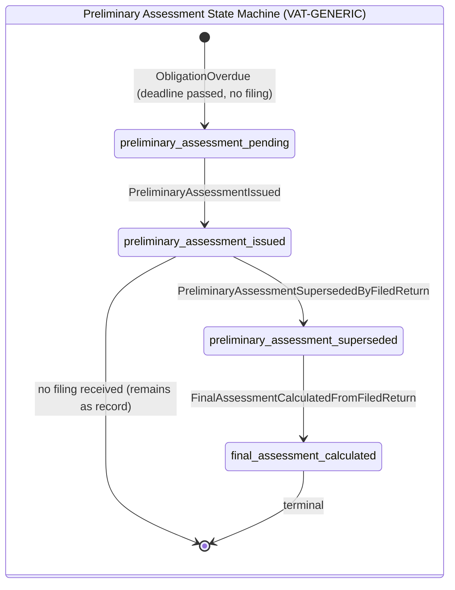

> Preliminary assessment records are **immutable** and never deleted. A final assessment references the superseded preliminary record via `supersedes_assessment_id`. The audit store keeps bidirectional linkage between preliminary and final outcomes.

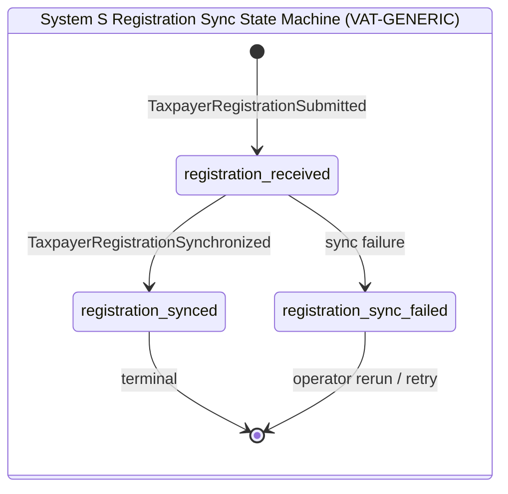

---

## 3. Building Blocks

### 3.1 Platform Layer `[PLATFORM]`

#### `API Gateway`
Routes authenticated requests to VAT-GENERIC services. Enforces RBAC at the entry point. Injects `trace_id` (OpenTelemetry). No VAT domain knowledge.
**Technology:** Kong Gateway OSS (Apache 2.0). Decision: ADR-010 (accepted). Documented fallback: Apache APISIX (Apache 2.0). (D-09)

#### `audit-evidence`
Append-only structured evidence writer and query API, keyed by `trace_id`. Written to by every service at every decision point. Feeds the Audit Store via Kafka. No domain knowledge — pure evidence persistence. (ADR-003)

Evidence schema:
- `trace_id`, `event_type`, `service_identity`, `actor`, `timestamp`, `input_summary_hash`, `decision_or_output_summary`, domain references

#### `Kafka backbone + DLQ`
Decoupled domain event distribution. All inter-service async communication flows through Kafka topics. DLQ captures failed deliveries. (ADR-007)
**Technology:** Apache Kafka on Strimzi operator (Kubernetes, Apache 2.0). Strimzi is CNCF Incubating; compatible with managed Kafka offerings where portability is preserved. (D-01)

#### `Schema Registry`
Manages Avro/Protobuf schemas for all events. CI/CD compatibility gates prevent breaking changes from reaching consumers. (ADR-006)
**Technology:** Apicurio Registry (Apache 2.0). Compatibility mode: `BACKWARD_TRANSITIVE`. One schema group per bounded context. (D-04)

#### `Outbox infrastructure`
Transactional outbox tables ensure claim intents are never lost on service restart. Relay publisher polls and forwards to Kafka. (ADR-004)
**Technology:** PostgreSQL transactional outbox table + application-level polling relay (v1). Debezium CDC connector (Apache 2.0) as v2 upgrade path. (D-08)

#### `Operational DB (ACID Relational)`
Stores filings, assessments, claims, obligations, rule catalog entries. Strong consistency for all decision writes. Strict schema migration discipline.
**Technology:** PostgreSQL 16+. Per-bounded-context schema isolation (`filing`, `assessment`, `claim`, `obligation`, `registration`, `rule_catalog`) within a shared cluster for v1. (D-07, D-02)

#### `Audit Store (Lakehouse / Iceberg)`
Apache Iceberg open table format on object storage. Immutable, queryable, partitioned by period. Receives evidence via Kafka ingestion. Isolated from operational service databases. (ADR-007, ADR-008)
**Technology:** Apache Iceberg (Apache 2.0) + MinIO object storage (Apache 2.0) + Trino query engine (Apache 2.0) + dbt Core ELT (Apache 2.0). (D-15)

#### `OpenTelemetry`
Traces, metrics, and logs across all services, including the portal BFF. `trace_id` correlates every request end-to-end from portal action to claim dispatch.
**Technology (backend):** Prometheus (Apache 2.0) for metrics + Grafana Tempo (Apache 2.0) for traces + Grafana Loki (Apache 2.0) for logs. All services export via OpenTelemetry SDK; all correlated by `trace_id`. (D-10)

---

### 3.2 Generic VAT Layer `[VAT-GENERIC]`

These services contain VAT lifecycle logic but are configurable for any jurisdiction. They have no hard-coded Danish rules, legal references, or System S-specific integrations.

#### `portal-bff`
**Responsibility:** Taxpayer-facing facade. Translates portal actions into Tax Core API calls. Composes UX-oriented responses. Does not own or execute tax domain logic.

| Concern | Detail |
|---|---|
| Accepts | Authenticated portal commands: register taxpayer, view obligations, submit filing, submit amendment, view filing status |
| Translates to | `POST /registration/parties`, `POST /registration/portal-users/quick-create`, `GET /obligations`, `POST /vat-filings`, `GET /vat-filings/{id}` |
| Does NOT | Execute tax calculations, validate legal rules, or hold tax domain state |
| Returns | UX-composed responses (aggregating Tax Core API responses) |
| Standards | OpenAPI 3.1 contract to API Gateway; `trace_id` propagated from portal entry point |
| API coverage | All portal workflows must be 100% achievable via public Tax Core APIs (API coverage rule) |

#### `registration-service`
**Responsibility:** Taxpayer registration lifecycle. Accepts portal registration payloads, validates required registration attributes, and synchronizes taxpayer identity to System S registration APIs before activating internal filing obligations.

| Concern | Detail |
|---|---|
| Accepts | `POST /registration/parties`, `PUT /registration/parties/{id}`, registration updates from System S |
| Owns | Registration records (`taxpayer_id`, `status`, `effective_date`, `system_s_party_id`, `additional_info`) |
| Emits | `RegistrationStatusChanged`, `TaxpayerRegistrationSubmitted`, `TaxpayerRegistrationSynchronized` [CloudEvents] |
| Triggers | Obligation lifecycle when registration becomes active |

#### `obligation-service`
**Responsibility:** Periodic VAT filing obligation management. Manages obligation lifecycle (`due` → `submitted` → `overdue`). Cadence rules (half-yearly / quarterly / monthly) are loaded from an effective-dated policy table — not hard-coded.

| Concern | Detail |
|---|---|
| Accepts | `RegistrationStatusChanged`, `GET /obligations` |
| Owns | Obligation records (`obligation_id`, `period`, `due_date`, `cadence`, `status`) |
| Emits | `ObligationCreated`, `ObligationOverdue`, `PreliminaryAssessmentTriggered` [CloudEvents] |
| Configurable | DK VAT cadence thresholds and due-date rules injected as policy data [DK VAT] |

#### `system-s-registration-projection-service`
**Responsibility:** Registration projection and sync orchestration service. Maintains the internal projection of what has been accepted by System S registration endpoints and coordinates resync/retry operations.

| Concern | Detail |
|---|---|
| Accepts | `POST /registration-projections`, `GET /registration-projections/{taxpayer_id}`, `POST /registration-projections/{taxpayer_id}/resync` |
| Owns | Registration sync projection records (`projection_id`, `taxpayer_id`, `system_s_party_id`, `status`) |
| States | `registration_received` -> `registration_synced` / `registration_sync_failed` |
| Emits | `TaxpayerRegistrationSubmitted`, `TaxpayerRegistrationSynchronized`, `TaxpayerRegistrationSyncFailed` [CloudEvents] |
| Delegates | External registration API dispatch to `system-s-registration-adapter` [DK VAT] |

#### `filing-service`
**Responsibility:** Canonical intake, normalization, state machine ownership, response contract.

| Concern | Detail |
|---|---|
| Accepts | `POST /vat-filings`, `GET /vat-filings/{id}` |
| Normalizes | Source fields → canonical VAT filing schema (DK VAT schema applied as overlay) |
| Persists | Immutable filing snapshot on first write |
| Orchestrates | → validation-service → rule-engine → assessment-service |
| State machine | `received` → `validation_failed` / `validated` → `assessed` → `claim_created` |
| Emits | `ReturnSubmitted` [CloudEvents] |
| Standards | OpenAPI 3.1 contract; `trace_id` injected |

#### `validation-service`
**Responsibility:** Configurable field and cross-field validation gate. Blocking errors halt the pipeline; warnings continue with flags.

| Concern | Detail |
|---|---|
| Logic | Schema conformance, period integrity, amount constraints, type consistency [VAT-GENERIC] |
| DK overlay | Rubrik A/B/C cross-field checks, CVR format, zero-filing constraint [DK VAT config] |
| Severity | `blocking_error` halts; `warning` flags and continues |
| Emits | `ReturnValidated` (passed/blocked, errors[], warnings[]) [CloudEvents] |

#### `assessment-service`
**Responsibility:** Net VAT calculation using deterministic staged derivation, result derivation, append-only assessment versioning, and preliminary assessment lifecycle.

| Concern | Detail |
|---|---|
| Input | EvaluatedFacts from rule engine |
| Staged derivation | stage_1: gross output VAT; stage_2: total deductible input VAT; stage_3: pre-adjustment net; stage_4: final net VAT (with adjustments) |
| Derives | `result_type`: `payable` (net > 0), `refund` (net < 0), `zero` (net = 0) |
| Persists | Append-only `assessment_version` (never overwrites); links to prior via `prior_assessment_id` |
| Preliminary | Issues `PreliminaryAssessmentIssued` when triggered by overdue obligation; superseded by `PreliminaryAssessmentSupersededByFiledReturn` when return is filed |
| Rounding | Applies `rounding_policy_version_id` at finalization; stores pre-round and rounded amounts |
| Emits | `VatAssessmentCalculated`, `PreliminaryAssessmentIssued`, `PreliminaryAssessmentSupersededByFiledReturn`, `FinalAssessmentCalculatedFromFiledReturn` [CloudEvents] |

#### `amendment-service`
**Responsibility:** VAT amendment versioning, delta computation, immutable lineage. (ADR-005)

| Concern | Detail |
|---|---|
| Input | `prior_filing_id` + amended facts |
| Computes | Delta: `increase` / `decrease` / `neutral` [VAT-GENERIC logic] |
| Creates | New `assessment_version` with `prior_version_id` pointer |
| Emits | `ReturnCorrected` [CloudEvents] |
| DK overlay | Age gate (>3 years) → Manual/legal routing [DK VAT config] |
| Constraint | Never mutates prior records (ADR-005) |

#### `claim-orchestrator`
**Responsibility:** Claim intent creation, transactional outbox publication, dispatch status lifecycle. (ADR-004)

| Concern | Detail |
|---|---|
| Input | `AssessmentCalculated` or `ReturnCorrected` events |
| Builds | Generic claim payload (domain fields injected via overlay) |
| Idempotency key | `taxpayer_id + tax_period_end + assessment_version` |
| Publishes | Claim intent to outbox transactionally with assessment write |
| Tracks | `queued` → `sent` → `acked` / `failed` → `dead_letter` |

---

### 3.3 Danish VAT Overlay `[DK VAT]`

These components and configuration artifacts contain Danish VAT legislation. They are the only layer that changes when Danish law changes.

#### `rule-engine-service` [DK VAT]
**Responsibility:** Pure, stateless, deterministic evaluation of Danish VAT legal rules against the DK Rule Catalog.

| Concern | Detail |
|---|---|
| Input | DK VAT filing facts + `rule_version_id` |
| Evaluates | 8 DK VAT rule packs (see below) |
| Output | EvaluatedFacts, RuleOutcomes[] with ML §§ references |
| Constraint | Pure function — no side effects, no DB writes |
| Determinism | Same inputs + same version → identical output (legal replay guarantee) |

**DK VAT Rule Pack execution order:**
1. `filing_validation` — cadence/obligation alignment
2. `domestic_vat` — salgsmoms/købsmoms baseline
3. `reverse_charge_eu_goods` — Rubrik A goods (ML §46 EU)
4. `reverse_charge_eu_services` — Rubrik A services (ML §46 EU)
5. `reverse_charge_dk` — domestic categories (ML §46 DK)
6. `exemption` — ML §13 exempt activity
7. `deduction_rights` — full / none / partial allocation; resolves `TaxpayerDeductionPolicy` by legal time; pins `deduction_policy_version_id` on line-level outcomes (OQ-05 resolved, D-16)
8. `cross_border` — Rubrik B/C reporting

#### `Rule Catalog` [DK VAT]
Effective-dated store of Danish VAT legal rules. Each record: `rule_id`, `rule_pack`, `legal_reference` (ML §§), `effective_from`, `effective_to` (nullable/open-ended), `applies_when`, `expression`, `severity`. (ADR-002)

Governance: new rule requires `legal_reference` and `effective_from`; `effective_to` is optional and defaults to open-ended "until further notice". Regression pass is required. Activation is data-only.

#### `system-s-connector` [DK VAT adapter]
**Responsibility:** Queue consumer adapting generic claim intents to the System S External Claims System API.

| Concern | Detail |
|---|---|
| Adapts | Generic claim payload → System S POST /claims format |
| Currency | Enforces `DKK` denomination and rounding |
| Auth | None required (trusted internal network between Tax Core and System S) |
| Retry | Exponential backoff, max 5 attempts |
| Anti-corruption | Wraps System S API behind internal interface — System S contract changes are isolated here |

#### `system-s-registration-adapter` [DK VAT adapter]
**Responsibility:** Adapter between `system-s-registration-projection-service` and external System S registration APIs. Handles registration contract translation and response normalization.

| Concern | Detail |
|---|---|
| Receives | Registration sync request from `system-s-registration-projection-service` |
| Adapts | Internal taxpayer registration payload -> `registration/parties` and related System S registration contracts |
| Emits | `TaxpayerRegistrationSynchronized` on success; `TaxpayerRegistrationSyncFailed` on failure |
| Audit | Writes registration sync evidence to `audit-evidence` |

#### `system-s-accounting-adapter` [DK VAT integration]
**Responsibility:** Integrates with System S taxpayer-accounting APIs after filing and assessment outcomes. Retrieves payment events/segments and maps them into Tax Core accounting evidence for settlement and reconciliation.

| Concern | Detail |
|---|---|
| API interaction | `GET /taxpayer-accounting/payment-events`, `GET /taxpayer-accounting/payment-segments` |
| Key query key | `segmentId` for event/segment correlation |
| Events emitted | `SystemSPaymentEventsIngested`, `SystemSPaymentSegmentsIngested`, `SystemSAccountingIntegrationFailed` |
| Audit evidence | `segment_id`, payload hash, fetch timestamp, reconciliation outcome linked to `trace_id` |
| Anti-corruption | Wraps System S taxpayer-accounting API changes behind internal contracts |

#### DK VAT Canonical Filing Schema [DK VAT configuration on `filing-service`]

**Generic header fields (VAT-GENERIC):**
`filing_id`, `taxpayer_id`, `tax_period_start`, `tax_period_end`, `filing_type` (regular/zero/amendment), `submission_timestamp`, `source_channel`, `rule_version_id`, `status`, `trace_id`

**DK VAT monetary fields:**
`output_vat_amount` (salgsmoms), `input_vat_deductible_amount` (købsmoms), `vat_on_goods_purchases_abroad_amount`, `vat_on_services_purchases_abroad_amount`, `adjustments_amount`

**DK VAT international value boxes:**
`rubrik_a_goods_eu_purchase_value`, `rubrik_a_services_eu_purchase_value`, `rubrik_b_goods_eu_sale_value_reportable`, `rubrik_b_goods_eu_sale_value_non_reportable`, `rubrik_b_services_eu_sale_value`, `rubrik_c_other_vat_exempt_supplies_value`, `reimbursement_oil_and_bottled_gas_duty_amount`, `reimbursement_electricity_duty_amount`

**DK VAT identifiers:**
`cvr_number` (8-digit Danish CVR), `contact_reference`

#### DK VAT Obligation Cadence Policy [DK VAT configuration on `obligation-service`]
- `half_yearly`: default (< DKK 5M turnover)
- `quarterly`: ≥ DKK 5M or opt-in
- `monthly`: ≥ DKK 50M or opt-in
- Registration threshold: DKK 50,000 taxable turnover (ML basis)
- Amendment age gate: > 3 years → Manual/legal routing

---

## 4. API and Event Contracts

### 4.1 API Coverage Rule (from `architecture/designer/02`)
All portal workflows — registration, obligation viewing, filing submission, amendment submission, status retrieval — must be fully supported by public Tax Core APIs. The portal-bff must achieve 100% functional coverage via these APIs without direct database access or bypass.

### 4.1.1 Unified API Explorer
- Consolidated API reference page: `build/openapi/index.html`
- Purpose: single-page inspection of all service OpenAPI contracts during design, implementation, and test alignment.
- Local offline-capable usage:
  - run static server from `build/`
  - open `http://localhost:8080/openapi/index.html`

### 4.2 POST /vat-filings (OpenAPI 3.1) — DK VAT schema

**Request:**
```json
{
  "cvr_number": "12345678",
  "tax_period_start": "2024-01-01",
  "tax_period_end": "2024-06-30",
  "filing_type": "regular",
  "source_channel": "portal",
  "output_vat_amount": 150000.00,
  "input_vat_deductible_amount": 80000.00,
  "vat_on_goods_purchases_abroad_amount": 5000.00,
  "vat_on_services_purchases_abroad_amount": 2000.00,
  "adjustments_amount": 0.00,
  "rubrik_a_goods_eu_purchase_value": 20000.00,
  "rubrik_a_services_eu_purchase_value": 8000.00,
  "rubrik_b_goods_eu_sale_value_reportable": 0.00,
  "rubrik_b_goods_eu_sale_value_non_reportable": 0.00,
  "rubrik_b_services_eu_sale_value": 0.00,
  "rubrik_c_other_vat_exempt_supplies_value": 0.00,
  "reimbursement_oil_and_bottled_gas_duty_amount": 0.00,
  "reimbursement_electricity_duty_amount": 0.00,
  "contact_reference": "ref-2024-001"
}
```

### 4.3 Duplicate Filing Submission Contract
- Duplicate `POST /vat-filings` with identical semantic payload for the same `filing_id` returns `200` idempotent replay.
- Duplicate `POST /vat-filings` with conflicting semantic payload for the same `filing_id` returns `409`.
- Duplicate replay is side-effect safe: no new `VatReturnSubmitted`, `VatAssessmentCalculated`, or `ClaimCreated` emission.

### 4.4 Assessment Retrieval Contract
- Primary operational lookup is `GET /assessments/by-filing/{filing_id}`.
- Audit/deep-link lookup remains `GET /assessments/{assessment_id}`.
- `POST /assessments` returns `assessment_id` and `filing_id` to support both retrieval modes.

**201 Created (assessment-service response envelope):**
```json
{
  "trace_id": "trc_01J...",
  "assessment_id": "asm_01J...",
  "filing_id": "fil_01J...",
  "assessment": {
    "assessment_id": "asm_01J...",
    "filing_id": "fil_01J...",
    "result_type": "payable",
    "claim_amount": 77000.00,
    "stage4_net_vat": 77000.00
  }
}
```

### 4.4.1 Contract Delta Log (2026-02-24)

| Contract area | OpenAPI contract (target) | Runtime behavior (current) | Delta classification | Freeze requirement |
|---|---|---|---|---|
| `POST /assessments` response | Returns `trace_id`, top-level `assessment_id`, top-level `filing_id`, and `assessment` payload | Returns `trace_id` and `assessment` only | Contract mismatch | Runtime must return top-level `assessment_id` and `filing_id` before implementation freeze |
| `GET /assessments/by-filing/{filing_id}` | Primary operational retrieval endpoint | Not implemented in assessment-service runtime yet | Missing endpoint | Runtime route and tests required before freeze |
| `POST /claims` request shape | Required: `taxpayer_id`, `filing_id`, `tax_period_end`, `assessment_version`, `assessment` (with required assessment summary fields) | Runtime consumes these fields; validation semantics are not yet consistently enforced at edge | Validation-policy gap | Add/confirm 422 validation behavior and required-field enforcement before freeze |
| `POST /claims` idempotency semantics | `201` create, `200` idempotent replay, `409` semantic conflict | Runtime already returns `201`/`200`/`409` with no side-effect replay | Aligned | Keep behavior and prove via automated tests |

### 4.4.2 Status-Code Policy (Idempotency and Conflict)

- `POST /claims`
  - `201 Created`: new claim intent persisted and outbox publish scheduled.
  - `200 OK`: idempotent replay for same key and semantic payload, no new side effects.
  - `409 Conflict`: same key with semantic payload conflict, no side effects.
  - `422 Unprocessable Entity`: required fields/contract shape violation.
- `POST /assessments`
  - `201 Created`: assessment persisted and retrieval identifiers returned.
  - `422 Unprocessable Entity`: required fields/contract shape violation.

**422 Unprocessable (VAT-GENERIC error envelope):**
```json
{
  "trace_id": "trc_01J...",
  "status": "validation_failed",
  "errors": [
    {
      "code": "VAL_CVR_INVALID",
      "field": "cvr_number",
      "message": "CVR must be an 8-digit numeric value",
      "severity": "blocking_error"
    }
  ],
  "warnings": []
}
```

### 4.5 Portal BFF API Surface (VAT-GENERIC)

| Endpoint | Backing Tax Core API | Notes |
|---|---|---|
| `POST /portal/registrations` | `POST /registration/parties` | Creates taxpayer party (no `additionalInfo` submitted by this solution) |
| `POST /portal/registrations/{id}/users` | `POST /registration/portal-users/quick-create` | Creates portal user linked to taxpayer |
| `PUT /portal/registrations/{id}` | `PUT /registration/parties/{id}` | Updates registration details |
| `GET /portal/obligations` | `GET /obligations?cvr=...` | Filters and composes for UX |
| `POST /portal/filings` | `POST /vat-filings` | Adds `source_channel=portal` |
| `POST /portal/amendments` | `POST /vat-filings` (filing_type=amendment) | Ensures prior reference |
| `GET /portal/filings/{id}` | `GET /vat-filings/{id}` | Direct pass-through with UX shaping |

### 4.6 System S Integration Contracts (authoritative subset)

| Integration area | System S endpoint | Usage in this solution | Contract notes |
|---|---|---|---|
| Registration create | `POST /registration/parties` | Portal taxpayer registration submission and sync | `additionalInfo` omitted by this solution |
| Registration read/update | `GET /registration/parties/{id}`, `PUT /registration/parties/{id}` | Registration status projection and resync | Preserve System S `id` as `system_s_party_id` |
| Registration search | `GET /registration/parties` | Duplicate checks and projection rebuild | Query uses effective-dated filters where needed |
| Portal user create | `POST /registration/portal-users/quick-create` | Self-service account bootstrapping | `keycloakUserExistsSW` treated as deprecated |
| Party type metadata | `GET /registration/party-types/{code}` | Optional metadata lookup | `validAdditionalInfoTypes` not used by this solution |
| Accounting events | `GET /taxpayer-accounting/payment-events` | Settlement/reconciliation ingestion | Support `segmentId` filtering/correlation |
| Accounting segments | `GET /taxpayer-accounting/payment-segments` | Segment-level status reconciliation | Support `segmentId` filtering/correlation |

#### 4.6.1 Party-Type Additional Information Policy

For this solution scope, party-type `additionalInfo` is not used.

Policy:
- Portal-bff does not submit `additionalInfo` for `POST/PUT /registration/parties*`.
- registration-service does not enforce `validAdditionalInfoTypes` rules.
- system-s-registration-adapter forwards registration without `additionalInfo` unless mandated by a future change request.
- Any future use of `additionalInfo` requires a new design decision and test expansion.

### 4.7 Outbound POST /claims to System S [DK VAT adapter]

```json
{
  "claim_id": "clm_01J...",
  "taxpayer_id": "12345678",
  "period_start": "2024-01-01",
  "period_end": "2024-06-30",
  "result_type": "payable",
  "amount": 77000.00,
  "currency": "DKK",
  "filing_reference": "fil_01J...",
  "rule_version_id": "rv_2024H1",
  "calculation_trace_id": "trc_01J...",
  "created_at": "2024-07-05T10:32:15Z",
  "idempotency_key": "12345678_2024-06-30_v1"
}
```

### 4.8 ViDA Step 1-3 API Contracts (configuration-driven)

| ViDA Step | Endpoint | Purpose | Guardrail |
|---|---|---|---|
| Step 1 | `POST /vida/reports/ingest` | Receive recurring ViDA eReports for verification/classification | Ingested data is non-binding until verified/classified |
| Step 1 | `POST /risk/high-risk/review-requests` | Create taxpayer-facing high-risk review request | Explainability payload required (`risk_reason_codes[]`) |
| Step 1 | `POST /risk/high-risk/{review_id}/confirm` | Taxpayer confirms unchanged filing | Confirmed unchanged high-risk routes to System S human-task-management event |
| Step 2 | `POST /prefill/prepare` | Build prefill package for open obligation period | Prefill mode controlled by policy (`full_b2b`, `partial_b2c`) |
| Step 2 | `POST /prefill/{prefill_id}/reclassifications` | Submit source-report reclassifications | `prefill_edit_policy=reclassification_only` |
| Step 3 | `GET /vat-balance/{taxpayer_id}` | Read ongoing VAT balance projection | Balance is projection/evidence-backed, not legal override |
| Step 3 | `POST /settlements/requests` | Submit taxpayer-initiated settlement request | Must link to active balance snapshot and policy context |

### 4.9 Domain Events (CloudEvents envelope, Avro/Protobuf, Schema Registry)

| Event | Layer | Publisher | Consumers | Key Fields |
|---|---|---|---|---|
| `VatRegistrationStatusChanged` | VAT-GENERIC | registration-service | obligation-service, audit | `taxpayer_id`, `status`, `effective_date` |
| `FilingObligationCreated` | VAT-GENERIC | obligation-service | filing-service, audit | `taxpayer_id`, `period`, `due_date`, `cadence` |
| `ObligationOverdue` | VAT-GENERIC | obligation-service | assessment-service, audit | `taxpayer_id`, `obligation_id`, `period_end` |
| `TaxpayerRegistrationSubmitted` | VAT-GENERIC | registration-service | system-s-registration-projection-service, audit | `taxpayer_id`, `registration_id`, `trace_id` |
| `TaxpayerRegistrationSynchronized` | DK VAT | system-s-registration-adapter | registration-service, audit | `taxpayer_id`, `system_s_party_id`, `synced_at` |
| `TaxpayerRegistrationSyncFailed` | DK VAT | system-s-registration-adapter | registration-service, audit, operations | `taxpayer_id`, `error`, `attempt` |
| `VatReturnSubmitted` | VAT-GENERIC | filing-service | validation-service, audit | `filing_id`, `trace_id`, `filing_type` |
| `VatReturnValidated` | VAT-GENERIC | validation-service | filing-service, audit | `filing_id`, `passed`, `errors[]`, `warnings[]` |
| `VatAssessmentCalculated` | VAT-GENERIC | assessment-service | claim-orchestrator, audit | `filing_id`, `assessment_version`, `result_type`, `net_vat_amount`, `rounding_policy_version_id` |
| `PreliminaryAssessmentTriggered` | VAT-GENERIC | obligation-service | assessment-service, audit | `taxpayer_id`, `obligation_id`, `period_end` |
| `PreliminaryAssessmentIssued` | VAT-GENERIC | assessment-service | claim-orchestrator, audit | `assessment_id`, `taxpayer_id`, `period_end` |
| `PreliminaryAssessmentSupersededByFiledReturn` | VAT-GENERIC | assessment-service | audit | `assessment_id`, `supersedes_assessment_id`, `filing_id` |
| `FinalAssessmentCalculatedFromFiledReturn` | VAT-GENERIC | assessment-service | claim-orchestrator, audit | `assessment_id`, `filing_id`, `supersedes_assessment_id` |
| `VatReturnCorrected` | VAT-GENERIC | amendment-service | claim-orchestrator, audit | `filing_id`, `prior_version`, `new_version`, `delta_type` |
| `SystemSPaymentEventsIngested` | DK VAT | system-s-accounting-adapter | settlement-trigger-service, audit | `taxpayer_id`, `segment_id`, `event_count` |
| `SystemSPaymentSegmentsIngested` | DK VAT | system-s-accounting-adapter | settlement-trigger-service, audit | `taxpayer_id`, `segment_id`, `segment_status` |
| `SystemSAccountingIntegrationFailed` | DK VAT | system-s-accounting-adapter | audit, operations | `segment_id`, `error`, `attempt` |
| `ClaimCreated` | VAT-GENERIC | claim-orchestrator | audit | `claim_id`, `filing_id`, `idempotency_key` |
| `ClaimDispatched` | DK VAT | system-s-connector | claim-orchestrator, audit | `claim_id`, `claim_ref`, `dispatched_at` |
| `ClaimDispatchFailed` | DK VAT | system-s-connector | claim-orchestrator, audit | `claim_id`, `attempt`, `error`, `dead_letter: bool` |
| `VidaEReportReceived` | VAT-GENERIC | vida-ingestion-service | vida-verification-classification-service, audit | `vida_report_id`, `taxpayer_id`, `period`, `source_profile` |
| `HighRiskFlagRaised` | VAT-GENERIC | risk-profile-refresh-service | portal-bff, audit | `taxpayer_id`, `risk_score`, `risk_reason_codes[]` |
| `TaxpayerReviewRequested` | VAT-GENERIC | risk-profile-refresh-service | portal-bff, audit | `review_id`, `taxpayer_id`, `recommended_action` |
| `TaxpayerAmendRequested` | VAT-GENERIC | portal-bff | filing-service, audit | `review_id`, `taxpayer_id`, `filing_id` |
| `TaxpayerConfirmSubmitted` | VAT-GENERIC | portal-bff | risk-profile-refresh-service, audit | `review_id`, `taxpayer_id`, `filing_id` |
| `HighRiskCaseTaskCreated` | DK VAT | risk-profile-refresh-service | System S human-task-management integration, audit | `review_id`, `taxpayer_id`, `task_ref` |
| `PrefillPrepared` | VAT-GENERIC | prefill-computation-service | portal-bff, filing-service, audit | `prefill_id`, `taxpayer_id`, `prefill_mode` |
| `PrefillReclassified` | VAT-GENERIC | prefill-computation-service | filing-service, audit | `prefill_id`, `changes[]`, `actor` |
| `VatBalanceUpdated` | VAT-GENERIC | vat-balance-service | portal-bff, settlement-trigger-service, audit | `taxpayer_id`, `period`, `vat_balance_amount` |
| `SettlementRequested` | VAT-GENERIC | portal-bff | settlement-trigger-service, audit | `request_id`, `taxpayer_id`, `amount` |
| `SystemSettlementTriggered` | VAT-GENERIC | settlement-trigger-service | settlement-flow, audit | `trigger_id`, `taxpayer_id`, `policy_id` |
| `SystemSettlementObligationCreated` | VAT-GENERIC | settlement-trigger-service | obligation-service, audit | `obligation_id`, `taxpayer_id`, `due_date` |
| `SystemSettlementNoticeIssued` | VAT-GENERIC | settlement-trigger-service | portal-bff, audit | `notice_id`, `taxpayer_id`, `trigger_id` |
| `PaymentPlanEstablished` | DK VAT | settlement-flow | System S taxpayer-accounting integration, audit | `plan_id`, `taxpayer_id`, `instalment_schedule` |
| `PaymentPlanInstalmentMissed` | DK VAT | settlement-flow | System S taxpayer-accounting integration, audit | `plan_id`, `instalment_no`, `missed_at` |
| `PaymentPlanTerminated` | DK VAT | settlement-flow | System S taxpayer-accounting integration, audit | `plan_id`, `terminated_at`, `reason_code` |

---

## 5. Data Model and State Transitions

### 5.1 Entities by Layer

**VAT-GENERIC schema (layer-owned fields)**

**Filing** `[VAT-GENERIC with DK VAT overlay fields]`
- `filing_id` (PK)
- `taxpayer_id` (generic identifier)
- `tax_period_start`, `tax_period_end`
- `filing_type` (`regular | zero | amendment`)
- `source_channel`
- `submission_timestamp`
- `rule_version_id`
- `status`
- `trace_id`
DK VAT overlay fields:
- `cvr_number` (DK VAT, 8-digit CVR)
- `output_vat_amount` (DK VAT, salgsmoms)
- `input_vat_deductible_amount` (DK VAT, kobsmoms)
- `vat_on_goods_purchases_abroad_amount` (DK VAT)
- `vat_on_services_purchases_abroad_amount` (DK VAT)
- `adjustments_amount` (DK VAT)
- `rubrik_a_goods_eu_purchase_value` (DK VAT)
- `rubrik_a_services_eu_purchase_value` (DK VAT)
- `rubrik_b_goods_eu_sale_value_reportable` (DK VAT)
- `rubrik_b_goods_eu_sale_value_non_reportable` (DK VAT)
- `rubrik_b_services_eu_sale_value` (DK VAT)
- `rubrik_c_other_vat_exempt_supplies_value` (DK VAT)
- `reimbursement_oil_and_bottled_gas_duty_amount` (DK VAT)
- `reimbursement_electricity_duty_amount` (DK VAT)
- `contact_reference` (DK VAT)

**Assessment (append-only)** `[VAT-GENERIC]`
- `assessment_id` (PK)
- `filing_id` (FK, null for preliminary)
- `assessment_version`
- `assessment_type` (`regular | preliminary | amendment`)
- `prior_assessment_id` (FK, null for original)
- `supersedes_assessment_id` (FK, null unless supersedes preliminary)
- `stage_1_gross_output_vat_amount`
- `stage_2_total_deductible_input_vat_amount`
- `stage_3_pre_adjustment_net_vat_amount`
- `stage_4_net_vat_amount` (final net, basis for `result_type`)
- `result_type` (`payable | refund | zero`)
- `claim_amount_pre_round`
- `claim_amount` (rounded)
- `rounding_policy_version_id` (DK VAT)
- `rule_version_id`
- `calculation_trace_id`
- `delta_type` (`null | increase | decrease | neutral`)

**LineFact (line-level fact store)** `[VAT-GENERIC]`
- `line_fact_id` (PK)
- `filing_id` (FK)
- `calculation_trace_id`
- `rule_version_id`
- `source_document_ref`
- `supply_type`
- `counterparty_country`
- `counterparty_vat_id`
- `place_of_supply_country`
- `reverse_charge_applied` (bool)
- `reverse_charge_reason_code`
- `eu_transaction_category`
- `deduction_right_type`
- `deduction_percentage`
- `deduction_basis_reference`
- `allocation_method_id`
- `deduction_policy_version_id` (FK, references `TaxpayerDeductionPolicy`)

**Claim** `[VAT-GENERIC + DK VAT currency rule]`
- `claim_id` (PK)
- `assessment_id`, `filing_id` (FK)
- `taxpayer_id`, `period_start`, `period_end`
- `result_type`, `amount`
- `currency` (DK VAT: always `DKK`)
- `rule_version_id`
- `calculation_trace_id`
- `rounding_policy_version_id` (DK VAT)
- `idempotency_key`
- `status` (`queued | sent | acked | failed | dead_letter`)
- `dispatch_attempts`, timestamps

**Obligation** `[VAT-GENERIC service + DK VAT cadence data]`
- `obligation_id` (PK)
- `taxpayer_id`, `cvr_number`
- `period_start`, `period_end`, `due_date`
- `cadence` (`monthly | quarterly | half_yearly | annual`) (DK VAT data)
- `return_type_expected`
- `status` (`due | submitted | overdue`)

**RegistrationSyncRecord** `[VAT-GENERIC service + DK VAT registration adapter]`
- `projection_id` (PK)
- `taxpayer_id`, `cvr_number`, `system_s_party_id`
- `submitted_at`, `synced_at`
- `status` (`registration_received | registration_synced | registration_sync_failed`)
- `last_error_code`, `last_error_message`

**Rule** `[DK VAT]`
- `rule_id` (PK)
- `rule_pack`
- `legal_reference` (ML sections)
- `effective_from`, `effective_to`
- `applies_when`, `expression`
- `severity`

### 5.2 State Machines - see Section 2.10

### 5.3 Return-Level vs Line-Level Data Boundary

The filing data model separates return-level aggregates from line-level transaction facts.

| Store | Contents | Linkage |
|---|---|---|
| **Return-level** | Canonical filing aggregates and staged derived totals (stage_1 through stage_4) | `filing_id` |
| **Line-level fact store** | Reverse-charge, exemption, deduction-right, and place-of-supply facts per line | `filing_id`, `line_fact_id`, `calculation_trace_id`, `rule_version_id`, `source_document_ref` |

**Reproducibility rule:** Return-level aggregates and deductible totals must be reproducible from linked line-level facts. Any audit query that reconstructs a return must be able to derive identical stage totals from the line-fact store records.

### 5.4 DKK Normalization and Rounding Policy

Ownership: Tax Core architecture and rule governance (not portal-bff).

| Step | Responsibility |
|---|---|
| Normalize monetary inputs to `DKK` | `filing-service` at canonical normalization |
| High-precision decimal computation | `rule-engine-service` and `assessment-service` |
| Round output/claim amounts at finalization | `assessment-service`, using `rounding_policy_version_id` |
| Audit persistence | Store `claim_amount_pre_round`, `claim_amount` (rounded), and `rounding_policy_version_id` for replay and legal traceability |

### Rounding Policy Entity (D-06)

Rounding policy is versioned per jurisdiction + effective date. One active policy per jurisdiction at any time.

| Field | Type | Description |
|---|---|---|
| `rounding_policy_version_id` | UUID PK | Immutable version identifier pinned to each assessment |
| `jurisdiction_code` | string | e.g. `DK` |
| `effective_from` | date | Policy start date |
| `effective_to` | date \| null | null = open-ended (current active policy) |
| `rounding_mode` | enum | `HALF_UP` \| `HALF_EVEN` |
| `precision_scale` | int | Decimal places for final rounded amounts |

Assessment records store `claim_amount_pre_round` (high-precision) and `claim_amount` (rounded) alongside `rounding_policy_version_id`, enabling deterministic replay and legal audit traceability.

### Taxpayer Deduction Policy Entity (D-16)

Danish mixed-use deduction (ML SS38) requires a stable deduction policy source for rule evaluation and audit traceability.

v1 decision:
- Use effective-dated `TaxpayerDeductionPolicy` per taxpayer.
- Rule engine resolves and pins `deduction_policy_version_id` at line evaluation time.
- Preliminary per-period deduction application is in scope.
- Annual correction (`aarsregulering`, ML SS38 stk. 2) is modeled in data and event contract, but operational batch execution is deferred to a later phase.

| Field | Type | Description |
|---|---|---|
| `deduction_policy_version_id` | UUID PK | Immutable version identifier pinned to each line-level deduction outcome |
| `taxpayer_id` | string | Taxpayer this policy applies to |
| `effective_from` | date | Policy start date |
| `effective_to` | date \| null | null = open-ended (current active policy) |
| `deduction_right_type` | enum | `full` \| `none` \| `partial` |
| `deduction_percentage` | decimal | 0-100; nullable for `full` and `none` |
| `allocation_method_id` | string | Method reference (for example turnover split) |
| `approved_by` | enum | `self_calculated` \| `skat_issued` \| `annual_adjustment` |

Line-level linkage addition:
- `LineFact.deduction_policy_version_id` (FK) must be populated and auditable.

---

## 6. Rule Integration and Version Handling

### Resolution [PLATFORM mechanism, VAT-GENERIC lifecycle, DK VAT data]
1. `filing-service` resolves active `rule_version_id` from Rule Catalog at intake (by `tax_period_end`)
2. `rule_version_id` pinned to Filing record immediately
3. All downstream evaluation uses this pinned version — rule changes mid-flight do not affect in-flight filings

### Rule Version Resolution Interface (D-03)

```
resolve_rule_version(
  period_end:        date,    // required -- tax period end date
  jurisdiction_code: string,  // required -- e.g. "DK"
  filing_type?:      string   // optional -- present in interface, unused in v1
) -> rule_version_id: string
```

**v1 behavior:** Resolves by `period_end` + `jurisdiction_code` only. The `filing_type` parameter is accepted but ignored, enabling forward compatibility without a breaking API change if filing-type-specific rule splits are mandated by future legislation.

**Catalog query (v1):**
```sql
SELECT rule_version_id
FROM rule_catalog
WHERE jurisdiction_code = :jurisdiction_code
  AND effective_from <= :period_end
  AND (effective_to IS NULL OR :period_end <= effective_to)
ORDER BY effective_from DESC
LIMIT 1
```

### DK VAT Rule Pack Execution Order
```
1. filing_validation       → cadence/obligation alignment
2. domestic_vat            → salgsmoms/købsmoms baseline
3. reverse_charge_eu_goods → Rubrik A goods (ML §46 EU)
4. reverse_charge_eu_svcs  → Rubrik A services (ML §46 EU)
5. reverse_charge_dk       → domestic categories (ML §46 DK)
6. exemption               → ML §13 exempt activity
7. deduction_rights        → full / none / partial allocation
8. cross_border            → Rubrik B/C reporting
```

### Determinism Guarantee [VAT-GENERIC principle]
`evaluate(facts, rule_version_id) → outcomes` — pure function, no side effects, deterministic replay.

### Country-Variation Governance
National or customer-specific deviations from Tax Core semantics are routed through an explicit governance process. No semantic forks are accepted without a governed decision:

| Outcome | Meaning |
|---|---|
| `policy change` | Update the policy or rule catalog for the jurisdiction (defaults to effective immediately, open-ended until changed) |
| `country extension` | Add a new DK VAT overlay artifact; VAT-GENERIC layer unchanged |
| `core change` | Modify the VAT-GENERIC or PLATFORM layer; requires full architecture review |
| `reject` | Request is outside Tax Core product scope; handled externally |

---

## 7. Modern Stack Integration (ADR-006, ADR-007, ADR-008)

| Concern | Technology / Standard | Layer |
|---|---|---|
| Synchronous API contracts | OpenAPI 3.1, versioned per service | PLATFORM |
| Async event contracts | AsyncAPI + CloudEvents | PLATFORM |
| Schema management | Avro/Protobuf + **Apicurio Registry** (Apache 2.0), BACKWARD_TRANSITIVE, CI compatibility gate (D-04) | PLATFORM |
| Event backbone | **Apache Kafka on Strimzi** operator (Kubernetes, Apache 2.0) (D-01) | PLATFORM |
| Outbox | PostgreSQL transactional outbox + polling relay; **Debezium** CDC as v2 upgrade (D-08) | PLATFORM |
| Observability | OpenTelemetry SDK -> **Prometheus** (metrics) + **Grafana Tempo** (traces) + **Grafana Loki** (logs); `trace_id` end-to-end incl. BFF (D-10) | PLATFORM |
| Audit analytics | Events -> **Apache Iceberg** + **MinIO** + **Trino** + **dbt Core** (all Apache 2.0) (D-15) | PLATFORM |
| Service auth | **Linkerd** (Apache 2.0, CNCF Graduated) service mesh; mTLS service-to-service (D-12) | PLATFORM |
| Infrastructure | **OpenTofu** (MPL-2.0) IaC + **ArgoCD** (Apache 2.0) GitOps (D-11) | PLATFORM |
| Policy as code | **OPA + Gatekeeper** (Apache 2.0, CNCF Graduated) admission control and RBAC enforcement (D-13) | PLATFORM |
| Supply chain | SBOM, artifact signing, provenance | PLATFORM |
| Technology policy | Open-source-only for all core paths (ADR-008) | PLATFORM |

---

## 8. Security, NFR, and Observability-by-Design

### RBAC Role Mapping

| Role | Permitted Operations |
|---|---|
| `preparer` | `POST /vat-filings`, `GET /vat-filings/{id}` (own CVR only) via portal-bff or direct API |
| `reviewer_approver` | Read all filings; approve amendment filings |
| `operations_support` | Read claim status; trigger DLQ reprocessing |
| `auditor` | Read-only audit-evidence store and all filings |

### Performance Targets
- `POST /vat-filings` (validation + assessment): p95 < 2s at baseline load
- Claim dispatch retry initiation: within 1 minute of failure
- Rule catalog version resolution: p99 < 100ms (cached per version)
- Portal BFF response: p95 < 500ms (Tax Core API call + composition)

### Observability (OpenTelemetry — per service)

| Service | Key Metrics | Key Alerts |
|---|---|---|
| portal-bff | `bff_requests_total`, `bff_errors_total`, `bff_duration_p95` | Error rate spike, duration > 500ms |
| filing-service | `filings_received_total`, `filings_failed_total`, `duration_p95` | Duration > 2s |
| validation-service | `validation_errors_by_code`, `warnings_by_code` | Blocking error rate spike |
| rule-engine-service | `rule_evaluations_total`, `version_miss_total` | Version resolution failures |
| assessment-service | `assessments_by_result_type`, `duration_p95` | Assessment failures |
| claim-orchestrator | `claims_queued_total`, `claims_acked_total`, `dead_letter_total` | DLQ growth, failure burst |
| system-s-connector | `dispatch_attempts_total`, `dispatch_success_rate` | Success rate < threshold |

Portal BFF `trace_id` must be propagated through all Tax Core service calls for end-to-end correlation.

### AI Boundary

AI capabilities must be scoped to assistive use only. This is an architecture-level constraint enforced by design — AI components must not be placed in the deterministic assessment or rule evaluation path.

| Category | Permitted |
|---|---|
| Assistive triage and anomaly hints | Yes — surfaced as informational, non-binding |
| Explanation generation for filed assessments | Yes — reads audit evidence, does not mutate it |
| Issuing legal assessments or penalties | **No** |
| Mutating legal facts (filing records, assessment records) | **No** |
| Overriding deterministic rule outcomes | **No** |

### Security Controls
- TLS in transit (portal -> BFF -> API Gateway -> services, services -> System S)
- **Service mesh (Linkerd, Apache 2.0, CNCF Graduated):** mTLS for all service-to-service communication within Tax Core; Prometheus-native metrics per sidecar. (D-12)
- System S integration auth: not required (trusted internal network constraint)
- Encryption at rest (Operational DB, Audit Store)
- Secrets in centralized secrets manager
- PII excluded from structured logs; present only in audit evidence
- RBAC enforced at API Gateway; BFF holds no privileged access beyond what API Gateway grants
- **Policy as code (OPA + Gatekeeper, Apache 2.0, CNCF Graduated):** Kubernetes admission control; CI-testable RBAC policy rules; prevents non-compliant workload deployments. (D-13)
- **IaC/GitOps (OpenTofu MPL-2.0 + ArgoCD Apache 2.0):** All infrastructure defined as code; declarative GitOps delivery pipeline. Standard Terraform (BSL 1.1) is not permitted under ADR-008. (D-11)
- SBOM + artifact signing; supply chain provenance (ADR-008)

---

## 9. Test Design and Scenario Coverage

### Scenario-to-Test Matrix

| Scenario | Layer | Services Under Test | Key Assertions |
|---|---|---|---|
| S01 - Domestic payable | DK VAT | filing -> validation -> rule -> assessment -> claim | `result_type=payable`, claim correct, staged derivation persisted |
| S02 - Refund | DK VAT | same | `result_type=refund` |
| S03 - Zero declaration | DK VAT | same | `result_type=zero` |
| S04/S05 - Amendments | DK VAT | amendment -> assessment -> claim | `delta_type`, new version, adjustment claim |
| S06/S07 - EU reverse charge | DK VAT | rule engine | Rubrik A, ML section 46 applied, `line_fact` created with `eu_transaction_category` |
| S08 - EU B2B sale | DK VAT | filing -> rule | Rubrik B, zero DK output VAT |
| S09/S10 - Non-EU | DK VAT | rule -> assessment | Import/place-of-supply rules, `place_of_supply_country` |
| S11 - Domestic section 46 | DK VAT | rule engine | Buyer-liable flag |
| S12/S13/S14 - Deductions | DK VAT | rule engine | Full/none/partial deduction, `deduction_percentage` in line-fact |
| S18/S19 - Late/no filing | VAT-GENERIC | obligation, assessment | `overdue`, `PreliminaryAssessmentTriggered`, `PreliminaryAssessmentIssued` |
| S-PRELIM - Supersession | VAT-GENERIC | assessment-service | Filed return supersedes preliminary; `supersedes_assessment_id` linked |
| S20 - Contradictory data | VAT-GENERIC | validation | Blocking error, pipeline halted |
| S21 - Past-period >3y | DK VAT | amendment | Manual/legal routing |
| S-REG - Taxpayer registration sync | DK VAT | portal-bff, registration-service, system-s-registration-adapter | `TaxpayerRegistrationSubmitted`, `TaxpayerRegistrationSynchronized`, system_s_party_id persisted, `additionalInfo` absent in outbound payload |
| S-ACC - System S accounting pull | DK VAT | system-s-accounting-adapter, settlement-trigger-service | payment-events/payment-segments fetched by `segmentId`, reconciliation evidence written |
| S-ROUND - Rounding policy | DK VAT | assessment-service | `claim_amount_pre_round` != `claim_amount`, `rounding_policy_version_id` stored |
| S26 - High-risk amend/confirm loop | VAT-GENERIC | risk-profile-refresh-service, portal-bff, filing-service | `TaxpayerReviewRequested` then `TaxpayerAmendRequested` or `TaxpayerConfirmSubmitted` |
| S27 - Confirm unchanged high-risk to System S tasking | DK VAT | risk-profile-refresh-service integration | `HighRiskCaseTaskCreated` on confirmed unchanged filing |
| S28 - B2B full prefill (reclassification-only) | VAT-GENERIC | prefill-computation-service, filing-service | Numeric overwrite blocked, reclassification-only edits accepted |
| S29 - B2C partial prefill + sales completion | VAT-GENERIC | prefill-computation-service, portal-bff, filing-service | Purchase-side prefill plus taxpayer sales-side completion |
| S30 - B2B VAT balance + settlement request | VAT-GENERIC | vat-balance-service, settlement-trigger-service | `VatBalanceUpdated`, `SettlementRequested` linked to same taxpayer/period |
| S31 - B2C step-3 phase-A lump-sum supplements | VAT-GENERIC | vat-balance-service, filing-service | `b2c_sales_source_mode=lump_sum` honored, balance reproducible |
| S32 - B2C step-3 phase-B SAF-T/POS evidence | VAT-GENERIC | vida-ingestion-service, vat-balance-service | `b2c_sales_source_mode=saft|pos`; ingestion to balance traceability preserved |
| S33 - System-initiated settlement threshold breach | VAT-GENERIC | settlement-trigger-service, obligation-service | `SystemSettlementTriggered`, `SystemSettlementObligationCreated`, `SystemSettlementNoticeIssued` emitted |
| S34 - Payment-plan breach lifecycle | DK VAT | settlement-flow integration | `PaymentPlanEstablished`, `PaymentPlanInstalmentMissed`, `PaymentPlanTerminated` lifecycle integrity |

### Portal BFF Tests
- API parity: every portal workflow achievable via Tax Core public APIs
- BFF does not call Rule Catalog or assessment-service directly
- `trace_id` from portal request visible in Tax Core service logs

### Generic VAT Platform Tests
- State machine: all Filing and Claim states exercised
- Idempotency: duplicate claim intent → no second claim
- Retry: fails 2×, succeeds 3rd → `acked`
- DLQ: fails 5× → dead letter + alert

### DK VAT Rule Engine Tests
- One fixture per rule pack + ML §§ reference
- Determinism: same input × 100 → identical output
- Historical replay: old `rule_version_id` → period-correct result
- Schema Registry: breaking rule contract change blocked by CI gate

---

## 10. Delivery Plan, Open Questions, and Risks

### Delivery Alignment

| Phase | Design Deliverables |
|---|---|
| Phase 1 | filing-service + OpenAPI spec, validation catalog (incl. reverse-charge + deduction-right min. fields), audit-evidence API, OpenTelemetry baseline |
| Phase 1+ | portal-bff design + API parity test suite |
| Phase 2 | rule-engine-service + DK Rule Catalog schema, assessment-service (staged derivation + rounding policy), obligation-service, preliminary assessment lifecycle |
| Phase 3 | claim-orchestrator, outbox schema, system-s-connector System S adapter, retry/DLQ playbook |
| Phase 3M | AsyncAPI + CloudEvents, Schema Registry CI gates, Kafka backbone |
| Phase 4 | amendment-service, lineage query API, compliance dashboard alerts |
| Phase 4M | Lakehouse ingestion pipeline, audit analytics models |
| Phase 5 | system-s-registration-projection-service + system-s-registration-adapter; system-s-accounting-adapter + reconciliation; line-level fact store + reproducibility API |
| Phase 6 | ViDA Step 1-3 enablement: ingestion/verification, high-risk review loop + System S task handoff, prefill controls, VAT balance + settlement triggers, payment-plan lifecycle events |
| Phase 7 | Module contracts for S24, S25, C14, C15, C20, C21, C22 |

### Open Questions

| # | Status | Question | Impact | Owner |
|---|---|---|---|---|
| OQ-01 | Open | System S Claims System API contract details (status/error semantics and idempotency acknowledgment behavior)? | Refines system-s-connector error-handling and replay design | Architecture / Integration |
| OQ-02 | **RESOLVED** | Kafka hosting model? | **D-01: Apache Kafka on Strimzi operator (Kubernetes, Apache 2.0). Managed hosting compatible.** | Architecture |
| OQ-03 | **RESOLVED** | Rule Catalog storage? | **D-02: PostgreSQL 16+ dedicated schema within Operational DB cluster.** | Architecture |
| OQ-04 | **RESOLVED** | `rule_version_id` by period only, or also by filing type? | **D-03: Period + jurisdiction_code in v1; filing_type optional in interface for forward compatibility.** | Architecture / BA |
| OQ-05 | **RESOLVED** | Partial deduction percentage sourcing and granularity | **D-16: Effective-dated `TaxpayerDeductionPolicy` per taxpayer; pinned at evaluation time. Annual correction path modeled and deferred.** | BA |
| OQ-06 | Open | Audit Store retention policy? | Affects Lakehouse partitioning | Architecture / Legal |
| OQ-07 | **RESOLVED** | Schema Registry technology? | **D-04: Apicurio Registry (Apache 2.0), BACKWARD_TRANSITIVE compatibility, one schema group per bounded context.** | Architecture |
| OQ-08 | **RESOLVED** | Portal BFF deployment boundary? | **D-05: Independently deployed Kubernetes workload; W3C TraceContext propagation mandatory.** | Architecture |
| OQ-09 | Open | Reserved for future scope: `additionalInfo`/`validAdditionalInfoTypes` policy (currently out of scope and not implemented). | No current delivery impact | Architecture / Integration / BA |
| OQ-10 | Open | Taxpayer-accounting API consumption policy: polling cadence, `segmentId` strategy, and consistency guarantees across `payment-events` and `payment-segments`? | Blocks accounting reconciliation and settlement trigger behavior | Architecture / Integration |
| OQ-11 | **RESOLVED** | `rounding_policy_version_id` scope? | **D-06: Per jurisdiction_code + effective_from. Entity fields defined in Section 5.4.** | Architecture / BA |
| OQ-12 | **RESOLVED** | API Gateway product selection? | **D-09: Kong Gateway OSS (Apache 2.0). ADR-010 accepted. Fallback: Apache APISIX.** | Architecture |
| OQ-13 | Open | ViDA Step 3 stream processor scope: Kafka Streams (embedded, v1) vs Apache Flink (v2)? Decision required at ViDA Step 3 design milestone. | Affects infrastructure footprint and stateful computation capability | Architecture |

### Risks

| Risk | Likelihood | Impact | Mitigation |
|---|---|---|---|
| System S Claims API changes without notice | Medium | High | Anti-corruption adapter in system-s-connector |
| Rule catalog governance gaps | Medium | High | Schema validation at ingestion; block incomplete rules |
| BFF bypassing API coverage rule | Low | High | API parity test suite enforced in CI |
| Audit Store growth under high volume | Low | Medium | Lakehouse partitioning by period; retention policy |
| Replay fidelity broken by rule version gaps | Low | High | No-gap constraint on effective_from/effective_to |
| Kafka operational complexity | Medium | Medium | Managed hosting; platform team runbook |
| Schema incompatibility breaks consumers | Low | High | Schema Registry CI/CD compatibility gate |
| System S API changes without notice | Medium | Medium | Anti-corruption adapter in system-s-registration-adapter |
| System S API instability or reconciliation mismatch | Medium | High | Reconciliation API + mismatch events; manual operator playbook |
| Product scope erosion from custom semantic requests | Medium | High | Country-variation governance model (policy change / extension / core change / reject) |
| AI advisory outputs mistaken for binding decisions | Low | High | AI boundary enforced by design; AI outputs labelled non-binding in UX |

---

## 11. ViDA Alignment Update (Step 1-3 Only)

### 11.1 Scope Decision
This design is updated to support VAT 3.0 ladder **Step 1, Step 2, and Step 3**.

- Step 1: ViDA-informed risk and verification over current filing model
- Step 2: (Partial/full) pre-filled VAT filing model based on verified ViDA eReports
- Step 3: Near real-time VAT balance with recurring processing and settlement workflows
- Step 4: Split-payment real-time collection is explicitly out of scope for this release

### 11.2 Consequences of ViDA on the Solution

#### A. Data Ingestion and Verification
- Tax Core must ingest recurring ViDA eReports from approved access-point channels.
- A dedicated verification/classification pipeline is required before data can be used for legal computations.
- ViDA eReports become first-class evidence in audit traceability.

#### B. Risk and Compliance Model
- Risk profiling is no longer only post-filing; it must run periodically using ViDA streams.
- Filing-time risk checks must include discrepancy logic between filed amounts and ViDA-derived liability estimates.
- High-risk outcomes require explainable reasons in taxpayer-facing channels.

#### C. Step 2 Prefill Model
- B2B taxpayers: full prefill possible where ViDA coverage is complete.
- B2C taxpayers: partial prefill (purchase-side from ViDA, sales-side still taxpayer-supplied in this phase).
- Taxpayer edits must be constrained to reclassification of eReports and governed supplemental fields; direct arbitrary overwrite of calculated values is disallowed.

#### D. Step 3 VAT Balance Model
- Filing-period interaction shifts toward an ongoing VAT balance view updated on recurring ingestion cadence.
- Settlement can be taxpayer-initiated or system-initiated based on threshold/time rules.
- B2B path: reclassification + settlement interactions.
- B2C path: reclassification + sales-side supplementation (transitioning from lump-sum entry to evidence-based source feeds).

#### E. External Integration Consequences
- Add ViDA eReport connector and classification/verification service.
- Keep System S integration with explicit registration sync and taxpayer-accounting reconciliation capabilities.
- Add operational integration point with internal compliance/risk analytics capability as advisory/risk signals only.

### 11.3 New/Refined Capabilities (Incremental by Step)

#### Step 1 Capabilities
- `vida-ingestion-service` (connector + ingestion orchestration)
- `vida-verification-classification-service`
- `risk-profile-refresh-service` (periodic)
- `high-risk-explanation-service` (read-only, evidence-backed)

#### Step 2 Capabilities
- `prefill-computation-service`
- `prefill-review-and-reclassification-flow`
- `b2b-full-prefill-policy`
- `b2c-partial-prefill-policy`

#### Step 3 Capabilities
- `vat-balance-service` (near real-time balance projection)
- `settlement-trigger-service` (time/amount threshold-driven)
- `settlement-request-flow` (taxpayer initiated)
- `b2c-sales-supplement-ingestion` (phase A lump-sum, phase B evidence-based source)

### 11.4 ViDA-Specific Domain Events (Additions)
- `VidaEReportReceived`
- `VidaEReportVerified`
- `VidaEReportClassified`
- `VidaLiabilityEstimated`
- `RiskProfileUpdated`
- `HighRiskFlagRaised`
- `TaxpayerReviewRequested`
- `PrefillPrepared`
- `PrefillReclassified`
- `VatBalanceUpdated`
- `SettlementRequested`
- `SystemSettlementTriggered`
- `SystemSettlementNoticeIssued`

### 11.5 ViDA Step Flows (Executable Intent)

#### Step 1 - ViDA-Enhanced Filing and Risk
1. Ingest and classify ViDA eReports on recurring cadence.
2. Update risk profile independently of return filing.
3. On filing submission, compare filing facts vs ViDA-derived estimates.
4. If high risk: notify taxpayer with explainable reasons and request amend/confirm.
5. If amended: rerun normal filing pipeline; if confirmed unchanged: route to audit queue.

#### Step 2 - Prefilled Filing (B2B/B2C Split)
1. Build prefill package for open obligation period.
2. B2B: full prefill from verified/classified ViDA facts.
3. B2C: purchase-side prefill + sales-side taxpayer completion.
4. Taxpayer reviews and reclassifies source eReports where needed.
5. Submit -> full risk evaluation -> amend/confirm loop on high risk.

#### Step 3 - Ongoing VAT Balance
1. Recurring ViDA ingestion updates VAT balance projection.
2. Taxpayer sees near real-time VAT balance in portal.
3. B2B: reclassification + settlement request.
4. B2C: reclassification + sales supplement + settlement request.
5. System can trigger settlement obligations based on configured thresholds.
6. High-risk changes go through amend/confirm loop and audit routing.

### 11.6 Data Model Additions (ViDA)
- `vida_report_id`
- `vida_report_source`
- `vida_report_period`
- `vida_verification_status`
- `vida_classification_status`
- `vida_counterparty_ref`
- `vida_liability_estimate_amount`
- `risk_score`
- `risk_reason_codes[]`
- `prefill_status` (`none|partial|full|reviewed|submitted`)
- `taxpayer_action_type` (`reclassify|confirm|amend|settlement_request`)
- `vat_balance_amount`
- `settlement_trigger_reason`

### 11.7 Non-Functional and Governance Impacts
- Must preserve deterministic legal outcome even when ViDA-derived estimates are used.
- Explainability is mandatory for any high-risk flag exposed to taxpayers.
- ViDA pipeline quality gates are required before liability estimation is consumed by assessment logic.
- Event replay must reproduce prefill and VAT-balance states for audit/legal review.
- AI/risk analytics remain advisory; legal decisions remain deterministic and policy-bound.

### 11.8 Updated Out-of-Scope Clarification
- Step 4 split-payment real-time collection with payment service provider orchestration is excluded from current implementation scope.

### 11.9 Delivery Impact (Add to Backlog Sequencing)
1. Implement Step 1 first: ingestion/classification/risk refresh + high-risk taxpayer loop.
2. Implement Step 2 next: prefill model with B2B/B2C policy split.
3. Implement Step 3 after Step 2: VAT balance projection + settlement triggers + B2C sales-source evolution.

### 11.10 Open Questions Added
- Which concrete ViDA transport contract and frequency are mandated for each taxpayer segment?
- What is the authoritative evidence source for B2C sales in Step 3 phase B (SAF-T vs POS eReporting)?
- What exact legal threshold/time policies trigger system-initiated settlement obligations?
- Which risk reason codes can be disclosed to taxpayers without compromising enforcement strategy?


### 11.11 Capability vs Configuration Rule (Authoritative)

The Tax Core shall provide the full reusable capability set; jurisdiction and maturity-step behavior are configuration overlays.

- Capability layer (stable product core): ingestion, verification/classification, obligations, filing intake, validation, rule evaluation, assessment, amendments, claims, audit evidence, risk/advisory interfaces, VAT balance projection, settlement-trigger orchestration.
- Configuration layer (changeable per rollout/jurisdiction):
  - ViDA step configuration (`step_1`, `step_2`, `step_3`)
  - Country VAT overlay (Danish first, then additional country overlays)
  - Policy/rule packs, obligation cadence, source availability, prefill eligibility, settlement thresholds.

Implementation guardrail:
- ViDA steps are never implemented as separate core systems; they are activation/configuration states of the same Tax Core capabilities.
- Country rollout is never implemented by forking core services; it is done by country overlay artifacts and governed extension points.

Configuration dimensions (minimum):
- `jurisdiction_code`
- `vida_step_mode` (`step_1|step_2|step_3`)
- `prefill_mode` (`none|partial_b2c|full_b2b`)
- `balance_mode` (`off|periodic_projection|near_realtime`)
- `settlement_mode` (`manual_request|system_triggered|hybrid`)
- `data_source_profile` (ViDA, SAF-T, POS, System S availability)
- `rule_pack_version_set`

Architectural consequence:
- Service/component topology stays stable while behaviors shift by configuration and effective-dated rules.

### 11.12 Gap Closure from Additional Danish VAT 3.0 Context

#### Step 0 Baseline Enhancements
- Filing cadence configuration must support: `monthly`, `quarterly`, `half_yearly`, `annual`.
- High-risk cases from automated controls must be routable to System S human-task-management case-task creation.
- Statutory time-limit tracking is required per relevant transaction/assessment item for assessment/collection windows.
- Payment-plan lifecycle support is required at integration boundary level:
  - plan creation with instalments
  - interest/fee accrual visibility
  - missed-instalment breach handling (plan termination signal)

#### Step 1 Specific Enhancements
- ViDA ingress must support recurring pull/push from a `corner_5_access_point` profile.
- Verification and classification of ViDA eReports is mandatory before use in liability estimation/risk.
- High-risk taxpayer loop must include explainable evidence payload:
  - risk reason codes
  - affected filing sections
  - recommended taxpayer action (`amend` or `confirm`)

#### Step 2 Specific Enhancements
- Prefill workflow must enforce `reclassification-first` interaction model:
  - taxpayers may alter source eReport classifications
  - direct arbitrary editing of derived prefill numeric totals is disallowed
- B2B profile supports full prefill where verified ViDA coverage is complete.
- B2C profile supports purchase-side prefill plus taxpayer-provided sales side.

#### Step 3 Specific Enhancements
- VAT balance update cadence must support near-real-time operation (for example daily recurrent processing).
- B2C step-3 transition model must support:
  - phase A: recurring lump-sum sales reporting
  - phase B: evidence-based sales-source ingestion (`SAF-T` and/or `POS`)
  - explicit exclusion: bank transaction feed as legal sales source for this purpose
- System-initiated settlement obligation must support threshold policies:
  - time-based trigger
  - balance-amount trigger
- Settlement outcomes must support both payment request and automatic payout.

#### Additional Domain Events (Gap Closure)
- `HighRiskCaseTaskCreated`
- `TaxpayerAmendRequested`
- `TaxpayerConfirmSubmitted`
- `PaymentPlanEstablished`
- `PaymentPlanInstalmentMissed`
- `PaymentPlanTerminated`
- `SystemSettlementObligationCreated`
- `SystemSettlementNoticeIssued`

#### Configuration Additions
- `vida_access_point_profile` (`corner_5` etc.)
- `risk_escalation_target` (`irm_case_task`)
- `prefill_edit_policy` (`reclassification_only`)
- `b2c_sales_source_mode` (`lump_sum` | `saft` | `pos`)
- `settlement_trigger_policy_id`
- `statutory_time_limit_profile_id`

### 11.13 Preliminary Assessment Claim Trigger Policy (D-17)

To close the preliminary-claim ambiguity, Tax Core uses a deterministic trigger policy:

- A preliminary claim intent is created only when:
  - `assessment_type=preliminary`
  - `result_type=payable`
  - `claim_amount > 0`
  - no active preliminary claim exists for the same `taxpayer_id + tax_period_end` idempotency key
- A preliminary claim intent is suppressed when:
  - `result_type in (refund, zero)` or `claim_amount <= 0`
  - trigger policy blocks issuance (for example de-minimis threshold profile)

Supersession behavior:
- On `PreliminaryAssessmentSupersededByFiledReturn`, preliminary claim state must transition to `superseded`.
- Final claim creation follows normal final-assessment path, with reconciliation against any preliminary claim already dispatched.

Configuration hook:
- `preliminary_claim_trigger_policy_id` controls optional threshold conditions without changing core orchestration logic.

### 11.14 Danish VAT Portal UI Alignment Delta

Source: provided Danish self-service VAT filing UI screenshot (2026-02-25 session context).

Confirmed field-level deltas:
- Portal has two Rubrik B goods fields:
  - reportable in EU-sales-without-VAT channel
  - non-reportable in EU-sales-without-VAT channel
- Portal has energy-duty reimbursement fields:
  - oil and bottled-gas duty reimbursement
  - electricity duty reimbursement
- Portal explicitly states negative amount input is allowed (minus prefix).

Design implications:
- Canonical filing schema must represent both Rubrik B goods fields separately.
- Canonical filing schema must include both energy-duty reimbursement fields.
- Input parser must accept signed amounts for portal filing fields; legal constraints are enforced by rule policies and filing-type context.
- Validation and assessment evidence must preserve original sign and transformed calculation values.

---

## 12. Platform Technology Decisions

All decisions comply with ADR-008 (open-source-only). See `design/recommendations/internal-platform-choices-suggestions.md` for full rationale and resolved OQ index.

| Decision | Technology | License | Status |
|---|---|---|---|
| D-01 Kafka backbone | Apache Kafka on Strimzi operator | Apache 2.0 | Resolved (replaces OQ-02) |
| D-02 Rule Catalog storage | PostgreSQL 16+ dedicated schema | PostgreSQL License | Resolved (replaces OQ-03) |
| D-03 Rule version resolution | `resolve_rule_version(period_end, jurisdiction_code, [filing_type])` interface | N/A | Resolved (replaces OQ-04) |
| D-04 Schema Registry | Apicurio Registry, BACKWARD_TRANSITIVE | Apache 2.0 | Resolved (replaces OQ-07) |
| D-05 Portal BFF deployment | Separate Kubernetes workload, W3C TraceContext propagation | N/A | Resolved (replaces OQ-08) |
| D-06 Rounding policy entity | Per jurisdiction_code + effective_from; fields defined in Section 5.4 | N/A | Resolved (replaces OQ-11) |
| D-07 Operational DB | PostgreSQL 16+, per-bounded-context schemas | PostgreSQL License | Resolved |
| D-08 Outbox | PostgreSQL outbox + polling relay (v1); Debezium CDC (v2 path) | Apache 2.0 | Resolved |
| D-09 API Gateway | Kong Gateway OSS; fallback: Apache APISIX | Apache 2.0 | Resolved (ADR-010) |
| D-10 Observability backend | Prometheus + Grafana Tempo + Grafana Loki (Grafana OSS stack) | Apache 2.0 | Resolved |
| D-11 IaC / GitOps | OpenTofu (MPL-2.0) + ArgoCD (Apache 2.0). Terraform BSL 1.1 prohibited by ADR-008. | MPL-2.0 / Apache 2.0 | Resolved |
| D-12 Service mesh | Linkerd, CNCF Graduated; mTLS service-to-service | Apache 2.0 | Resolved |
| D-13 Policy as code | OPA + Gatekeeper, CNCF Graduated | Apache 2.0 | Resolved |
| D-14 Stream processing | Kafka Streams embedded (v1); Apache Flink (v2 path) | Apache 2.0 | Resolved; revisit at ViDA Step 3 milestone |
| D-15 Lakehouse / analytical | Apache Iceberg + MinIO + Trino + dbt Core | Apache 2.0 | Resolved |
| D-16 Deduction policy entity | Effective-dated `TaxpayerDeductionPolicy` per taxpayer; pinned to LineFact via `deduction_policy_version_id` | N/A | Resolved (replaces OQ-05) |
| D-17 Preliminary claim trigger policy | Preliminary claim generated only for payable preliminary assessments with trigger-policy pass; suppressed otherwise | N/A | Resolved (closes module-guide OQ-12) |
