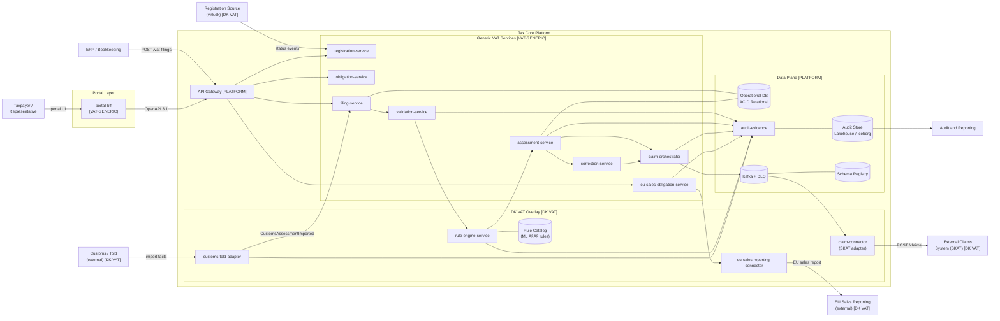
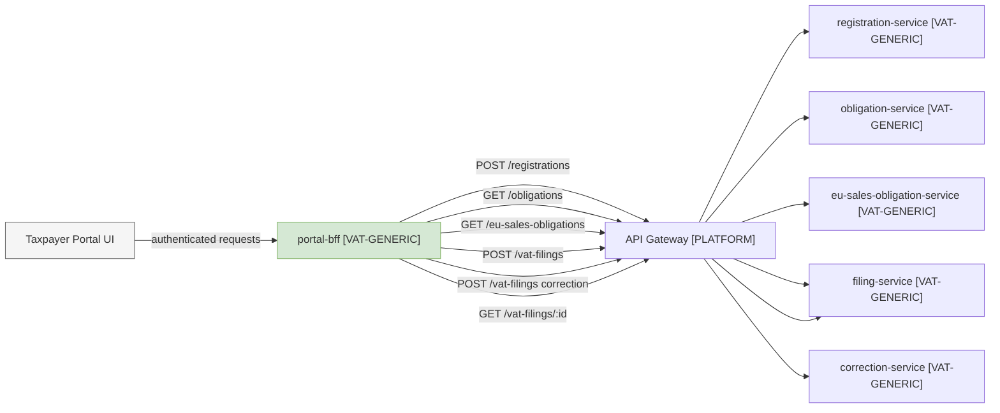
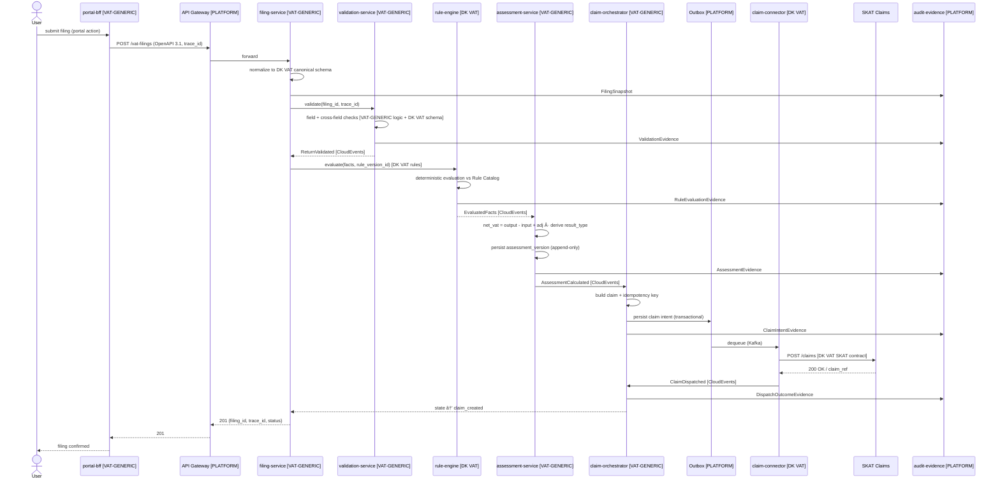
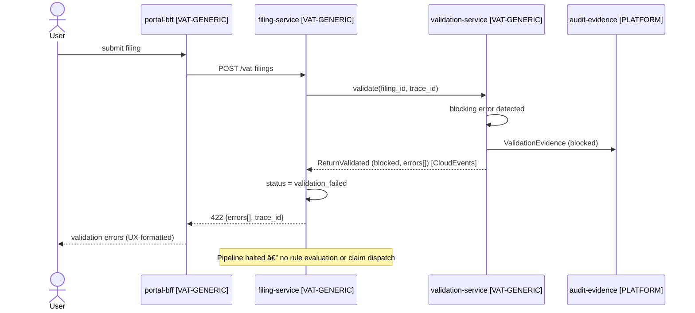
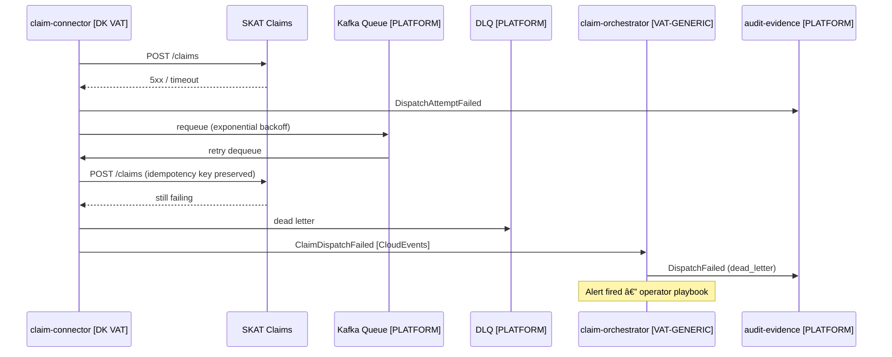
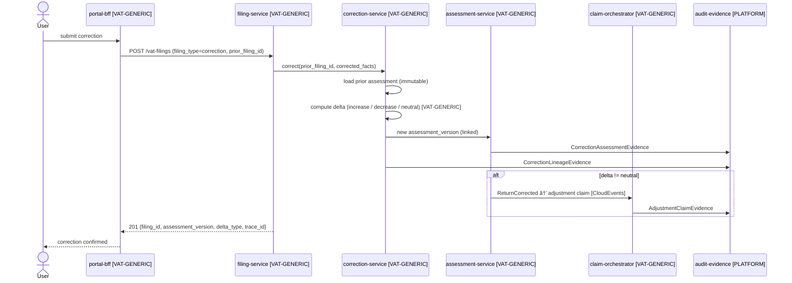
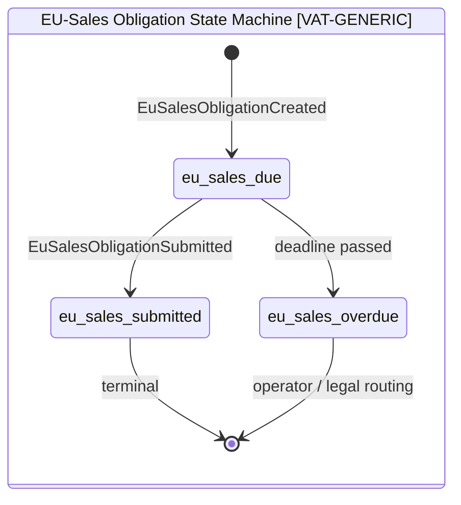

# Solution Design: VAT Filing and Assessment (Tax Core — Denmark)

> **Status:** Draft v1.3
> **Designer:** Solution Designer (DESIGNER.md contract)
> **Architecture inputs:** `architecture/01-target-architecture-blueprint.md`, `architecture/02-architectural-principles.md`, `architecture/03-future-proof-modern-data-stack-and-standards.md`, ADR-001 through ADR-009, `architecture/designer/01-03`
> **Analysis inputs:** `analysis/02-vat-form-fields-dk.md`, `analysis/03-vat-flows-obligations.md`, `analysis/07-filing-scenarios-and-claim-outcomes-dk.md`, `analysis/09-product-scope-and-requirements-alignment.md`
> **Working folder:** `design/`
> **Drawings:** `design/drawings/tax-core-vat.drawio`
> **Module guide:** `design/02-module-interaction-guide.md`

---

## 0. Building Block Taxonomy

This design uses a three-layer model to clearly separate reusable infrastructure, VAT domain logic, and Danish-specific legislation.

| Layer | Tag | Meaning |
|---|---|---|
| **Platform** | `[PLATFORM]` | Tax- and domain-agnostic infrastructure. Reusable for any system. No VAT or legal concepts. |
| **Generic VAT** | `[VAT-GENERIC]` | VAT-domain specific, but jurisdiction-agnostic. Works for any country's VAT system. Contains VAT lifecycle concepts (filing, obligation, correction, claim) but no national legislation. |
| **Danish VAT Overlay** | `[DK VAT]` | Danish VAT legislation-specific. Contains Danish legal rules (ML §§), SKAT integrations, DK-specific field schemas (Rubrik A/B/C, CVR), DKK denomination, and DK regulatory thresholds. Applied as a configuration and rule overlay on top of the Generic VAT layer. |

### Overlay Model

```
┌─────────────────────────────────────────────┐
│           DK VAT Overlay [DK VAT]            │
│  ML §§ rules · CVR · Rubrik A/B/C · SKAT    │
│  DKK thresholds · cadence policy data        │
├─────────────────────────────────────────────┤
│         Generic VAT Platform [VAT-GENERIC]   │
│  filing · validation · assessment · claim    │
│  correction · obligation · registration      │
│  BFF · rule catalog mechanism                │
├─────────────────────────────────────────────┤
│       Platform Infrastructure [PLATFORM]     │
│  API gateway · event backbone · audit store  │
│  schema registry · outbox · observability    │
└─────────────────────────────────────────────┘
```

The Generic VAT layer defines the **shape** of VAT processing. The DK VAT overlay populates that shape with Danish legislation. To support a second jurisdiction, only a new overlay is added — the Generic VAT layer and Platform remain unchanged.

---

## 1. Design Scope

### Product-First Scope Boundary
Tax Core (SOLON TAX) is a **product-first fiscal core** — not a platform, toolbox, or reference implementation. Core tax semantics are non-optional. Non-tax enterprise domains (HR, CRM, general ledger, banking, non-tax case management) are external integrations, not in-scope capabilities. Partial adoption is supported through capability slices; national variation is governed through the extension governance model, not semantic forks.

### In Scope
- Portal BFF — taxpayer-facing facade translating portal actions into Tax Core API calls
- VAT registration and obligation management
- **EU-sales obligation management** (separate lifecycle from domestic VAT return)
- VAT filing intake, canonical normalization, and schema validation
- Field and cross-field validation (including reverse-charge and deduction-right minimum fields)
- Deterministic rule evaluation (domestic VAT, reverse charge, exemptions, deductions)
- Assessment calculation and outcome determination (`payable`, `refund`, `zero`)
- **Preliminary assessment** lifecycle (issued on overdue, superseded by filed return)
- Correction versioning and lineage
- Claim creation, outbox publication, and external dispatch
- **Customs/import VAT integration** (Customs/Told Adapter — inbound facts, reconciliation)
- Append-only audit evidence across all stages
- Modern data stack (Kafka backbone, OpenAPI/AsyncAPI/CloudEvents, OpenTelemetry, Lakehouse audit plane)
- Return-level aggregates linked to line-level fact records for reproducibility
- DKK normalization and deterministic rounding policy

### AI Boundary
AI capabilities are **assistive only** in this system. Deterministic policy engines (rule-engine-service, assessment-service) are the exclusive source of legally binding VAT decisions.
- Allowed: assistive triage, anomaly hints, explanation generation
- Not allowed: AI-issued legal assessments, penalties, or mutation of legal facts

### Scenarios Covered
S01–S23 per `architecture/traceability/scenario-to-architecture-traceability-matrix.md`. S24, S25, C14, C15, C20, C21, C22 require dedicated modules or manual/legal routing — out of scope.

### Out of Scope
- Settlement and debt collection
- Legal dispute adjudication
- Taxpayer-facing UI (only BFF design is in scope — UI is a separate concern)
- Special schemes (brugtmoms, OSS/IOSS, momskompensation)
- Bankruptcy estate handling
- Non-tax enterprise domains (HR, CRM, general accounting)

---

## 2. Architecture Drawings

> Multi-page draw.io: `design/drawings/tax-core-vat.drawio`

### 2.1 System Context



### 2.2 Three-Layer Architecture

```mermaid
flowchart TB
    subgraph DK["DK VAT Overlay [DK VAT]"]
        DK1["rule-engine-service\nML §§ rule packs"]
        DK2["Rule Catalog\neffective-dated DK rules"]
        DK3["claim-connector\nSKAT adapter"]
        DK4["DK VAT Filing Schema\nCVR · Rubrik A/B/C · salgsmoms/købsmoms"]
        DK5["DK Cadence Policy\n50k threshold · half-yearly/quarterly/monthly"]
        DK6["eu-sales-reporting-connector\nEU reporting adapter"]
        DK7["customs-told-adapter\nimport VAT facts · reconciliation"]
    end

    subgraph VAT["Generic VAT Platform [VAT-GENERIC]"]
        V1["portal-bff"]
        V2["registration-service"]
        V3["obligation-service"]
        V3B["eu-sales-obligation-service"]
        V4["filing-service"]
        V5["validation-service"]
        V6["assessment-service"]
        V7["correction-service"]
        V8["claim-orchestrator"]
        V9["Rule Catalog mechanism\n(effective-dated rule store)"]
    end

    subgraph PLAT["Platform Infrastructure [PLATFORM]"]
        P1["API Gateway"]
        P2["audit-evidence"]
        P3["Kafka + DLQ"]
        P4["Schema Registry"]
        P5["Operational DB (ACID)"]
        P6["Audit Store (Lakehouse)"]
        P7["OpenTelemetry"]
        P8["Outbox infrastructure"]
    end

    DK1 -->|implements| V9
    DK2 -->|populates| V9
    DK3 -->|extends| V8
    DK4 -->|configures| V4
    DK5 -->|configures| V3
    DK6 -->|extends| V3B
    DK7 -->|injects customs facts| V4

    V4 -->|uses| P5
    V8 -->|uses| P8
    P8 -->|publishes to| P3
    P2 -->|writes to| P6
    P1 -->|routes to| V4
    P1 -->|routes to| V3B
```



### 2.3 Portal BFF Integration



### 2.4 Bounded Context Flow

```mermaid
flowchart TB
    BFF_CTX["Portal BFF Context\nportal-bff\n[VAT-GENERIC]"]
    REG_CTX["Registration Context\nregistration-service\n[VAT-GENERIC]"]
    OBL_CTX["Obligation Context\nobligation-service\n[VAT-GENERIC]"]
    EUS_CTX["EU-Sales Obligation Context\neu-sales-obligation-service [VAT-GENERIC]\neu-sales-reporting-connector [DK VAT]"]
    FIL_CTX["Filing Context\nfiling-service\n[VAT-GENERIC]"]
    VAL_CTX["Validation Context\nvalidation-service\n[VAT-GENERIC]"]
    RULE_CTX["Tax Rule & Assessment\nrule-engine [DK VAT]\nassessment-service [VAT-GENERIC]"]
    COR_CTX["Correction Context\ncorrection-service\n[VAT-GENERIC]"]
    CLM_CTX["Claim Context\nclaim-orchestrator [VAT-GENERIC]\nclaim-connector [DK VAT]"]
    CUS_CTX["Customs Context\ncustoms-told-adapter\n[DK VAT]"]
    AUD_CTX["Audit Context\naudit-evidence\n[PLATFORM]"]

    BFF_CTX -->|API calls| REG_CTX
    BFF_CTX -->|API calls| OBL_CTX
    BFF_CTX -->|API calls| EUS_CTX
    BFF_CTX -->|API calls| FIL_CTX
    REG_CTX -->|RegistrationStatusChanged [CloudEvents]| OBL_CTX
    OBL_CTX -->|ObligationCreated [CloudEvents]| FIL_CTX
    EUS_CTX -->|EuSalesObligationCreated [CloudEvents]| AUD_CTX
    CUS_CTX -->|CustomsAssessmentImported [CloudEvents]| FIL_CTX
    FIL_CTX -->|ReturnSubmitted [CloudEvents]| VAL_CTX
    VAL_CTX -->|ReturnValidated [CloudEvents]| RULE_CTX
    RULE_CTX -->|AssessmentCalculated [CloudEvents]| COR_CTX
    RULE_CTX -->|AssessmentCalculated [CloudEvents]| CLM_CTX
    RULE_CTX -->|PreliminaryAssessmentIssued [CloudEvents]| CLM_CTX
    COR_CTX -->|ReturnCorrected [CloudEvents]| CLM_CTX
    FIL_CTX -->|evidence| AUD_CTX
    VAL_CTX -->|evidence| AUD_CTX
    RULE_CTX -->|evidence| AUD_CTX
    CLM_CTX -->|evidence| AUD_CTX
    CUS_CTX -->|evidence| AUD_CTX
```

### 2.5 Modern Data Stack Planes

```mermaid
flowchart TB
    subgraph TRANS["Transactional Plane [PLATFORM]"]
        ODB_T["ACID Relational DB\nFilings · Assessments · Claims · Obligations"]
        OUTBOX["Outbox Tables\nReliable event publication"]
    end

    subgraph EVENT["Event & Streaming Plane [PLATFORM]"]
        KAFKA["Kafka-compatible Backbone"]
        SREG["Schema Registry\nAvro/Protobuf + CI compatibility"]
        STREAM["Stateful Stream Processing\nCompliance signals · Risk checks"]
    end

    subgraph ANALYTICAL["Analytical & Compliance Plane [PLATFORM]"]
        LAKE["Lakehouse — Apache Iceberg"]
        ELT["ELT · Semantic models · Reporting"]
        QUERY["Federated Query — Audit & Compliance"]
    end

    subgraph OBS_PLANE["Observability Plane [PLATFORM]"]
        OTEL["OpenTelemetry\nTraces · Metrics · Logs · trace_id"]
        ALERTS["Alerting\nOverdue · DLQ · Failure · Portal BFF chains"]
    end

    OUTBOX -->|publish| KAFKA
    KAFKA --- SREG
    KAFKA --> STREAM
    KAFKA -->|ingest| LAKE
    LAKE --> ELT
    ELT --> QUERY
    ODB_T --> OUTBOX
```



### 2.6 Happy-Path Sequence: Regular Filing → Claim Dispatch



### 2.7 Error Path: Validation Block



### 2.8 Error Path: Dispatch Failure and Retry



### 2.9 Correction Flow



### 2.10 State Machines


> Preliminary assessment records are **immutable** and never deleted. A final assessment references the superseded preliminary record via `supersedes_assessment_id`. The audit store keeps bidirectional linkage between preliminary and final outcomes.



---

## 3. Building Blocks

### 3.1 Platform Layer `[PLATFORM]`

#### `API Gateway`
Routes authenticated requests to VAT-GENERIC services. Enforces RBAC at the entry point. Injects `trace_id` (OpenTelemetry). No VAT domain knowledge.

#### `audit-evidence`
Append-only structured evidence writer and query API, keyed by `trace_id`. Written to by every service at every decision point. Feeds the Audit Store via Kafka. No domain knowledge — pure evidence persistence. (ADR-003)

Evidence schema:
- `trace_id`, `event_type`, `service_identity`, `actor`, `timestamp`, `input_summary_hash`, `decision_or_output_summary`, domain references

#### `Kafka backbone + DLQ`
Decoupled domain event distribution. All inter-service async communication flows through Kafka topics. DLQ captures failed deliveries. (ADR-007)

#### `Schema Registry`
Manages Avro/Protobuf schemas for all events. CI/CD compatibility gates prevent breaking changes from reaching consumers. (ADR-006)

#### `Outbox infrastructure`
Transactional outbox tables ensure claim intents are never lost on service restart. Relay publisher polls and forwards to Kafka. (ADR-004)

#### `Operational DB (ACID Relational)`
Stores filings, assessments, claims, obligations. Strong consistency for all decision writes. Strict schema migration discipline.

#### `Audit Store (Lakehouse / Iceberg)`
Apache Iceberg open table format on object storage. Immutable, queryable, partitioned by period. Receives evidence via Kafka ingestion. Isolated from operational service databases. (ADR-007, ADR-008)

#### `OpenTelemetry`
Traces, metrics, and logs across all services, including the portal BFF. `trace_id` correlates every request end-to-end from portal action to claim dispatch.

---

### 3.2 Generic VAT Layer `[VAT-GENERIC]`

These services contain VAT lifecycle logic but are configurable for any jurisdiction. They have no hard-coded Danish rules, legal references, or SKAT-specific integrations.

#### `portal-bff`
**Responsibility:** Taxpayer-facing facade. Translates portal actions into Tax Core API calls. Composes UX-oriented responses. Does not own or execute tax domain logic.

| Concern | Detail |
|---|---|
| Accepts | Authenticated portal commands: register, view obligations, submit filing, submit correction, view filing status |
| Translates to | `POST /registrations`, `GET /obligations`, `POST /vat-filings`, `GET /vat-filings/{id}` |
| Does NOT | Execute tax calculations, validate legal rules, or hold tax domain state |
| Returns | UX-composed responses (aggregating Tax Core API responses) |
| Standards | OpenAPI 3.1 contract to API Gateway; `trace_id` propagated from portal entry point |
| API coverage | All portal workflows must be 100% achievable via public Tax Core APIs (API coverage rule) |

#### `registration-service`
**Responsibility:** Taxpayer VAT registration lifecycle. Translates external registration events into internal `RegistrationStatusChanged` events. Stores registration status and effective dates.

| Concern | Detail |
|---|---|
| Accepts | `POST /registrations`, external registration source events |
| Owns | Registration records (`taxpayer_id`, `status`, `effective_date`) |
| Emits | `RegistrationStatusChanged` [CloudEvents] |
| Triggers | Obligation lifecycle when registration becomes active |

#### `obligation-service`
**Responsibility:** Periodic VAT filing obligation management. Manages obligation lifecycle (`due` → `submitted` → `overdue`). Cadence rules (half-yearly / quarterly / monthly) are loaded from an effective-dated policy table — not hard-coded.

| Concern | Detail |
|---|---|
| Accepts | `RegistrationStatusChanged`, `GET /obligations` |
| Owns | Obligation records (`obligation_id`, `period`, `due_date`, `cadence`, `status`) |
| Emits | `ObligationCreated`, `ObligationOverdue`, `PreliminaryAssessmentTriggered` [CloudEvents] |
| Configurable | DK VAT cadence thresholds and due-date rules injected as policy data [DK VAT] |

#### `eu-sales-obligation-service`
**Responsibility:** EU-sales obligation lifecycle management, separate from the domestic VAT return. Manages EU-sales reporting obligations from generation through submission and overdue tracking. Delegates to the `eu-sales-reporting-connector` [DK VAT] for external EU reporting submission.

| Concern | Detail |
|---|---|
| Accepts | `POST /eu-sales-obligations/generate`, `GET /eu-sales-obligations/{taxpayer_id}`, `POST /eu-sales-obligations/{obligation_id}/submissions` |
| Owns | EU-sales obligation records (`obligation_id`, `taxpayer_id`, `period`, `status`) |
| States | `eu_sales_due` → `eu_sales_submitted` / `eu_sales_overdue` |
| Emits | `EuSalesObligationCreated`, `EuSalesObligationSubmitted`, `EuSalesObligationOverdue` [CloudEvents] |
| Delegates | Submission dispatch to `eu-sales-reporting-connector` [DK VAT] |

#### `filing-service`
**Responsibility:** Canonical intake, normalization, state machine ownership, response contract.

| Concern | Detail |
|---|---|
| Accepts | `POST /vat-filings`, `GET /vat-filings/{id}` |
| Normalizes | Source fields → canonical VAT filing schema (DK VAT schema applied as overlay) |
| Persists | Immutable filing snapshot on first write |
| Orchestrates | → validation-service → rule-engine → assessment-service |
| State machine | `received` → `validation_failed` / `validated` → `assessed` → `claim_created` |
| Emits | `ReturnSubmitted` [CloudEvents] |
| Standards | OpenAPI 3.1 contract; `trace_id` injected |

#### `validation-service`
**Responsibility:** Configurable field and cross-field validation gate. Blocking errors halt the pipeline; warnings continue with flags.

| Concern | Detail |
|---|---|
| Logic | Schema conformance, period integrity, amount constraints, type consistency [VAT-GENERIC] |
| DK overlay | Rubrik A/B/C cross-field checks, CVR format, zero-filing constraint [DK VAT config] |
| Severity | `blocking_error` halts; `warning` flags and continues |
| Emits | `ReturnValidated` (passed/blocked, errors[], warnings[]) [CloudEvents] |

#### `assessment-service`
**Responsibility:** Net VAT calculation using deterministic staged derivation, result derivation, append-only assessment versioning, and preliminary assessment lifecycle.

| Concern | Detail |
|---|---|
| Input | EvaluatedFacts from rule engine |
| Staged derivation | stage_1: gross output VAT; stage_2: total deductible input VAT; stage_3: pre-adjustment net; stage_4: final net VAT (with adjustments) |
| Derives | `result_type`: `payable` (net > 0), `refund` (net < 0), `zero` (net = 0) |
| Persists | Append-only `assessment_version` (never overwrites); links to prior via `prior_assessment_id` |
| Preliminary | Issues `PreliminaryAssessmentIssued` when triggered by overdue obligation; superseded by `PreliminaryAssessmentSupersededByFiledReturn` when return is filed |
| Rounding | Applies `rounding_policy_version_id` at finalization; stores pre-round and rounded amounts |
| Emits | `VatAssessmentCalculated`, `PreliminaryAssessmentIssued`, `PreliminaryAssessmentSupersededByFiledReturn`, `FinalAssessmentCalculatedFromFiledReturn` [CloudEvents] |

#### `correction-service`
**Responsibility:** VAT correction versioning, delta computation, immutable lineage. (ADR-005)

| Concern | Detail |
|---|---|
| Input | `prior_filing_id` + corrected facts |
| Computes | Delta: `increase` / `decrease` / `neutral` [VAT-GENERIC logic] |
| Creates | New `assessment_version` with `prior_version_id` pointer |
| Emits | `ReturnCorrected` [CloudEvents] |
| DK overlay | Age gate (>3 years) → Manual/legal routing [DK VAT config] |
| Constraint | Never mutates prior records (ADR-005) |

#### `claim-orchestrator`
**Responsibility:** Claim intent creation, transactional outbox publication, dispatch status lifecycle. (ADR-004)

| Concern | Detail |
|---|---|
| Input | `AssessmentCalculated` or `ReturnCorrected` events |
| Builds | Generic claim payload (domain fields injected via overlay) |
| Idempotency key | `taxpayer_id + period_end + assessment_version` |
| Publishes | Claim intent to outbox transactionally with assessment write |
| Tracks | `queued` → `sent` → `acked` / `failed` → `dead_letter` |

---

### 3.3 Danish VAT Overlay `[DK VAT]`

These components and configuration artifacts contain Danish VAT legislation. They are the only layer that changes when Danish law changes.

#### `rule-engine-service` [DK VAT]
**Responsibility:** Pure, stateless, deterministic evaluation of Danish VAT legal rules against the DK Rule Catalog.

| Concern | Detail |
|---|---|
| Input | DK VAT filing facts + `rule_version_id` |
| Evaluates | 8 DK VAT rule packs (see below) |
| Output | EvaluatedFacts, RuleOutcomes[] with ML §§ references |
| Constraint | Pure function — no side effects, no DB writes |
| Determinism | Same inputs + same version → identical output (legal replay guarantee) |

**DK VAT Rule Pack execution order:**
1. `filing_validation` — cadence/obligation alignment
2. `domestic_vat` — salgsmoms/købsmoms baseline
3. `reverse_charge_eu_goods` — Rubrik A goods (ML §46 EU)
4. `reverse_charge_eu_services` — Rubrik A services (ML §46 EU)
5. `reverse_charge_dk` — domestic categories (ML §46 DK)
6. `exemption` — ML §13 exempt activity
7. `deduction_rights` — full / none / partial allocation
8. `cross_border` — Rubrik B/C reporting

#### `Rule Catalog` [DK VAT]
Effective-dated store of Danish VAT legal rules. Each record: `rule_id`, `rule_pack`, `legal_reference` (ML §§), `effective_from`, `effective_to`, `applies_when`, `expression`, `severity`. (ADR-002)

Governance: new rule requires `legal_reference`, `effective_from`, `effective_to`, regression pass. Activation is data-only.

#### `claim-connector` [DK VAT adapter]
**Responsibility:** Queue consumer adapting generic claim intents to the SKAT External Claims System API.

| Concern | Detail |
|---|---|
| Adapts | Generic claim payload → SKAT POST /claims format |
| Currency | Enforces `DKK` denomination and rounding |
| Auth | SKAT-specific authentication (TBD — OQ-01) |
| Retry | Exponential backoff, max 5 attempts |
| Anti-corruption | Wraps SKAT API behind internal interface — SKAT contract changes are isolated here |

#### `eu-sales-reporting-connector` [DK VAT adapter]
**Responsibility:** Adapter between `eu-sales-obligation-service` and the external EU Sales Reporting system. Handles Danish-specific EU reporting contract format.

| Concern | Detail |
|---|---|
| Receives | Submission request from `eu-sales-obligation-service` |
| Adapts | Generic EU-sales submission → DK-specific EU reporting contract |
| Emits | `EuSalesObligationSubmitted` on success |
| Audit | Writes submission evidence to `audit-evidence` |

#### `customs-told-adapter` [DK VAT integration]
**Responsibility:** Receives inbound customs/import VAT facts from the Danish Customs/Told system, normalizes them to the Tax Core import VAT contract, and injects them into the filing pipeline. Owns the reconciliation loop between customs import facts and filed VAT amounts.

| Concern | Detail |
|---|---|
| Inbound API | `POST /imports/customs-assessments` (from Customs/Told) |
| Reconciliation API | `POST /imports/customs-reconciliation` |
| Events emitted | `CustomsAssessmentImported`, `CustomsIntegrationFailed`, `CustomsIntegrationRetried`, `CustomsReconciliationMismatchDetected` |
| Audit evidence | `customs_reference_id`, payload hash, import timestamp, reconciliation outcome linked to `trace_id` |
| Anti-corruption | Wraps Customs/Told API — Told contract changes isolated here |

#### DK VAT Canonical Filing Schema [DK VAT configuration on `filing-service`]

**Generic header fields (VAT-GENERIC):**
`filing_id`, `taxpayer_id`, `tax_period_start`, `tax_period_end`, `filing_type` (regular/zero/correction), `submission_timestamp`, `source_channel`, `rule_version_id`, `status`, `trace_id`

**DK VAT monetary fields:**
`output_vat_amount` (salgsmoms), `input_vat_deductible_amount` (købsmoms), `vat_on_goods_purchases_abroad_amount`, `vat_on_services_purchases_abroad_amount`, `adjustments_amount`

**DK VAT international value boxes:**
`rubrik_a_goods_eu_purchase_value`, `rubrik_a_services_eu_purchase_value`, `rubrik_b_goods_eu_sale_value`, `rubrik_b_services_eu_sale_value`, `rubrik_c_other_vat_exempt_supplies_value`

**DK VAT identifiers:**
`cvr_number` (8-digit Danish CVR), `contact_reference`

#### DK VAT Obligation Cadence Policy [DK VAT configuration on `obligation-service`]
- `half_yearly`: default (< DKK 5M turnover)
- `quarterly`: ≥ DKK 5M or opt-in
- `monthly`: ≥ DKK 50M or opt-in
- Registration threshold: DKK 50,000 taxable turnover (ML basis)
- Correction age gate: > 3 years → Manual/legal routing

---

## 4. API and Event Contracts

### 4.1 API Coverage Rule (from `architecture/designer/02`)
All portal workflows — registration, obligation viewing, filing submission, correction submission, status retrieval — must be fully supported by public Tax Core APIs. The portal-bff must achieve 100% functional coverage via these APIs without direct database access or bypass.

### 4.2 POST /vat-filings (OpenAPI 3.1) — DK VAT schema

**Request:**
```json
{
  "cvr_number": "12345678",
  "tax_period_start": "2024-01-01",
  "tax_period_end": "2024-06-30",
  "filing_type": "regular",
  "source_channel": "portal",
  "output_vat_amount": 150000.00,
  "input_vat_deductible_amount": 80000.00,
  "vat_on_goods_purchases_abroad_amount": 5000.00,
  "vat_on_services_purchases_abroad_amount": 2000.00,
  "adjustments_amount": 0.00,
  "rubrik_a_goods_eu_purchase_value": 20000.00,
  "rubrik_a_services_eu_purchase_value": 8000.00,
  "rubrik_b_goods_eu_sale_value": 0.00,
  "rubrik_b_services_eu_sale_value": 0.00,
  "rubrik_c_other_vat_exempt_supplies_value": 0.00,
  "contact_reference": "ref-2024-001"
}
```

**201 Created (VAT-GENERIC response envelope):**
```json
{
  "filing_id": "fil_01J...",
  "trace_id": "trc_01J...",
  "status": "claim_created",
  "result_type": "payable",
  "net_vat_amount": 77000.00,
  "assessment_version": 1,
  "claim_id": "clm_01J...",
  "rule_version_id": "rv_2024H1",
  "submitted_at": "2024-07-05T10:32:00Z"
}
```

**422 Unprocessable (VAT-GENERIC error envelope):**
```json
{
  "trace_id": "trc_01J...",
  "status": "validation_failed",
  "errors": [
    {
      "code": "VAL_CVR_INVALID",
      "field": "cvr_number",
      "message": "CVR must be an 8-digit numeric value",
      "severity": "blocking_error"
    }
  ],
  "warnings": []
}
```

### 4.3 Portal BFF API Surface (VAT-GENERIC)

| Endpoint | Backing Tax Core API | Notes |
|---|---|---|
| `POST /portal/registrations` | `POST /registrations` | Translates portal payload |
| `GET /portal/obligations` | `GET /obligations?cvr=...` | Filters and composes for UX |
| `GET /portal/eu-sales-obligations` | `GET /eu-sales-obligations/{taxpayer_id}` | EU-sales obligation view |
| `POST /portal/filings` | `POST /vat-filings` | Adds `source_channel=portal` |
| `POST /portal/corrections` | `POST /vat-filings` (filing_type=correction) | Ensures prior reference |
| `GET /portal/filings/{id}` | `GET /vat-filings/{id}` | Direct pass-through with UX shaping |

### 4.4 Outbound POST /claims to SKAT [DK VAT adapter]

```json
{
  "claim_id": "clm_01J...",
  "taxpayer_id": "12345678",
  "period_start": "2024-01-01",
  "period_end": "2024-06-30",
  "result_type": "payable",
  "amount": 77000.00,
  "currency": "DKK",
  "filing_reference": "fil_01J...",
  "rule_version_id": "rv_2024H1",
  "calculation_trace_id": "trc_01J...",
  "created_at": "2024-07-05T10:32:15Z",
  "idempotency_key": "12345678_2024-06-30_v1"
}
```

### 4.5 Domain Events (CloudEvents envelope, Avro/Protobuf, Schema Registry)

| Event | Layer | Publisher | Consumers | Key Fields |
|---|---|---|---|---|
| `VatRegistrationStatusChanged` | VAT-GENERIC | registration-service | obligation-service, audit | `taxpayer_id`, `status`, `effective_date` |
| `FilingObligationCreated` | VAT-GENERIC | obligation-service | filing-service, audit | `taxpayer_id`, `period`, `due_date`, `cadence` |
| `ObligationOverdue` | VAT-GENERIC | obligation-service | assessment-service, audit | `taxpayer_id`, `obligation_id`, `period_end` |
| `EuSalesObligationCreated` | VAT-GENERIC | eu-sales-obligation-service | audit | `taxpayer_id`, `period`, `due_date` |
| `EuSalesObligationSubmitted` | DK VAT | eu-sales-reporting-connector | eu-sales-obligation-service, audit | `obligation_id`, `submitted_at` |
| `EuSalesObligationOverdue` | VAT-GENERIC | eu-sales-obligation-service | audit | `obligation_id`, `period_end` |
| `VatReturnSubmitted` | VAT-GENERIC | filing-service | validation-service, audit | `filing_id`, `trace_id`, `filing_type` |
| `VatReturnValidated` | VAT-GENERIC | validation-service | filing-service, audit | `filing_id`, `passed`, `errors[]`, `warnings[]` |
| `VatAssessmentCalculated` | VAT-GENERIC | assessment-service | claim-orchestrator, audit | `filing_id`, `assessment_version`, `result_type`, `net_vat_amount`, `rounding_policy_version_id` |
| `PreliminaryAssessmentTriggered` | VAT-GENERIC | obligation-service | assessment-service, audit | `taxpayer_id`, `obligation_id`, `period_end` |
| `PreliminaryAssessmentIssued` | VAT-GENERIC | assessment-service | claim-orchestrator, audit | `assessment_id`, `taxpayer_id`, `period_end` |
| `PreliminaryAssessmentSupersededByFiledReturn` | VAT-GENERIC | assessment-service | audit | `assessment_id`, `supersedes_assessment_id`, `filing_id` |
| `FinalAssessmentCalculatedFromFiledReturn` | VAT-GENERIC | assessment-service | claim-orchestrator, audit | `assessment_id`, `filing_id`, `supersedes_assessment_id` |
| `VatReturnCorrected` | VAT-GENERIC | correction-service | claim-orchestrator, audit | `filing_id`, `prior_version`, `new_version`, `delta_type` |
| `CustomsAssessmentImported` | DK VAT | customs-told-adapter | filing-service, audit | `customs_reference_id`, `taxpayer_id`, `import_timestamp` |
| `CustomsIntegrationFailed` | DK VAT | customs-told-adapter | audit, operations | `customs_reference_id`, `error`, `attempt` |
| `CustomsReconciliationMismatchDetected` | DK VAT | customs-told-adapter | audit, operations | `customs_reference_id`, `trace_id`, `mismatch_details` |
| `ClaimCreated` | VAT-GENERIC | claim-orchestrator | audit | `claim_id`, `filing_id`, `idempotency_key` |
| `ClaimDispatched` | DK VAT | claim-connector | claim-orchestrator, audit | `claim_id`, `claim_ref`, `dispatched_at` |
| `ClaimDispatchFailed` | DK VAT | claim-connector | claim-orchestrator, audit | `claim_id`, `attempt`, `error`, `dead_letter: bool` |

---

## 5. Data Model and State Transitions

### 5.1 Entities by Layer

```
── VAT-GENERIC schema (layer-owned fields) ────────────────────────────

Filing
├── filing_id (PK)
├── taxpayer_id              ← generic identifier
├── tax_period_start / end
├── filing_type              (regular | zero | correction)
├── source_channel
├── submission_timestamp
├── rule_version_id
├── status
└── trace_id

  + DK VAT overlay fields:
  ├── cvr_number             [DK VAT — 8-digit CVR]
  ├── output_vat_amount      [DK VAT — salgsmoms]
  ├── input_vat_deductible_amount [DK VAT — købsmoms]
  ├── vat_on_goods_purchases_abroad_amount  [DK VAT]
  ├── vat_on_services_purchases_abroad_amount [DK VAT]
  ├── adjustments_amount     [DK VAT]
  ├── rubrik_a_goods_eu_purchase_value      [DK VAT]
  ├── rubrik_a_services_eu_purchase_value   [DK VAT]
  ├── rubrik_b_goods_eu_sale_value          [DK VAT]
  ├── rubrik_b_services_eu_sale_value       [DK VAT]
  ├── rubrik_c_other_vat_exempt_supplies_value [DK VAT]
  └── contact_reference      [DK VAT]

Assessment (append-only)        [VAT-GENERIC]
├── assessment_id (PK)
├── filing_id (FK, null for preliminary)
├── assessment_version
├── assessment_type          (regular | preliminary | correction)
├── prior_assessment_id (FK, null for original)
├── supersedes_assessment_id (FK, null unless this supersedes a preliminary)
├── stage_1_gross_output_vat_amount
├── stage_2_total_deductible_input_vat_amount
├── stage_3_pre_adjustment_net_vat_amount
├── stage_4_net_vat_amount   (final net, basis for result_type)
├── result_type              (payable | refund | zero)
├── claim_amount_pre_round
├── claim_amount             (rounded)
├── rounding_policy_version_id [DK VAT]
├── rule_version_id
├── calculation_trace_id
└── delta_type               (null | increase | decrease | neutral)

LineFact (line-level fact store) [VAT-GENERIC]
├── line_fact_id (PK)
├── filing_id (FK)
├── calculation_trace_id
├── rule_version_id
├── source_document_ref
├── supply_type
├── counterparty_country
├── counterparty_vat_id
├── place_of_supply_country
├── reverse_charge_applied (bool)
├── reverse_charge_reason_code
├── eu_transaction_category
├── deduction_right_type
├── deduction_percentage
├── deduction_basis_reference
└── allocation_method_id

Claim                           [VAT-GENERIC + DK VAT: currency=DKK]
├── claim_id (PK)
├── assessment_id / filing_id (FK)
├── taxpayer_id, period_start/end
├── result_type, amount
├── currency                 [DK VAT: always DKK]
├── rule_version_id
├── calculation_trace_id
├── rounding_policy_version_id [DK VAT]
├── idempotency_key
├── status                   (queued | sent | acked | failed | dead_letter)
└── dispatch_attempts, timestamps

Obligation                      [VAT-GENERIC service + DK VAT cadence data]
├── obligation_id (PK)
├── taxpayer_id / cvr_number
├── period_start / period_end, due_date
├── cadence                  (monthly | quarterly | half_yearly) [DK VAT data]
├── return_type_expected
└── status                   (due | submitted | overdue)

EuSalesObligation               [VAT-GENERIC service + DK VAT reporting adapter]
├── obligation_id (PK)
├── taxpayer_id / cvr_number
├── period_start / period_end, due_date
└── status                   (eu_sales_due | eu_sales_submitted | eu_sales_overdue)

Rule                            [DK VAT]
├── rule_id (PK)
├── rule_pack
├── legal_reference            (ML §§)
├── effective_from / effective_to
├── applies_when, expression
└── severity
```

### 5.2 State Machines — see Section 2.10

### 5.3 Return-Level vs Line-Level Data Boundary

The filing data model separates return-level aggregates from line-level transaction facts.

| Store | Contents | Linkage |
|---|---|---|
| **Return-level** | Canonical filing aggregates and staged derived totals (stage_1 through stage_4) | `filing_id` |
| **Line-level fact store** | Reverse-charge, exemption, deduction-right, and place-of-supply facts per line | `filing_id`, `line_fact_id`, `calculation_trace_id`, `rule_version_id`, `source_document_ref` |

**Reproducibility rule:** Return-level aggregates and deductible totals must be reproducible from linked line-level facts. Any audit query that reconstructs a return must be able to derive identical stage totals from the line-fact store records.

### 5.4 DKK Normalization and Rounding Policy

Ownership: Tax Core architecture and rule governance (not portal-bff).

| Step | Responsibility |
|---|---|
| Normalize monetary inputs to `DKK` | `filing-service` at canonical normalization |
| High-precision decimal computation | `rule-engine-service` and `assessment-service` |
| Round output/claim amounts at finalization | `assessment-service`, using `rounding_policy_version_id` |
| Audit persistence | Store `claim_amount_pre_round`, `claim_amount` (rounded), and `rounding_policy_version_id` for replay and legal traceability |

---

## 6. Rule Integration and Version Handling

### Resolution [PLATFORM mechanism, VAT-GENERIC lifecycle, DK VAT data]
1. `filing-service` resolves active `rule_version_id` from Rule Catalog at intake (by `tax_period_end`)
2. `rule_version_id` pinned to Filing record immediately
3. All downstream evaluation uses this pinned version — rule changes mid-flight do not affect in-flight filings

### DK VAT Rule Pack Execution Order
```
1. filing_validation       → cadence/obligation alignment
2. domestic_vat            → salgsmoms/købsmoms baseline
3. reverse_charge_eu_goods → Rubrik A goods (ML §46 EU)
4. reverse_charge_eu_svcs  → Rubrik A services (ML §46 EU)
5. reverse_charge_dk       → domestic categories (ML §46 DK)
6. exemption               → ML §13 exempt activity
7. deduction_rights        → full / none / partial allocation
8. cross_border            → Rubrik B/C reporting
```

### Determinism Guarantee [VAT-GENERIC principle]
`evaluate(facts, rule_version_id) → outcomes` — pure function, no side effects, deterministic replay.

### Country-Variation Governance
National or customer-specific deviations from Tax Core semantics are routed through an explicit governance process. No semantic forks are accepted without a governed decision:

| Outcome | Meaning |
|---|---|
| `policy change` | Update the effective-dated policy or rule catalog for the jurisdiction |
| `country extension` | Add a new DK VAT overlay artifact; VAT-GENERIC layer unchanged |
| `core change` | Modify the VAT-GENERIC or PLATFORM layer; requires full architecture review |
| `reject` | Request is outside Tax Core product scope; handled externally |

---

## 7. Modern Stack Integration (ADR-006, ADR-007, ADR-008)

| Concern | Standard | Layer |
|---|---|---|
| Synchronous API contracts | OpenAPI 3.1, versioned per service | PLATFORM |
| Async event contracts | AsyncAPI + CloudEvents | PLATFORM |
| Schema management | Avro/Protobuf, Schema Registry, CI compatibility | PLATFORM |
| Event backbone | Kafka-compatible broker | PLATFORM |
| Outbox | Transactional outbox tables + relay | PLATFORM |
| Observability | OpenTelemetry — traces/metrics/logs, trace_id end-to-end incl. BFF | PLATFORM |
| Audit analytics | Events → Lakehouse (Apache Iceberg) | PLATFORM |
| Service auth | Zero-trust (mTLS or token-based) | PLATFORM |
| Infrastructure | IaC + GitOps | PLATFORM |
| Supply chain | SBOM, artifact signing, provenance | PLATFORM |
| Technology policy | Open-source-only for all core paths (ADR-008) | PLATFORM |

---

## 8. Security, NFR, and Observability-by-Design

### RBAC Role Mapping

| Role | Permitted Operations |
|---|---|
| `preparer` | `POST /vat-filings`, `GET /vat-filings/{id}` (own CVR only) via portal-bff or direct API |
| `reviewer_approver` | Read all filings; approve correction filings |
| `operations_support` | Read claim status; trigger DLQ reprocessing |
| `auditor` | Read-only audit-evidence store and all filings |

### Performance Targets
- `POST /vat-filings` (validation + assessment): p95 < 2s at baseline load
- Claim dispatch retry initiation: within 1 minute of failure
- Rule catalog version resolution: p99 < 100ms (cached per version)
- Portal BFF response: p95 < 500ms (Tax Core API call + composition)

### Observability (OpenTelemetry — per service)

| Service | Key Metrics | Key Alerts |
|---|---|---|
| portal-bff | `bff_requests_total`, `bff_errors_total`, `bff_duration_p95` | Error rate spike, duration > 500ms |
| filing-service | `filings_received_total`, `filings_failed_total`, `duration_p95` | Duration > 2s |
| validation-service | `validation_errors_by_code`, `warnings_by_code` | Blocking error rate spike |
| rule-engine-service | `rule_evaluations_total`, `version_miss_total` | Version resolution failures |
| assessment-service | `assessments_by_result_type`, `duration_p95` | Assessment failures |
| claim-orchestrator | `claims_queued_total`, `claims_acked_total`, `dead_letter_total` | DLQ growth, failure burst |
| claim-connector | `dispatch_attempts_total`, `dispatch_success_rate` | Success rate < threshold |

Portal BFF `trace_id` must be propagated through all Tax Core service calls for end-to-end correlation.

### AI Boundary

AI capabilities must be scoped to assistive use only. This is an architecture-level constraint enforced by design — AI components must not be placed in the deterministic assessment or rule evaluation path.

| Category | Permitted |
|---|---|
| Assistive triage and anomaly hints | Yes — surfaced as informational, non-binding |
| Explanation generation for filed assessments | Yes — reads audit evidence, does not mutate it |
| Issuing legal assessments or penalties | **No** |
| Mutating legal facts (filing records, assessment records) | **No** |
| Overriding deterministic rule outcomes | **No** |

### Security Controls
- TLS in transit (portal → BFF → API Gateway → services, services → SKAT)
- Zero-trust service-to-service auth
- Encryption at rest (Operational DB, Audit Store)
- Secrets in centralized secrets manager
- PII excluded from structured logs; present only in audit evidence
- RBAC enforced at API Gateway; BFF holds no privileged access beyond what API Gateway grants
- Policy-as-code admission controls; SBOM + artifact signing (ADR-008)

---

## 9. Test Design and Scenario Coverage

### Scenario-to-Test Matrix

| Scenario | Layer | Services Under Test | Key Assertions |
|---|---|---|---|
| S01 — Domestic payable | DK VAT | filing→validation→rule→assessment→claim | `result_type=payable`, claim correct, staged derivation persisted |
| S02 — Refund | DK VAT | same | `result_type=refund` |
| S03 — Zero declaration | DK VAT | same | `result_type=zero` |
| S04/S05 — Corrections | DK VAT | correction→assessment→claim | `delta_type`, new version, adj. claim |
| S06/S07 — EU reverse charge | DK VAT | rule engine | Rubrik A, ML §46 applied, `line_fact` created with `eu_transaction_category` |
| S08 — EU B2B sale | DK VAT | filing→rule | Rubrik B, zero DK output VAT |
| S09/S10 — Non-EU | DK VAT | rule→assessment | Import/place-of-supply rules, `place_of_supply_country` |
| S11 — Domestic §46 | DK VAT | rule engine | Buyer-liable flag |
| S12/S13/S14 — Deductions | DK VAT | rule engine | Full/none/partial deduction, `deduction_percentage` in line-fact |
| S18/S19 — Late/no filing | VAT-GENERIC | obligation, assessment | `overdue`, `PreliminaryAssessmentTriggered`, `PreliminaryAssessmentIssued` |
| S-PRELIM — Supersession | VAT-GENERIC | assessment-service | Filed return supersedes preliminary; `supersedes_assessment_id` linked |
| S20 — Contradictory data | VAT-GENERIC | validation | Blocking error, pipeline halted |
| S21 — Past-period >3y | DK VAT | correction | Manual/legal routing |
| S-EUS — EU-Sales obligation | DK VAT | eu-sales-obligation-service, connector | `EuSalesObligationCreated`, submission dispatched, evidence written |
| S-CUS — Customs import | DK VAT | customs-told-adapter, filing-service | `CustomsAssessmentImported`, reconciliation, audit evidence |
| S-ROUND — Rounding policy | DK VAT | assessment-service | `claim_amount_pre_round` ≠ `claim_amount`, `rounding_policy_version_id` stored |

### Portal BFF Tests
- API parity: every portal workflow achievable via Tax Core public APIs
- BFF does not call Rule Catalog or assessment-service directly
- `trace_id` from portal request visible in Tax Core service logs

### Generic VAT Platform Tests
- State machine: all Filing and Claim states exercised
- Idempotency: duplicate claim intent → no second claim
- Retry: fails 2×, succeeds 3rd → `acked`
- DLQ: fails 5× → dead letter + alert

### DK VAT Rule Engine Tests
- One fixture per rule pack + ML §§ reference
- Determinism: same input × 100 → identical output
- Historical replay: old `rule_version_id` → period-correct result
- Schema Registry: breaking rule contract change blocked by CI gate

---

## 10. Delivery Plan, Open Questions, and Risks

### Delivery Alignment

| Phase | Design Deliverables |
|---|---|
| Phase 1 | filing-service + OpenAPI spec, validation catalog (incl. reverse-charge + deduction-right min. fields), audit-evidence API, OpenTelemetry baseline |
| Phase 1+ | portal-bff design + API parity test suite |
| Phase 2 | rule-engine-service + DK Rule Catalog schema, assessment-service (staged derivation + rounding policy), obligation-service, preliminary assessment lifecycle |
| Phase 3 | claim-orchestrator, outbox schema, claim-connector SKAT adapter, retry/DLQ playbook |
| Phase 3M | AsyncAPI + CloudEvents, Schema Registry CI gates, Kafka backbone |
| Phase 4 | correction-service, lineage query API, compliance dashboard alerts |
| Phase 4M | Lakehouse ingestion pipeline, audit analytics models |
| Phase 5 | eu-sales-obligation-service + eu-sales-reporting-connector; customs-told-adapter + reconciliation; line-level fact store + reproducibility API |
| Phase 6 | Module contracts for S24, S25, C14, C15, C20, C21, C22 |

### Open Questions

| # | Question | Impact | Owner |
|---|---|---|---|
| OQ-01 | SKAT Claims System API contract and auth mechanism? | Blocks claim-connector design | Architecture / Integration |
| OQ-02 | Kafka hosting model (managed vs self-hosted)? | Affects outbox + connector implementation | Architecture |
| OQ-03 | Rule Catalog storage: relational vs. document store? | Affects version resolution performance | Architecture |
| OQ-04 | `rule_version_id` by period only, or also by filing type? | Affects rule resolution logic | Architecture / BA |
| OQ-05 | Partial deduction %: per-taxpayer or per-period? | Affects deduction rights rule design | BA |
| OQ-06 | Audit Store retention policy? | Affects Lakehouse partitioning | Architecture / Legal |
| OQ-07 | Schema Registry technology (Apicurio, Confluent OSS)? | Affects CI gate implementation | Architecture |
| OQ-08 | Portal BFF: same deployment unit as Tax Core or separate? | Affects auth model and deployment topology | Architecture |
| OQ-09 | EU Sales Reporting: which external system and contract format? | Blocks eu-sales-reporting-connector design | Architecture / Integration |
| OQ-10 | Customs/Told API: push or pull model, contract format, and auth? | Blocks customs-told-adapter design | Architecture / Integration |
| OQ-11 | `rounding_policy_version_id`: single global policy or per-period per-jurisdiction? | Affects assessment-service rounding contract | Architecture / BA |

### Risks

| Risk | Likelihood | Impact | Mitigation |
|---|---|---|---|
| SKAT Claims API changes without notice | Medium | High | Anti-corruption adapter in claim-connector |
| Rule catalog governance gaps | Medium | High | Schema validation at ingestion; block incomplete rules |
| BFF bypassing API coverage rule | Low | High | API parity test suite enforced in CI |
| Audit Store growth under high volume | Low | Medium | Lakehouse partitioning by period; retention policy |
| Replay fidelity broken by rule version gaps | Low | High | No-gap constraint on effective_from/effective_to |
| Kafka operational complexity | Medium | Medium | Managed hosting; platform team runbook |
| Schema incompatibility breaks consumers | Low | High | Schema Registry CI/CD compatibility gate |
| EU Sales Reporting API changes without notice | Medium | Medium | Anti-corruption adapter in eu-sales-reporting-connector |
| Customs/Told API instability or reconciliation mismatch | Medium | High | Reconciliation API + mismatch events; manual operator playbook |
| Product scope erosion from custom semantic requests | Medium | High | Country-variation governance model (policy change / extension / core change / reject) |
| AI advisory outputs mistaken for binding decisions | Low | High | AI boundary enforced by design; AI outputs labelled non-binding in UX |

---

## 11. ViDA Alignment Update (Step 1-3 Only)

### 11.1 Scope Decision
This design is updated to support VAT 3.0 ladder **Step 1, Step 2, and Step 3**.

- Step 1: ViDA-informed risk and verification over current filing model
- Step 2: (Partial/full) pre-filled VAT filing model based on verified ViDA eReports
- Step 3: Near real-time VAT balance with recurring processing and settlement workflows
- Step 4: Split-payment real-time collection is explicitly out of scope for this release

### 11.2 Consequences of ViDA on the Solution

#### A. Data Ingestion and Verification
- Tax Core must ingest recurring ViDA eReports from approved access-point channels.
- A dedicated verification/classification pipeline is required before data can be used for legal computations.
- ViDA eReports become first-class evidence in audit traceability.

#### B. Risk and Compliance Model
- Risk profiling is no longer only post-filing; it must run periodically using ViDA streams.
- Filing-time risk checks must include discrepancy logic between filed amounts and ViDA-derived liability estimates.
- High-risk outcomes require explainable reasons in taxpayer-facing channels.

#### C. Step 2 Prefill Model
- B2B taxpayers: full prefill possible where ViDA coverage is complete.
- B2C taxpayers: partial prefill (purchase-side from ViDA, sales-side still taxpayer-supplied in this phase).
- Taxpayer edits must be constrained to reclassification of eReports and governed supplemental fields; direct arbitrary overwrite of calculated values is disallowed.

#### D. Step 3 VAT Balance Model
- Filing-period interaction shifts toward an ongoing VAT balance view updated on recurring ingestion cadence.
- Settlement can be taxpayer-initiated or system-initiated based on threshold/time rules.
- B2B path: reclassification + settlement interactions.
- B2C path: reclassification + sales-side supplementation (transitioning from lump-sum entry to evidence-based source feeds).

#### E. External Integration Consequences
- Add ViDA eReport connector and classification/verification service.
- Keep customs/told integration and separate EU-sales obligation capability.
- Add operational integration point with compliance/risk analytics capability (Lumenus context) as advisory/risk signals only.

### 11.3 New/Refined Capabilities (Incremental by Step)

#### Step 1 Capabilities
- `vida-ingestion-service` (connector + ingestion orchestration)
- `vida-verification-classification-service`
- `risk-profile-refresh-service` (periodic)
- `high-risk-explanation-service` (read-only, evidence-backed)

#### Step 2 Capabilities
- `prefill-computation-service`
- `prefill-review-and-reclassification-flow`
- `b2b-full-prefill-policy`
- `b2c-partial-prefill-policy`

#### Step 3 Capabilities
- `vat-balance-service` (near real-time balance projection)
- `settlement-trigger-service` (time/amount threshold-driven)
- `settlement-request-flow` (taxpayer initiated)
- `b2c-sales-supplement-ingestion` (phase A lump-sum, phase B evidence-based source)

### 11.4 ViDA-Specific Domain Events (Additions)
- `VidaEReportReceived`
- `VidaEReportVerified`
- `VidaEReportClassified`
- `VidaLiabilityEstimated`
- `RiskProfileUpdated`
- `HighRiskFlagRaised`
- `TaxpayerReviewRequested`
- `PrefillPrepared`
- `PrefillReclassified`
- `VatBalanceUpdated`
- `SettlementRequested`
- `SystemSettlementTriggered`
- `SystemSettlementNoticeIssued`

### 11.5 ViDA Step Flows (Executable Intent)

#### Step 1 - ViDA-Enhanced Filing and Risk
1. Ingest and classify ViDA eReports on recurring cadence.
2. Update risk profile independently of return filing.
3. On filing submission, compare filing facts vs ViDA-derived estimates.
4. If high risk: notify taxpayer with explainable reasons and request amend/confirm.
5. If amended: rerun normal filing pipeline; if confirmed unchanged: route to audit queue.

#### Step 2 - Prefilled Filing (B2B/B2C Split)
1. Build prefill package for open obligation period.
2. B2B: full prefill from verified/classified ViDA facts.
3. B2C: purchase-side prefill + sales-side taxpayer completion.
4. Taxpayer reviews and reclassifies source eReports where needed.
5. Submit -> full risk evaluation -> amend/confirm loop on high risk.

#### Step 3 - Ongoing VAT Balance
1. Recurring ViDA ingestion updates VAT balance projection.
2. Taxpayer sees near real-time VAT balance in portal.
3. B2B: reclassification + settlement request.
4. B2C: reclassification + sales supplement + settlement request.
5. System can trigger settlement obligations based on configured thresholds.
6. High-risk changes go through amend/confirm loop and audit routing.

### 11.6 Data Model Additions (ViDA)
- `vida_report_id`
- `vida_report_source`
- `vida_report_period`
- `vida_verification_status`
- `vida_classification_status`
- `vida_counterparty_ref`
- `vida_liability_estimate_amount`
- `risk_score`
- `risk_reason_codes[]`
- `prefill_status` (`none|partial|full|reviewed|submitted`)
- `taxpayer_action_type` (`reclassify|confirm|amend|settlement_request`)
- `vat_balance_amount`
- `settlement_trigger_reason`

### 11.7 Non-Functional and Governance Impacts
- Must preserve deterministic legal outcome even when ViDA-derived estimates are used.
- Explainability is mandatory for any high-risk flag exposed to taxpayers.
- ViDA pipeline quality gates are required before liability estimation is consumed by assessment logic.
- Event replay must reproduce prefill and VAT-balance states for audit/legal review.
- AI/risk analytics remain advisory; legal decisions remain deterministic and policy-bound.

### 11.8 Updated Out-of-Scope Clarification
- Step 4 split-payment real-time collection with payment service provider orchestration is excluded from current implementation scope.

### 11.9 Delivery Impact (Add to Backlog Sequencing)
1. Implement Step 1 first: ingestion/classification/risk refresh + high-risk taxpayer loop.
2. Implement Step 2 next: prefill model with B2B/B2C policy split.
3. Implement Step 3 after Step 2: VAT balance projection + settlement triggers + B2C sales-source evolution.

### 11.10 Open Questions Added
- Which concrete ViDA transport contract and frequency are mandated for each taxpayer segment?
- What is the authoritative evidence source for B2C sales in Step 3 phase B (SAF-T vs POS eReporting)?
- What exact legal threshold/time policies trigger system-initiated settlement obligations?
- Which risk reason codes can be disclosed to taxpayers without compromising enforcement strategy?


### 11.11 Capability vs Configuration Rule (Authoritative)

The Tax Core shall provide the full reusable capability set; jurisdiction and maturity-step behavior are configuration overlays.

- Capability layer (stable product core): ingestion, verification/classification, obligations, filing intake, validation, rule evaluation, assessment, corrections, claims, audit evidence, risk/advisory interfaces, VAT balance projection, settlement-trigger orchestration.
- Configuration layer (changeable per rollout/jurisdiction):
  - ViDA step configuration (`step_1`, `step_2`, `step_3`)
  - Country VAT overlay (Danish first, then additional country overlays)
  - Policy/rule packs, obligation cadence, source availability, prefill eligibility, settlement thresholds.

Implementation guardrail:
- ViDA steps are never implemented as separate core systems; they are activation/configuration states of the same Tax Core capabilities.
- Country rollout is never implemented by forking core services; it is done by country overlay artifacts and governed extension points.

Configuration dimensions (minimum):
- `jurisdiction_code`
- `vida_step_mode` (`step_1|step_2|step_3`)
- `prefill_mode` (`none|partial_b2c|full_b2b`)
- `balance_mode` (`off|periodic_projection|near_realtime`)
- `settlement_mode` (`manual_request|system_triggered|hybrid`)
- `data_source_profile` (ViDA, SAF-T, POS, customs/told availability)
- `rule_pack_version_set`

Architectural consequence:
- Service/component topology stays stable while behaviors shift by configuration and effective-dated rules.

### 11.12 Gap Closure from Additional Danish VAT 3.0 Context

#### Step 0 Baseline Enhancements
- Filing cadence configuration must support: `monthly`, `quarterly`, `semi_annual`, `annual`.
- High-risk cases from automated controls must be routable to IRM case-task creation.
- Statutory time-limit tracking is required per relevant transaction/assessment item for assessment/collection windows.
- Payment-plan lifecycle support is required at integration boundary level:
  - plan creation with instalments
  - interest/fee accrual visibility
  - missed-instalment breach handling (plan termination signal)

#### Step 1 Specific Enhancements
- ViDA ingress must support recurring pull/push from a `corner_5_access_point` profile.
- Verification and classification of ViDA eReports is mandatory before use in liability estimation/risk.
- High-risk taxpayer loop must include explainable evidence payload:
  - risk reason codes
  - affected filing sections
  - recommended taxpayer action (`amend` or `confirm`)

#### Step 2 Specific Enhancements
- Prefill workflow must enforce `reclassification-first` interaction model:
  - taxpayers may alter source eReport classifications
  - direct arbitrary editing of derived prefill numeric totals is disallowed
- B2B profile supports full prefill where verified ViDA coverage is complete.
- B2C profile supports purchase-side prefill plus taxpayer-provided sales side.

#### Step 3 Specific Enhancements
- VAT balance update cadence must support near-real-time operation (for example daily recurrent processing).
- B2C step-3 transition model must support:
  - phase A: recurring lump-sum sales reporting
  - phase B: evidence-based sales-source ingestion (`SAF-T` and/or `POS`)
  - explicit exclusion: bank transaction feed as legal sales source for this purpose
- System-initiated settlement obligation must support threshold policies:
  - time-based trigger
  - balance-amount trigger
- Settlement outcomes must support both payment request and automatic payout.

#### Additional Domain Events (Gap Closure)
- `HighRiskCaseTaskCreated`
- `TaxpayerAmendRequested`
- `TaxpayerConfirmSubmitted`
- `PaymentPlanEstablished`
- `PaymentPlanInstalmentMissed`
- `PaymentPlanTerminated`
- `SystemSettlementObligationCreated`
- `SystemSettlementNotificationIssued`

#### Configuration Additions
- `vida_access_point_profile` (`corner_5` etc.)
- `risk_escalation_target` (`irm_case_task`)
- `prefill_edit_policy` (`reclassification_only`)
- `b2c_sales_source_mode` (`lump_sum` | `saft` | `pos`)
- `settlement_trigger_policy_id`
- `statutory_time_limit_profile_id`

